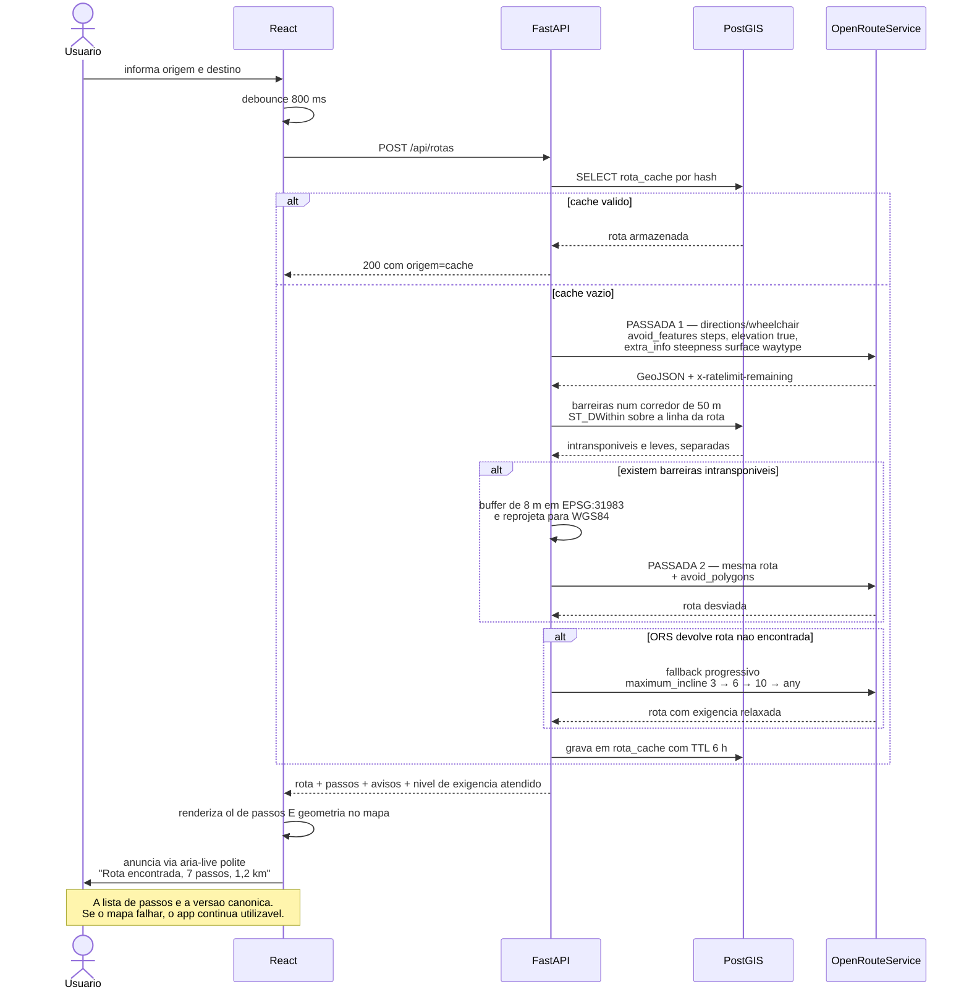
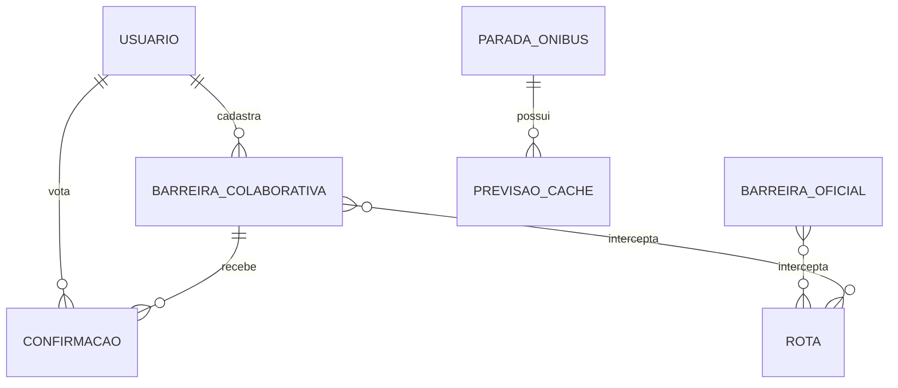
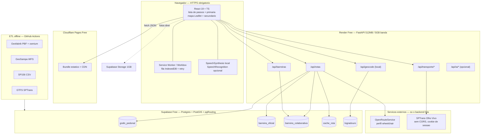
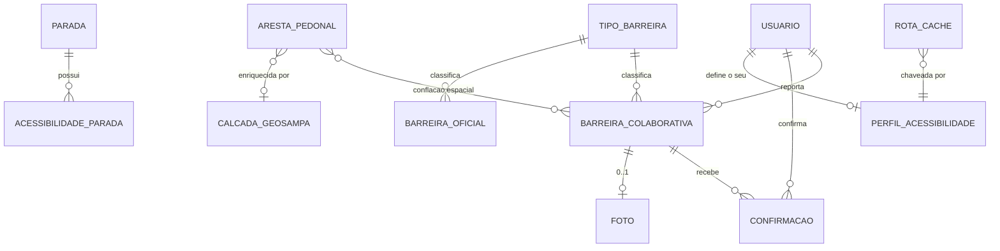
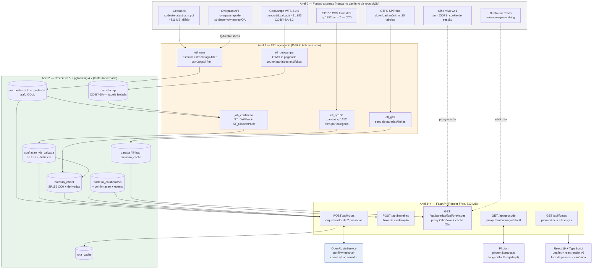
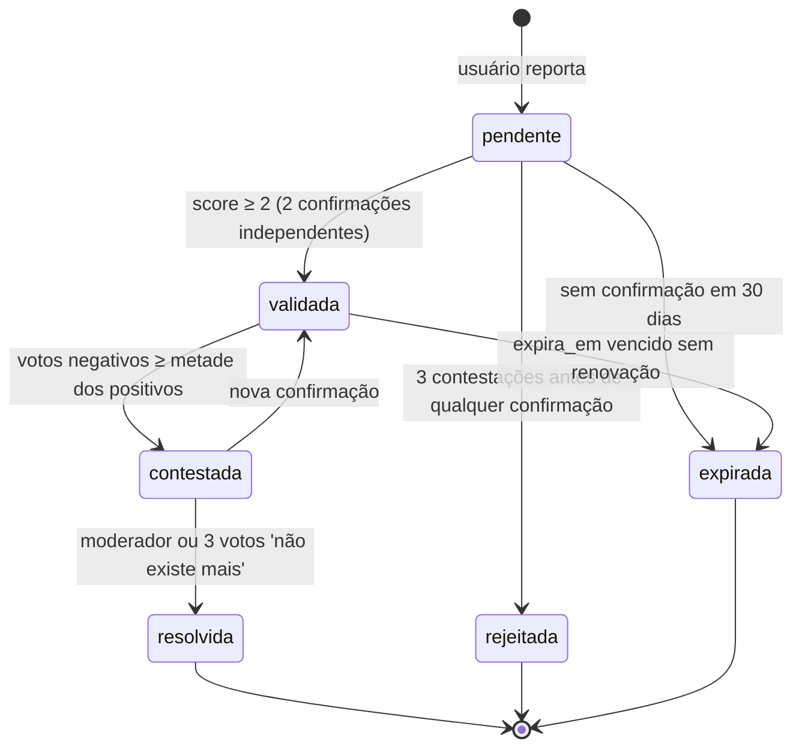

```mermaid
graph TB
    subgraph Cliente["Navegador — Cloudflare Pages"]
        UI["React 19 + TypeScript<br/>react-leaflet 5"]
        LISTA["Lista de passos semantica<br/>ol + aria-live"]
        SW["Service Worker<br/>Workbox + fila IndexedDB"]
        VOZ["Web Speech API<br/>Synthesis local + Recognition opcional"]
        UI --- LISTA
        UI --- SW
        UI --- VOZ
    end

    subgraph Backend["FastAPI — Render Free 512 MB"]
        ROTA["/api/rotas<br/>orquestrador de 2 passadas"]
        BARR["/api/barreiras<br/>CRUD + moderacao"]
        GEO["/api/geocode<br/>proxy Photon"]
        BUS["/api/transporte<br/>proxy SPTrans"]
        CACHE["Cache em memoria + tabela<br/>TTL por tipo de dado"]
        AUTH["Middleware JWT Supabase"]
    end

    subgraph Banco["Supabase Free — PostgreSQL + PostGIS"]
        T1[("barreira_oficial<br/>seed GeoSampa + SP156<br/>somente leitura")]
        T2[("barreira_colaborativa<br/>+ confirmacoes")]
        T3[("rota_cache")]
        T4[("parada_onibus<br/>seed GTFS")]
        T5[("logradouro<br/>autocomplete local")]
    end

    subgraph Externo["Servicos externos — em tempo de requisicao"]
        ORS["OpenRouteService<br/>perfil wheelchair<br/>2000 req/dia"]
        SPT["SPTrans Olho Vivo<br/>sem CORS, cookie de sessao"]
        PHO["Photon<br/>autocomplete, lang=default"]
    end

    subgraph ETL["ETL — offline, agendado, NUNCA em runtime"]
        GS["GeoSampa WFS<br/>geoportal:calcada"]
        SP156["SP156 CSV<br/>cp1252 sep=;"]
        PBF["Geofabrik sudeste.osm.pbf<br/>osmium + osm2pgsql"]
        GTFS["GTFS SPTrans<br/>download anonimo"]
        OVP["Overpass API<br/>SO em desenvolvimento"]
    end

    UI -->|"HTTPS, so /api/*"| ROTA
    UI --> BARR
    UI --> GEO
    UI --> BUS
    ROTA --> AUTH
    BARR --> AUTH
    ROTA --> CACHE
    ROTA --> T1
    ROTA --> T2
    ROTA --> T3
    BARR --> T2
    GEO --> T5
    GEO -.->|"fallback"| PHO
    BUS --> T4
    BUS --> SPT
    ROTA -->|"POST directions/wheelchair/geojson"| ORS
    GS --> T1
    SP156 --> T1
    PBF --> T5
    GTFS --> T4
    OVP -.->|"analise e estatisticas do relatorio"| ETL

    style Externo fill:#fff4e6
    style ETL fill:#eef7ee
    style Banco fill:#eef2ff
```

# Painel de arquiteturas e julgamento

## Design 1: Rota Livre SP — MVP-first: seed oficial do GeoSampa + roteamento delegado ao OpenRouteService + camada colaborativa como penalização

A tese central desta arquitetura é: **não construa nada que já exista de graça, e gaste todo o cronograma no que a disciplina realmente avalia** — a camada colaborativa e a acessibilidade WCAG/eMAG do próprio site.

Três decisões de escopo sustentam isso:

1. **Não implementar motor de rotas.** O OpenRouteService já tem o perfil `wheelchair` pronto, com `maximum_incline`, `maximum_sloped_kerb` e `minimum_width` — exatamente as variáveis da NBR 9050 (faixa livre 1,20 m, inclinação transversal máx. 3%, rampa máx. 8,33%). Consumimos a API pública gratuita. pgRouting e ORS auto-hospedado ficam documentados como plano B / trabalho futuro, não entram no MVP.
2. **Não nascer com o mapa vazio.** O maior achado do dossiê é a camada `geoportal:calcada` do GeoSampa: 491.383 polígonos de calçada com largura e declividade medidas, oficiais, sem chave de API. Isso dá ao sistema ~139 mil trechos de declividade acima de 8,33% e ~138 mil de largura abaixo de 1,20 m (já descontando os zeros que são dado ausente) **antes de qualquer usuário cadastrar algo**. Resolve o problema clássico de mapa colaborativo que estreia vazio e é o argumento de defesa mais forte na banca.
3. **Recorte piloto, não São Paulo inteira.** Uma sub-região (proposta: Sé + Consolação + Bela Vista, ou o entorno da FATEC) cabe nos 500 MB do Supabase Free, torna a demo densa o suficiente para o desvio de rota aparecer de verdade, e é uma decisão de escopo defensável academicamente.

**O que o sistema faz no MVP:** o usuário informa origem e destino (texto, voz ou "minha localização"), o backend pede uma rota `wheelchair` ao ORS, consulta no PostGIS quais barreiras — oficiais do GeoSampa/SP156 ou colaborativas confirmadas — interceptam um corredor de 50 m ao redor dessa rota, converte as intransponíveis em `avoid_polygons` e refaz a requisição. A resposta chega ao React como **lista de passos semântica** (`<ol>`) *e* como geometria no mapa Leaflet — a lista é a versão canônica, o mapa é o enriquecimento visual. Enquanto isso, o usuário pode cadastrar uma barreira nova em qualquer ponto, com moderação por confirmação e expiração automática.

**O que fica de fora do MVP e por quê:** ARTESP/Trilhos (mudança regulatória de 03/09/2026 tirou Metrô e CPTM, limite de 12 req/h, allowlist de IP incompatível com hospedagem gratuita); Wheelmap/accessibility.cloud (API clássica morta, sucessora exige token organizacional); MDT LiDAR do GeoSampa (processamento offline pesado — vira seção de "trabalho futuro" no relatório); IA generativa como caminho crítico (cotas voláteis demais — entra só como enfeite opcional com fallback determinístico).

**Correção importante de premissa da proposta original:** a SPTrans **não** responde à pergunta central do projeto. O GTFS da SPTrans, verificado no feed de 08/09/2026, não tem `wheelchair_boarding` em `stops.txt` nem `wheelchair_accessible` em `trips.txt`. A única fonte estruturada de acessibilidade de ônibus é o campo booleano `a` do endpoint `/Posicao` e `/Previsao` da API Olho Vivo — e ele é do **veículo**, não do ponto nem do trajeto. Portanto a SPTrans entra como camada de enriquecimento ("o próximo ônibus neste ponto chega às HH:MM e é acessível"), nunca como núcleo. Isso precisa ser reescrito na proposta antes da entrega, sob pena de prometer o que a fonte de dados não sustenta.

**Backend:** Python / FastAPI 0.139+ com Pydantic v2 (>=2.7) e Uvicorn — A escolha de Python aqui não é concessão à facilidade — é a decisão tecnicamente correta, e vale registrar essa justificativa no relatório em vez de apresentá-la como preferência pessoal.

**1. O trabalho pesado do projeto é ETL geoespacial, e é aí que Python é imbatível.** O pipeline obrigatório é: paginar o WFS do GeoSampa → ler GeoPackage/Shapefile → validar geometrias → gravar no PostGIS → ler CSVs cp1252 do SP156 → filtrar categorias → conflar com o grafo do OSM. Em Python isso são poucas dezenas de linhas com GeoPandas + Shapely + pyogrio + OWSLib. O equivalente em Java (GeoTools) é maduro mas várias vezes mais verboso; em C#/.NET não existe equivalente ao GeoPandas e a equipe escreveria parsing de GML/GeoJSON à mão.

**2. A parte difícil — a conflação entre o grafo do OSM e os polígonos de calçada do GeoSampa — é experimentação iterativa, não código estável.** A equipe vai testar várias distâncias de buffer, plotar, comparar, ajustar. Jupyter + GeoPandas + matplotlib tornam isso trivial; em Java ou C# é doloroso.

**3. O limite de 512 MB de RAM do Render Free decide o empate.** FastAPI/Uvicorn ocupa 80–150 MB e sobe em segundos. .NET Minimal API fica na mesma faixa (segunda opção legítima). Spring Boot em JVM parte de 250–400 MB e leva 10–30 s de startup, que SOMA ao cold start de ~1 minuto do Render — só viável com tuning agressivo ou GraalVM, complexidade desnecessária para uma equipe pequena.

**4. Nada aqui exige performance de Java ou C#.** Todas as consultas pesadas (interseção espacial, ST_DWithin, buffer) rodam DENTRO do PostGIS, em C. O backend só orquestra SQL e chamadas HTTP. Escolher Java 'por performance' seria otimizar a camada errada.

**5. O cliente Olho Vivo é mais barato em Python.** O padrão de autenticação da SPTrans (POST /Login/Autenticar que devolve cookie apiCredentials reenviado em todas as chamadas) é exatamente o caso de uso de `requests.Session` / `httpx.Client`, que gerencia o cookie sozinho. Em C# exige HttpClientHandler + CookieContainer explícito; em Java, CookieManager. O cliente inteiro cabe em ~80 linhas.

**6. Pydantic v2 casa com o TypeScript do frontend.** O FastAPI gera OpenAPI automaticamente e a equipe gera os tipos TS com `openapi-typescript`, eliminando erro de contrato entre camadas — que é justamente onde moram as duas armadilhas conhecidas da SPTrans: o campo `a` polissêmico (bool = acessibilidade em /Posicao, int = área em /Empresa) e o px/py invertido (px é LONGITUDE, py é LATITUDE).

**Ressalva honesta a favor de Java:** se o objetivo fosse contribuir com o motor de rotas — escrever um custom model de cadeirante no GraphHopper, ou estender o perfil wheelchair do ORS (que é uma aplicação Java/Spring Boot) — Java seria a escolha certa e renderia um trabalho de maior profundidade técnica. Mas o GraphHopper removeu o veículo `wheelchair` na versão 9.0 (23/04/2024) e reescrevê-lo como custom model é um projeto em si, que consome o semestre inteiro.

**C# é a opção mais fraca para este tema:** sem cliente ORS, sem equivalente a pyrosm/OSMnx, ecossistema GTFS pobre. NetTopologySuite + Npgsql resolvem geometria e PostGIS bem, então é viável — mas a equipe estaria constantemente reimplementando o que em Python é uma linha. Só se justificaria por domínio prévio forte de .NET.

### Arquitetura
## Princípio organizador

Três camadas com uma regra inegociável entre elas: **nenhuma requisição de usuário toca uma fonte externa lenta ou instável.** O GeoSampa, o extrato Geofabrik e o GTFS entram por ETL agendado. A Overpass API só existe como ferramenta de desenvolvimento — nunca no caminho da requisição (a política oficial lista "montar um app para além de mapeadores do OSM e depender das instâncias públicas como backend" como *problematic behaviour*, e nos testes as instâncias públicas falharam repetidamente por sobrecarga; latência medida de 12,4 s numa área de 4×4 km). Sobram apenas duas chamadas externas em tempo real: ORS (rota) e SPTrans (previsão de ônibus), ambas atrás de cache e ambas com fallback para fixtures.

## Componentes e responsabilidades

**1. Frontend — React 19 + TypeScript + Vite (Cloudflare Pages)**
Responsabilidade: interface acessível. É onde vão ~50% do esforço da equipe, porque é o que a disciplina avalia com rigor. Não guarda segredo nenhum, não chama API externa nenhuma diretamente. Consome apenas `/api/*` do backend.

**2. Backend — FastAPI (Render Free, Docker)**
Responsabilidade: ser o *único* detentor de segredos (chave ORS, token SPTrans, service_role do Supabase), o *único* ponto de cache, e o tradutor entre o mundo bagunçado das APIs externas e um contrato limpo tipado para o React. Três razões o tornam obrigatório, não opcional:
- a API Olho Vivo **não devolve nenhum header CORS** (verificado em GET, POST e preflight OPTIONS) — o React não consegue chamá-la, ponto final;
- a chave do ORS no bundle do React seria pública por definição e queimaria a cota de 2.000 req/dia;
- o cache é o que impede o estouro dessa cota.

**3. Dados — PostgreSQL 15 + PostGIS + (opcional) pgRouting, no Supabase Free**
Responsabilidade: guardar o seed oficial, as barreiras colaborativas, o cache de rotas e o índice espacial. É aqui que roda o trabalho pesado (`ST_DWithin`, `ST_Intersects`), em C, não no backend de 512 MB.

**4. ETL — scripts Python versionados, executados sob demanda + GitHub Actions**
Responsabilidade: popular e atualizar o banco. Roda na máquina de um integrante ou num job agendado, **nunca** no processo do backend.

## Diagrama de componentes



## Fluxo "usuário pede rota → resposta"

O ponto não óbvio deste fluxo é o **padrão de duas passadas**: pedimos a rota primeiro, descobrimos quais barreiras ela atravessa, e só então refazemos evitando-as. A alternativa ingênua — mandar todas as barreiras da cidade como `avoid_polygons` — estouraria o limite de 200 km² por polígono, tornaria a requisição gigante e provavelmente resultaria em "rota não encontrada".



## Decisões de arquitetura que merecem defesa na banca

**Por que duas tabelas de barreira em vez de uma?** Não é organização — é licença. O GeoSampa é CC-BY-SA 4.0 (copyleft) e o OSM é ODbL (copyleft), mutuamente incompatíveis para gerar uma base derivada única. Mantendo tabelas **separadas** com coluna de proveniência e cruzando por consulta espacial em tempo de execução, o conjunto se caracteriza como *Collective Database* na ODbL, e o share-alike **não contamina** os dados próprios do grupo. Se fossem mescladas fisicamente numa tabela derivada única, contaminaria. É uma decisão de modelagem que custa quase nada tomar corretamente no início e é cara de reverter depois — e rende uma seção inteira de discussão jurídico-técnica no relatório.

**Por que cache no banco e não só em memória?** O Render Free hiberna após 15 minutos sem tráfego e o cold start é de ~1 minuto. Cache em memória evapora a cada hibernação. A tabela `rota_cache` sobrevive, e a primeira requisição pós-hibernação já pode ser servida do banco.

**Por que autocomplete local em vez de Nominatim?** A política do Nominatim proíbe explicitamente autocomplete e limita a 1 req/s — uma caixa de busca React que dispare a cada tecla geraria bloqueio de IP. Pré-carregamos os logradouros do recorte piloto no próprio PostGIS a partir do extrato OSM e fazemos o autocomplete com `pg_trgm` localmente: cumpre a política e fica instantâneo. O Photon (`photon.komoot.io`) fica como fallback para endereços fora do piloto — atenção, ele **rejeita `lang=pt`**, exigindo `lang=default`.

### Modelo de dados
## Entidades principais

Todas as geometrias em **EPSG:4326** (WGS84) para armazenamento e troca com o frontend. Cálculos métricos (buffer, distância) reprojetam para **EPSG:31983** (SIRGAS 2000 / UTM 23S) — sem isso, um "buffer de 10 metros" em graus decimais dá resultado errado e variável com a latitude.

### `barreira_oficial` — seed, somente leitura
Carregada pelo ETL a partir do GeoSampa e do SP156. Nunca editada pelo app.

| Campo | Tipo | Observação |
|---|---|---|
| `id` | bigserial PK | |
| `geom` | `geometry(Geometry, 4326)` | polígono (calçada) ou ponto (SP156). Índice GiST. |
| `tipo` | enum | `calcada_estreita`, `declividade_excessiva`, `obstaculo_reportado`, `guia_sem_rebaixamento`, `calcada_danificada` |
| `severidade` | smallint 1–3 | 3 = intransponível, vira `avoid_polygon` |
| `fonte` | text | `GEOSAMPA_CALCADA`, `SP156`, `OSM` |
| `licenca` | text | `CC-BY-SA-4.0`, `CC0`, `ODbL` — obrigatório para atribuição correta na UI |
| `data_fonte` | date | **2021-08-13** para largura/declividade da calçada, não 2024 |
| `atributos` | jsonb | `largura_min_m`, `declividade_max_pct`, `medido` (bool) |
| `dentro_piloto` | boolean | filtro rápido do recorte |

**Armadilha crítica no ETL:** o campo `qt_largura_minima_trecho` do GeoSampa **nunca é NULL** — dado ausente vem codificado como `0`. Dos 154.770 trechos com largura < 1,20 m, 16.381 têm valor exatamente 0; e 116.489 feições têm `pc_declividade_maxima_trecho = 0`. O filtro honesto é `> 0 AND < 1.2`, e o campo `atributos->>'medido'` deve distinguir **"estreita"** de **"não medida"**. Vender "154.770 barreiras" sem essa ressalva é erro metodológico que a banca pode apontar.

### `barreira_colaborativa` — o núcleo do produto
| Campo | Tipo | Observação |
|---|---|---|
| `id` | uuid PK | |
| `autor_id` | uuid FK → `auth.users` | Supabase Auth |
| `geom` | `geometry(Point, 4326)` | GiST |
| `tipo` | enum | `escada`, `sem_rampa`, `calcada_danificada`, `obstaculo`, `piso_irregular`, `elevador_quebrado`, `guia_alta` |
| `severidade` | smallint 1–3 | 3 = bloqueia, 1–2 = apenas avisa |
| `descricao` | text | opcional, preenchível por voz |
| `foto_url` | text NULL | **sempre opcional** |
| `foto_alt` | text | obrigatório se houver foto |
| `status` | enum | `pendente`, `confirmada`, `resolvida`, `expirada`, `rejeitada` |
| `confirmacoes` | int default 0 | ≥ 2 promove a `confirmada` |
| `criada_em` / `expira_em` | timestamptz | default `now() + interval '180 days'` |

### `confirmacao_barreira`
`(barreira_id, usuario_id)` como PK composta — impede voto duplicado no nível do banco, não da aplicação. Campo `voto` em `{confirma, resolvida, nao_existe}`.

### `rota_cache`
| Campo | Observação |
|---|---|
| `chave` (text PK) | `sha256(origem 5 casas + destino 5 casas + restrições + hash do conjunto de barreiras relevantes)` |
| `resposta` (jsonb), `criada_em`, `expira_em` (default +6 h) |

Invalidação: quando uma barreira nova é **confirmada**, apagam-se as linhas cujo `bbox_rota` intersecta a barreira.

### `parada_onibus` — seed do GTFS
`stop_id`, `nome`, `endereco`, `geom(Point)`, `codigo_parada_olhovivo` (nullable). **Duas advertências:** o `stop_id` do GTFS (ex.: `18848`) e o `codigoParada` do Olho Vivo (ex.: `340015329`) são espaços de identificadores **diferentes** — a junção é por proximidade espacial + nome, e é trabalho real de sprint. E não existe campo de acessibilidade: `wheelchair_boarding` **não existe** no `stops.txt` da SPTrans.

### `logradouro` — autocomplete local
`nome`, `nome_normalizado` (unaccent + lower), `geom`, índice `gin (nome_normalizado gin_trgm_ops)`.

## Relacionamentos



`BARREIRA_OFICIAL` e `BARREIRA_COLABORATIVA` **não têm FK entre si e nunca são unidas fisicamente** — a união acontece só na consulta, por `UNION ALL` com coluna de proveniência. É essa separação que preserva a compatibilidade de licenças.

## A consulta que é o coração do sistema

```sql
-- barreiras num corredor de 50 m ao redor da rota devolvida pelo ORS
WITH corredor AS (
  SELECT ST_Buffer(
           ST_Transform(ST_GeomFromGeoJSON(:linha_rota), 31983), 50
         ) AS g
)
SELECT 'oficial' AS proveniencia, o.id, o.tipo, o.severidade,
       o.fonte, o.licenca, o.data_fonte,
       ST_AsGeoJSON(o.geom) AS geojson
  FROM barreira_oficial o, corredor c
 WHERE ST_Intersects(ST_Transform(o.geom, 31983), c.g)
UNION ALL
SELECT 'colaborativa', b.id, b.tipo::text, b.severidade,
       'USUARIO', 'proprietaria', b.criada_em::date,
       ST_AsGeoJSON(b.geom)
  FROM barreira_colaborativa b, corredor c
 WHERE b.status = 'confirmada'
   AND b.expira_em > now()
   AND ST_Intersects(ST_Transform(b.geom, 31983), c.g);
```

Segurança: **RLS ligada desde a primeira migração**. Leitura pública em `barreira_colaborativa`, escrita apenas com `auth.uid() = autor_id`, moderação por claim de papel. Sem RLS, a `anon key` exposta no frontend permite que qualquer pessoa apague o banco inteiro.

**Dimensionamento (recorte piloto):** ~25 mil polígonos de calçada, ~3 mil pontos SP156, ~40 mil logradouros, ~2 mil paradas. Com índices GiST, algo entre 80 e 150 MB — folgado nos 500 MB do Supabase Free. A cidade inteira (491 mil polígonos) **não** caberia com topologia de roteamento, e é por isso que o recorte é decisão de arquitetura, não preguiça.

### Roteamento
## Motor escolhido: OpenRouteService, API pública, perfil `wheelchair`

**Por que não implementar do zero.** O ORS já modela, em tempo de requisição, exatamente as variáveis da NBR 9050. Verificado na documentação oficial do backend, os parâmetros de `profile_params.restrictions` para o perfil `wheelchair` são:

| Parâmetro | Valores | Padrão | Correspondência NBR 9050 |
|---|---|---|---|
| `maximum_incline` | 3, 6, 10, 15, `any` | 6 | rampa máx. 8,33% (1:12) |
| `maximum_sloped_kerb` | 0.03, 0.06, 0.1, `any` | 0.06 | desnível de guia rebaixada |
| `minimum_width` | número (m) | — | faixa livre 1,20 m |
| `surface_type` | string | `cobblestone:flattened` | tipo de piso |
| `smoothness_type` | string | `good` | regularidade |
| `track_type` | string | `grade1` | — |

E `avoid_features` aceita, para wheelchair, exatamente `["steps", "ferries"]`.

**Por que não auto-hospedar no MVP.** Um ORS em Docker com recorte de São Paulo pede 4–8 GB de RAM — não cabe em nenhum tier gratuito de PaaS, ficaria restrito à máquina de um integrante, e seria frágil no dia da apresentação. Fica documentado no relatório como plano B avaliado, com o comando de recorte pronto (`osmium extract -b -46.83,-24.01,-46.36,-23.35 sudeste-latest.osm.pbf -o sao-paulo.osm.pbf`), mas não é executado. Isso é gestão de escopo, e explicar por que **não** se fez algo vale ponto.

**Por que não GraphHopper nem OSRM.** O GraphHopper removeu o veículo `wheelchair` na versão 9.0 (23/04/2024) — teria que ser reescrito do zero como custom model, o que é um projeto em si. O OSRM aplica perfis Lua **apenas no pré-processamento**: cada barreira nova cadastrada exigiria `osrm-extract` + `osrm-contract`, arquitetonicamente incompatível com um sistema colaborativo. O Valhalla tem modo `type=wheelchair` e instância pública gratuita da FOSSGIS — vale citar como alternativa real (o ORS não é o *único* motor com perfil cadeirante, só o mais parametrizável) — mas seu `max_grade` é lido pelo parser e tem a verificação **desativada no código-fonte** ("currently disabled bcs of noisy data"), então não serve como teto duro de inclinação.

## Como as barreiras entram no cálculo

O ORS só sabe fazer **bloqueio binário** com `avoid_polygons` — não existe "essa calçada é ruim mas passável". A granularidade de severidade é a **lógica de negócio própria do projeto**, e é o que diferencia o trabalho de um simples wrapper de API:

**Severidade 3 (intransponível)** — escada, ausência de rampa, obstáculo fixo, guia alta confirmada. Requisitos: se colaborativa, precisa de ≥ 2 confirmações e não estar expirada. Vira polígono: buffer de 8 m em EPSG:31983, reprojetado para WGS84, enviado em `avoid_polygons`. **Teto de 15 polígonos por requisição** — acima disso o roteador pode não achar caminho nenhum ou dar uma volta absurda; se houver mais, ordenar por severidade e proximidade da rota.

**Severidade 1–2 (dificulta)** — piso irregular, calçada estreita mas medida, declividade entre 6% e 8,33%. **Não bloqueia.** É exibida como aviso textual no passo correspondente da lista ("neste trecho, calçada com 0,95 m de largura — fonte: Prefeitura de São Paulo, 2021") e usada para **ranquear rotas alternativas**: pede-se `alternative_routes` ao ORS e ordena-se pela contagem de barreiras leves atravessadas.

**Fallback progressivo — a feature de acessibilidade mais honesta do sistema.** Com `maximum_incline=3` e `smoothness_type=excellent`, o ORS remove tantas vias do grafo que muitas rotas ficam impossíveis. Sem fallback, a demo mostra tela vazia diante da banca. Implementar a escada: `maximum_incline` 3 → 6 → 10 → `any`, relaxando `smoothness`/`surface` em degraus, e **informar na interface qual nível de exigência foi atendido**: *"Não encontramos rota com inclinação até 3%. Esta rota tem trechos de até 6%."* Isso transforma uma limitação técnica em transparência com o usuário.

## Detalhes operacionais que evitam o desastre no dia da apresentação

**Cotas, medidas por endpoint (não cumulativas):** `directions` no plano gratuito tem **2.000 req/dia e 40 req por janela deslizante de 60 s**. Estouro diário retorna **HTTP 403**; estouro por minuto retorna **429**. Fontes oficiais divergem entre 2.000 e 2.500/dia, então **não codifique um número fixo** — leia os headers `x-ratelimit-remaining` e `x-ratelimit-reset` a cada resposta, grave num contador e degrade quando cair abaixo de 10% do saldo. Isso é exatamente a dica de "monitorar chaves de API" do enunciado do projeto, resolvida da forma correta.

**Sempre POST, nunca GET.** Polígonos em GeoJSON estouram o limite de tamanho de URL rapidamente.

**Cache é obrigatório**, com a chave descrita no modelo de dados. Sem ele, uma tela que recalcula rota a cada arrastar de marcador queima a cota em uma tarde. Combine com **debounce de 800 ms no frontend**.

**Chave por integrante em desenvolvimento** — se todos compartilharem uma, a cota some no dia da integração.

**Fixtures como plano B.** Grave snapshots reais de respostas do ORS e da SPTrans em `tests/fixtures/` e coloque uma flag `USE_FIXTURES=true` no backend. Se qualquer serviço externo cair no dia da entrega, a demo continua funcionando. Isso é gestão de risco concreta e rende pontos.

**`elevation=true` e `extra_info=steepness|surface|waytype` na requisição.** A própria resposta do ORS já traz declividade e superfície por segmento, além de `ascent`/`descent` — isso **elimina completamente** a necessidade de chamar Open Topo Data ponto a ponto. Não reinvente esse trabalho.

## Como o transporte público entra

**Sem roteamento multimodal no MVP.** Roteamento porta-a-porta com ônibus exigiria OpenTripPlanner consumindo GTFS + OSM, e o GTFS da SPTrans não tem `pathways.txt`, `levels.txt`, `wheelchair_boarding` nem `wheelchair_accessible` — o motor não teria com que trabalhar o trecho intra-estação nem a acessibilidade do embarque. Além disso, não existe `calendar_dates.txt`, então **feriados simplesmente não são modelados** e o sistema calcularia horário de dia útil num feriado.

**O que entra:** ao final da rota a pé, se o destino estiver a mais de ~1,5 km, o sistema oferece um painel de enriquecimento — *"paradas de ônibus próximas ao seu caminho"*. Ao selecionar uma parada, o backend chama `GET /v2.1/Previsao/Parada?codigoParada={cp}` (o endpoint de melhor custo-benefício: uma chamada devolve todas as linhas que chegam ali, cada veículo com horário previsto `t` e flag de acessibilidade `a`), com cache de 25 s.

**Cinco armadilhas da SPTrans que precisam estar no código desde o primeiro dia:**
1. **Sem CORS** — proxy no backend é obrigatório, não opcional.
2. **HTTP 411** — o `POST /Login/Autenticar` **exige `Content-Length: 0`**; sem ele retorna 411 Length Required em vez de erro de token, e a equipe perde horas achando que a chave está errada. Em Python, `httpx.Client().post(url)` já resolve.
3. **Reautenticação automática** — o cookie `apiCredentials` expira em tempo não documentado. Envolva todas as chamadas num wrapper que, ao receber `401` com `{"Message":"Authorization has been denied for this request."}`, refaz o login e repete a requisição **uma vez**. Sem isso, a aplicação funciona nos testes e quebra sozinha depois de um tempo no ar — inclusive durante a apresentação.
4. **px é LONGITUDE, py é LATITUDE** — converta uma única vez, no modelo Pydantic da fronteira, para `{lat, lng}`.
5. **O campo `a` é polissêmico** — bool (acessibilidade) em `/Posicao` e `/Previsao`, int (código de área) em `/Empresa`. Tipar errado gera bug silencioso.

**Medição obrigatória na primeira sprint:** chame `/Posicao` uma vez e calcule que porcentagem dos veículos tem `a=true`. Se for ~100%, o filtro "só ônibus acessível" não agrega valor nenhum e o esforço deve ser realocado para a camada colaborativa. É uma medição de 15 minutos, é decisão de produto baseada em evidência, e é excelente material de relatório.

**A lacuna que vira feature:** não existe **nenhuma** fonte de status de elevador ou escada rolante de Metrô/CPTM em São Paulo — o Metrô publica só um PDF de maio/2023. Em vez de tentar contornar com scraping frágil, deixe os próprios usuários reportarem "elevador da estação X quebrado" pelo mesmo fluxo colaborativo. É coerente com a proposta, honesto no relatório, e é o argumento mais forte do trabalho: **o sistema existe justamente porque o dado oficial não existe.**

### Integrações
- **OpenRouteService — Directions perfil wheelchair** (motor de rotas, em tempo real). `POST https://api.openrouteservice.org/v2/directions/wheelchair/geojson`, header `Authorization: <chave>`. Cadastro gratuito em account.heigit.org; chaves novas são JWT desde 2025, o que quebra tutoriais antigos. Cota: 2.000/dia e 40/min NO ENDPOINT (não cumulativa entre endpoints); 403 no estouro diário, 429 no por minuto; ler `x-ratelimit-remaining` e `x-ratelimit-reset`. Atribuição literal exigida na interface: `© openrouteservice.org by HeiGIT | Map data © OpenStreetMap contributors`. Resultados sob CC-BY 4.0.
- **GeoSampa WFS 2.0.0** (ETL, offline). `https://wfs.geosampa.prefeitura.sp.gov.br/geoserver/geoportal/wfs` — 477 camadas, SEM chave e SEM cadastro. Camada-chave: `geoportal:calcada`, 491.383 polígonos com largura e declividade. ARMADILHA CRÍTICA: o `GetCapabilities` declara `CountDefault=30000` e há tetos por camada (10.200 em `segmento_logradouro`) — toda requisição sem `count` explícito é silenciosamente truncada com HTTP 200 e nenhum aviso. Todo script DEVE passar `count` e `startIndex` e validar `numberReturned` contra o `numberMatched` obtido com `count=1`. BBOX funciona em EPSG:4326 desde que na ordem **longitude,latitude** — não é preciso reprojetar para 31983. Peça `outputFormat=SHAPE-ZIP` ou `gpkg`, nunca GeoJSON (164 MB / 319 MB contra 619 MB). Licença CC-BY-SA 4.0.
- **Portal de Dados Abertos SP156** (ETL, offline). CSVs trimestrais em `dados.prefeitura.sp.gov.br/dataset/dados-do-sp156`, licença **CC0**. Ler com `encoding='cp1252'` (NÃO latin-1: o arquivo tem byte 0x96, travessão, que é indefinido em latin-1 estrito e vira `\x96` silenciosamente no meio dos nomes de serviço) e `sep=';'`. Os nomes de serviço misturam hífen comum e travessão — normalize o traço antes de filtrar, ou perde linhas em silêncio. Categorias a filtrar, além das óbvias de calçada: 'Guias, sarjetas e sarjetões - solicitar manutenção' (6.895), 'Árvore – Solicitar avaliação em calçadas e praças' (15.834 — raiz levantando calçada é barreira clássica), 'Semáforo de veículos e pedestres - Sugerir ajuste de tempo' (654). 35,9% das linhas não têm coordenada — descarte-as e valide as demais com ST_Within contra o limite municipal. O WAF da PRODAM bloqueia o User-Agent do curl (devolve HTTP 200 com HTML 'Requisicao Bloqueada'); `requests` e `axios` funcionam de primeira.
- **Geofabrik — extrato Sudeste em PBF** (ETL, offline). `https://download.geofabrik.de/south-america/brazil/sudeste-latest.osm.pbf`, ~857 MB, sem cadastro. Recortado com `osmium extract` e filtrado com `osmium tags-filter` antes de entrar no PostGIS via `osm2pgsql`. Atualização incremental com `pyosmium-up-to-date` ou `osm2pgsql --append --slim` — sem isso o banco congela no dia do primeiro carregamento.
- **Overpass API — SOMENTE em desenvolvimento**. `https://overpass-api.de/api/interpreter`. Usada para levantar as estatísticas de cobertura que vão para a fundamentação do relatório (é o argumento mais forte do trabalho: apenas 1.035 das 54.954 travessias de SP têm `kerb=*`, ou 1,9%; só 185 das 3.713 escadas informam `ramp=*`; `smoothness` existe em 52 vias na cidade inteira). NUNCA no caminho da requisição do usuário. Use exclusivamente `overpass-api.de` para números do relatório: o espelho kumi.systems é um cluster cujos workers têm datas de dados diferentes — quatro consultas consecutivas devolveram quatro `timestamp_osm_base` distintos, o que destrói reprodutibilidade; e `private.coffee` compartilha a mesma infraestrutura do kumi, não servindo de plano B. Atenção de sintaxe: `{{bbox}}` é template do overpass-turbo e retorna 'parse error: Unknown query clause' no endpoint real — interpole coordenadas literais.
- **SPTrans Olho Vivo v2.1** (enriquecimento, em tempo real via proxy). `https://api.olhovivo.sptrans.com.br/v2.1` — use HTTPS mesmo que a documentação oficial ainda publique `http://`. Token em 'Meus Aplicativos' do portal de desenvolvedores; uma chave por integrante. SEM CORS, SEM SLA, SEM rate limit publicado (autolimite-se: cache de 20–30 s para previsões, horas ou dias para paradas e linhas). Endpoint principal: `/Previsao/Parada?codigoParada={cp}`. Evite `/Posicao` sem parâmetros (frota inteira da cidade).
- **GTFS estático da SPTrans** (ETL, offline). `http://www.sptrans.com.br/umbraco/Surface/PerfilDesenvolvedor/BaixarGTFS` — download **anônimo**, sem token, automatizável em cron (verificado: HTTP 200, 14,3 MB). 10 tabelas, 1.362 rotas, 22.262 paradas. NÃO tem `wheelchair_boarding`, `wheelchair_accessible`, `pathways.txt`, `levels.txt` nem `calendar_dates.txt`. Defeito de qualidade real: `route_id` é idêntico a `route_short_name`, quebrando qualquer suposição de identificador opaco.
- **Photon (komoot)** — geocodificação com autocomplete. `https://photon.komoot.io/api?q=...&lang=default&lat=-23.55&lon=-46.63`. É o geocodificador OSM construído para busca tecla a tecla, gratuito e autohospedável — a alternativa correta ao Nominatim, que PROÍBE autocomplete e limita a 1 req/s. RESSALVA VERIFICADA: o Photon **rejeita `lang=pt`** ('Language is not supported. Supported are: default, de, en, fr') — use `lang=default` para endereços brasileiros. No MVP é apenas fallback: o autocomplete primário é local, sobre a tabela `logradouro` no PostGIS com `pg_trgm`.
- **Tiles do mapa base**. `https://tile.openstreetmap.org/{z}/{x}/{y}.png` com User-Agent próprio identificando a aplicação, atribuição visível e cache ≥ 7 dias. PROIBIDO pre-seeding e download para uso offline — a política define bulk downloading como qualquer busca preventiva de tiles além dos que o usuário está vendo, e o bloqueio ocorre sem aviso. Cachear o que o usuário JÁ viu é permitido. Plano B: OpenFreeMap (`https://tiles.openfreemap.org/styles/liberty`, sem chave, sem limite declarado) ou MapTiler Free (100 mil req/mês, mas exige logo MapTiler visível e é declarado para uso pessoal/não comercial).
- **Supabase** (Auth + Storage + PostgreSQL/PostGIS). Free: 500 MB de banco, 1 GB de storage, 5 GB de egress, 50 mil MAU, 2 projetos, pausa após 7 dias sem requisição. PostGIS e pgRouting habilitáveis por SQL sem restrição de plano. RLS obrigatória desde a primeira migração.

### Acessibilidade do frontend
## Meta declarada

**WCAG 2.2 nível AA**, com eMAG 3.1 (45 recomendações em seis seções) e ABNT NBR 17225:2025 (146 diretrizes: 96 requisitos obrigatórios A/AA + 50 recomendações AAA, baseada na WCAG 2.2) como referências nacionais, e o **art. 63 da Lei 13.146/2015 (LBI)** como base legal. Declarar isso explicitamente na documentação organiza o backlog e rende pontos. Como a NBR 17225 é norma paga, cite WCAG 2.2 (W3C, gratuita) e eMAG (gov.br, gratuito) como fontes primárias e a NBR como referência normativa.

## A decisão de arquitetura de acessibilidade: a lista de passos é a versão canônica

Um mapa interativo é, por padrão, o componente mais hostil que existe para leitor de tela. A resposta realista não é "tornar o canvas acessível" — é **entregar a rota em duas representações equivalentes**, e tratar a textual como a principal:

```
<div class="layout">
  <ol aria-label="Instruções da rota">          <!-- CANÔNICA -->
    <li>Siga 120 m pela Rua Augusta. Calçada com rampa rebaixada.</li>
    <li>Atravesse na faixa elevada. ⚠ Guia sem rebaixamento — reportado
        por 3 usuários em 02/09/2026.</li>
  </ol>
  <div id="mapa" aria-describedby="resumo-rota"></div>  <!-- ENRIQUECIMENTO -->
</div>
```

Se o mapa quebrar, se o WebGL falhar, se o tile server cair — **o app continua 100% funcional**. Nenhum dado existe apenas no mapa.

## Biblioteca de mapa: Leaflet + react-leaflet 5

É a única das três (Leaflet, MapLibre GL, OpenLayers) com marcadores em **DOM real**, foco por teclado nativo e um guia oficial de acessibilidade. MapLibre e OpenLayers desenham em canvas/WebGL, opaco para leitor de tela — escolhê-los pela estética inviabilizaria o requisito central do projeto. Duas advertências práticas: **react-leaflet 5.0.0 exige React 19 como peer dependency** (planeje a versão do React desde o `create vite`), e há o erro recorrente `Map container is already initialized` no StrictMode do React 19.

Não basta usar Leaflet e declarar acessibilidade: o próprio projeto documenta problemas (JAWS lendo o `alt` de cada tile). Marcadores precisam de `alt` **único e descritivo** — `alt="Escada sem rampa na Rua Augusta, 500 — gravidade alta"`, não `alt="marcador"`.

## Regras concretas que entram no backlog

**Anúncio de navegação passo a passo.** Uma única região `<div role="status" aria-live="polite" aria-atomic="true">` que anuncia **apenas mudanças de passo**, com throttle de 3–5 s. Nunca `aria-live="assertive"` e nunca a cada tick do GPS — o leitor de tela vira ruído contínuo e o usuário desliga o recurso, que é o pior resultado possível.

**Alvo de toque de 44×44 px** em todos os controles e pinos de mapa. Supera o mínimo AA de 24×24 px do critério 2.5.8 e alinha com Apple HIG/Material. Pinos de 16–20 px são inutilizáveis para quem tem tremor ou usa ponteiro de cabeça — exatamente o público-alvo.

**Nunca arrastar como forma única de marcar um ponto** (critério 2.5.7 Dragging Movements, AA). Sempre três caminhos: (a) clique/Enter no mapa, (b) botão "usar minha localização atual", (c) campo de busca de endereço.

**Foco não pode ser coberto** (critério 2.4.11 Focus Not Obscured, AA) — o erro mais comum em layout de mapa com painel sobreposto e cabeçalho sticky. Teste navegando só por Tab e observando se o elemento focado some atrás da barra.

**Reflow a 320 px CSS** (critério 1.4.10, AA, equivalente a zoom de 400%) — mapa em tela cheia com painel flutuante é o layout que mais quebra aqui, e zoom de 200–400% é uso corrente entre pessoas com baixa visão. O painel deve empilhar abaixo do mapa, não flutuar.

**`lang="pt-BR"` no `<html>`** (critério 3.1.1, nível A). É pré-requisito direto para que o leitor de tela e o `SpeechSynthesis` escolham a voz pt-BR corretamente.

**Gerenciamento de foco em SPA React** — ao mudar de rota, o foco fica no `<body>` e o leitor de tela não anuncia nada. Mover o foco para o `<h1>` da nova view, atualizar `document.title`, e ter um skip link. São os três erros de a11y mais comuns em React.

**Contraste sobre o mapa** (1.4.3 e 1.4.11): halo/casing branco na linha da rota, contorno escuro nos pinos, camada semitransparente de dessaturação sobre o tile. O texto **dentro** do tile do OSM não é controlável — mais uma razão para nenhum dado existir só no mapa.

**Atribuição acessível.** A licença CC-BY-SA 4.0 do GeoSampa e a ODbL do OSM **exigem** atribuição. Coloque-a em texto real, alcançável por leitor de tela, nunca escondida em elemento puramente visual. Num projeto cujo tema é inclusão e conformidade, esconder a atribuição seria contraditório — e expô-la corretamente conta ponto.

## Voz: progressive enhancement, nunca caminho crítico

`SpeechSynthesis` (saída de voz) é **local**, gratuito e amplamente suportado — pode ser oferecido com confiança. `SpeechRecognition` (comando de voz) **não é Baseline**: está como "Limited availability", não existe no Firefox (desabilitado por padrão desde a v22), o caniuse marca o Edge como não suportado em todas as versões, e no Chrome o áudio é enviado a um serviço em nuvem do Google — não funciona offline e tem implicação de LGPD idêntica à que se critica no envio de fotos para IA.

Portanto: detecte `window.SpeechRecognition || window.webkitSpeechRecognition` e só então renderize o botão de microfone. Trate explicitamente os erros `not-allowed`, `service-not-allowed`, `audio-capture`, `no-speech` e `language-not-supported` com mensagem visível — o botão de microfone falhando em silêncio é o antipadrão clássico. E **use categoria por seleção** (radio/select: escada, calçada danificada, ausência de rampa, obstáculo, piso irregular) em vez de texto livre: casar voz com lista fechada é muito mais confiável que transcrever frase livre em pt-BR, onde "Rua Haddock Lobo" sai errado com frequência. Depois de qualquer entrada por voz, **mostre a transcrição e peça confirmação explícita** antes de gravar.

## Foto sempre opcional

Um usuário cego não consegue enquadrar uma foto. Se a foto fosse obrigatória, ele seria excluído do papel de colaborador — o que contradiz frontalmente a proposta do projeto. Foto opcional, com campo de texto alternativo (preenchível por voz) quando houver.

## Critérios de aceite mensuráveis

Sem métrica, "conformidade WCAG 2.2 AA" é afirmação sem prova. Adote estes e reporte no trabalho:
- zero violações **críticas** ou **sérias** no axe-core nas 3 telas principais;
- 100% dos fluxos principais (calcular rota, cadastrar barreira, confirmar barreira) completáveis **só com teclado**;
- todo controle interativo com alvo ≥ 44 px, verificado por script;
- Lighthouse Accessibility ≥ 95 nas 3 telas;
- pelo menos **um teste com usuário real** de cadeira de rodas ou de leitor de tela, registrado no trabalho. Isso vale mais que qualquer relatório do Lighthouse — automação cobre apenas ~57% dos problemas.

## Símbolo e página de acessibilidade

Símbolo internacional de acessibilidade em destaque e uma página "Acessibilidade" declarando o nível de conformidade, os recursos disponíveis (atalhos de teclado, comandos de voz, alto contraste) e um canal de contato. É **exigência literal do art. 63, §1º da LBI** e recomendação do eMAG.

### MVP
- **Mapa acessível do recorte piloto** — Leaflet + react-leaflet 5, navegável por teclado, marcadores com `alt` descritivo único, atribuição visível e alcançável por leitor de tela, alvos de 44 px.
- **Cálculo de rota acessível a pé** — origem e destino por texto, voz ou 'minha localização'; ORS perfil wheelchair com padrão de duas passadas; resposta como `<ol>` semântica de passos E geometria no mapa; anúncio via `aria-live="polite"`.
- **Fallback progressivo de exigência** — quando não há rota com `maximum_incline=3`, relaxar para 6 → 10 → `any` e informar explicitamente qual nível foi atendido. Evita tela vazia na apresentação e é, em si, uma feature de acessibilidade honesta.
- **Seed oficial de barreiras** — ~25 mil polígonos de calçada do GeoSampa com largura < 1,20 m (excluindo os zeros que são dado ausente) ou declividade > 8,33%, mais os pontos geolocalizados do SP156 nas categorias de acessibilidade. O mapa nasce cheio, com proveniência e data visíveis em cada alerta.
- **Cadastro colaborativo de barreira** — formulário totalmente acessível: categoria por seleção fixa (não texto livre), ponto marcado por clique/teclado/localização atual/endereço (nunca só por arrastar), descrição opcional por voz, foto opcional com alt obrigatório.
- **Moderação por confirmação comunitária** — outros usuários confirmam, marcam como resolvida ou contestam; ≥ 2 confirmações promovem a barreira a `confirmada` (só então ela entra no cálculo de rota); expiração automática em 180 dias. Sem isso, uma obra temporária vira bloqueio permanente e a base degrada.
- **Autenticação** — Supabase Auth por e-mail/senha e OAuth Google, com RLS no PostgreSQL amarrando cada barreira ao seu autor.
- **Busca de endereço com autocomplete local** — sobre a tabela `logradouro` no PostGIS com `pg_trgm`, instantânea e sem violar a política do Nominatim; Photon (`lang=default`) como fallback.
- **Painel de ônibus acessível** — paradas próximas ao trajeto; ao selecionar uma, `Previsao/Parada` mostra as linhas com horário previsto e o flag de acessibilidade do veículo, atualizado com `aria-live` de polidez adequada e sem roubar foco.
- **Leitura da rota em voz alta** — `SpeechSynthesis` local, com destaque visual sincronizado do passo sendo falado via evento `onboundary`.
- **Página 'Acessibilidade'** — declaração de conformidade, recursos disponíveis, canal de contato e símbolo internacional (art. 63 §1º da LBI).
- **Página 'Fontes de dados'** — atribuição a GeoSampa (CC-BY-SA 4.0), SP156 (CC0), OpenStreetMap (ODbL), ORS/HeiGIT e SPTrans, com a data de cada fonte. Cumpre licença e demonstra rigor.
- **Aviso permanente de limitação** — as rotas são apresentadas como *sugestões baseadas em dados incompletos*, nunca como garantia. Com 1,9% das travessias de SP tendo informação de guia, prometer garantia seria irresponsável com o público-alvo.

### Futuro
- **Isócronas de alcance** — `POST /v2/isochrones/wheelchair`: 'o que consigo alcançar em 15 minutos de cadeira de rodas a partir daqui'. Uma chamada de API, alto impacto visual, ótimo para a defesa.
- **MDT LiDAR do GeoSampa como diferencial acadêmico** — levantamento de 2020, densidade média de 10 pontos/m², precisão ~10 cm, PEC-PCD classe A, resolução espacial de 0,50 m, distribuído em LAZ em 5.362 quadrículas. Processar offline algumas quadrículas da área piloto, extrair declividade por segmento de calçada e comparar com o SRTM global de 30 m. Rende uma seção forte no relatório (dado municipal centimétrico vs. global métrico) sem colocar o cronograma em risco.
- **Roteamento próprio com pgRouting** — a extensão já estará instalada; barreiras entrariam como `UPDATE` na coluna `cost`, sem rebuild de grafo, eliminando a dependência da cota externa do ORS. Alternativa a avaliar ao `osm2pgrouting`, que está sem release desde jun/2021 e carrega tudo em memória: `osm2po` ou topologia construída a partir do `osm2pgsql`.
- **ORS auto-hospedado em Docker** — recorte municipal com `osmium extract`, 4–8 GB de RAM, removendo todas as cotas e permitindo ajustar `maximum_avoid_polygon_area` no `ors-config.yml`. Testar com semanas de antecedência, jamais na véspera.
- **PWA com mapa offline via Protomaps/PMTiles** — a ÚNICA rota legalmente válida para uso offline. Gerar recorte de SP com o CLI `pmtiles extract --bbox=...` e servir do Cloudflare R2. Usar `tile.openstreetmap.org` para isso viola a política e resulta em bloqueio sem aviso.
- **Roteamento multimodal com OpenTripPlanner** — porta a porta com ônibus. Depende de a SPTrans passar a publicar `wheelchair_boarding`/`wheelchair_accessible` e `pathways.txt`, ou de a equipe construir esses campos a partir da camada colaborativa.
- **Devolução das barreiras ao OpenStreetMap** via API 0.6 / changesets. Levanta uma questão simultaneamente técnica, jurídica e academicamente rica: a proveniência dos reportes dos usuários é compatível com a cessão exigida pelos Contributor Terms do OSM? Excelente tópico de discussão no relatório.
- **Consultas históricas da Overpass** (`[date:...]`, `[adiff]`, attic data) para medir a EVOLUÇÃO do mapeamento de acessibilidade em SP — por exemplo, o impacto do projeto SMPED/SMT de 2021 na Lapa e Vila Mariana. Material de fundamentação de alto valor, disponível de graça.
- **Pedido via Lei de Acesso à Informação (e-SIC)** ao Metrô e à CPTM sobre status de elevadores. Gratuito, legítimo, com prazo legal de resposta — bem melhor academicamente do que declarar a lacuna e parar.
- **VLibras** — suíte gratuita do gov.br para tradução automática para Libras, embutível com duas linhas de script. A NBR 17225 trata de janela de Libras; é ganho barato de conformidade.
- **Cobertura metropolitana** — GTFS aberto da EMTU para quem usa linhas intermunicipais. No MVP, declare explicitamente que o escopo é o município de São Paulo.
- **Comparação com o estado da arte** — o AccessMap da Universidade de Washington (do mesmo Taskar Center envolvido no projeto municipal 'Calçadas Urbanas Inclusivas') e o demo wheelchair do próprio ORS, como baseline de comparação.

### Estrutura de pastas
```
rota-livre-sp/
├── README.md                    # inclui as armadilhas: cp1252, count do WFS,
│                                # px/py da SPTrans, Content-Length 0, lon,lat no BBOX
├── LICENSE                      # código MIT; dados sob suas próprias licenças
├── docker-compose.yml           # postgis + backend, para desenvolvimento local
├── .github/workflows/
│   ├── ci.yml                   # lint + testes + build + axe-core
│   ├── keep-alive.yml           # cron: ping no Render e query no Supabase
│   └── backup.yml               # pg_dump semanal como artifact
│
├── backend/
│   ├── Dockerfile
│   ├── pyproject.toml
│   ├── app/
│   │   ├── main.py              # FastAPI, CORS, middlewares
│   │   ├── config.py            # pydantic-settings; TODOS os segredos por env
│   │   ├── deps.py              # sessão do banco, validação do JWT Supabase
│   │   ├── routers/
│   │   │   ├── rotas.py         # POST /api/rotas — orquestrador de 2 passadas
│   │   │   ├── barreiras.py     # CRUD + confirmação + moderação
│   │   │   ├── geocode.py       # autocomplete local + fallback Photon
│   │   │   └── transporte.py    # proxy SPTrans
│   │   ├── services/
│   │   │   ├── ors_client.py    # httpx; lê x-ratelimit-*; fallback progressivo
│   │   │   ├── sptrans_client.py# Session + Content-Length 0 + reauth no 401
│   │   │   ├── photon_client.py # lang=default (NUNCA lang=pt)
│   │   │   ├── barreira_geom.py # buffer 8 m em EPSG:31983 → WGS84
│   │   │   └── cache.py         # chave por hash; TTL por tipo de dado
│   │   ├── models/              # SQLAlchemy + GeoAlchemy2
│   │   ├── schemas/             # Pydantic v2 — px/py vira {lat,lng} AQUI
│   │   └── core/
│   │       ├── ratelimit.py
│   │       └── fixtures.py      # USE_FIXTURES=true salva a apresentação
│   ├── migrations/              # Alembic; primeira migração já liga RLS
│   └── tests/
│       ├── fixtures/            # snapshots reais de ORS e SPTrans
│       ├── test_rotas.py
│       ├── test_barreiras.py
│       └── test_sptrans_reauth.py
│
├── etl/                         # scripts idempotentes, NUNCA importados pelo backend
│   ├── requirements.txt         # geopandas, pyogrio, owslib, pandas
│   ├── 01_geosampa_calcadas.py  # WFS paginado; valida numberReturned vs numberMatched
│   ├── 02_sp156.py              # cp1252, sep=';', normaliza traço, ST_Within
│   ├── 03_osm_extract.sh        # osmium extract + tags-filter + osm2pgsql
│   ├── 04_logradouros.py        # tabela de autocomplete + índice pg_trgm
│   ├── 05_gtfs_paradas.py       # seed de paradas (sem campo de acessibilidade)
│   └── notebooks/
│       ├── cobertura_osm_sp.ipynb    # estatísticas Overpass para o relatório
│       └── conflacao_calcada.ipynb   # experimentação de buffer — a parte difícil
│
├── frontend/
│   ├── package.json             # react 19, react-leaflet 5, vite 6
│   ├── vite.config.ts           # vite-plugin-pwa
│   └── src/
│       ├── main.tsx             # <html lang="pt-BR">
│       ├── api/
│       │   ├── client.ts
│       │   └── types.gen.ts     # gerado do OpenAPI do FastAPI
│       ├── components/
│       │   ├── Mapa.tsx
│       │   ├── ListaDePassos.tsx     # a versão CANÔNICA da rota
│       │   ├── AnunciadorRota.tsx    # aria-live com throttle
│       │   ├── FormBarreira.tsx      # categoria fixa, foto opcional
│       │   ├── BotaoVoz.tsx          # feature detection + tratamento de erro
│       │   └── PainelOnibus.tsx
│       ├── hooks/
│       │   ├── useRota.ts            # debounce 800 ms
│       │   ├── useSpeech.ts
│       │   └── useFocoDeRota.ts      # foco no <h1> ao trocar de view
│       ├── pages/
│       │   ├── Home.tsx
│       │   ├── Acessibilidade.tsx    # art. 63 §1º da LBI
│       │   └── FontesDeDados.tsx     # atribuição CC-BY-SA / ODbL / CC-BY
│       └── styles/tokens.css         # contraste, alvos 44 px, reduced-motion
│
└── docs/
    ├── arquitetura.md
    ├── decisoes/            # ADRs: por que ORS, por que Python, por que 2 tabelas
    ├── acessibilidade.md    # roteiro manual de teclado + NVDA/TalkBack
    ├── licencas.md          # CC-BY-SA vs ODbL; Collective vs Derivative Database
    └── limites-e-contingencia.md   # tabela por serviço: limite, o que acontece, plano B
```

## Comandos de setup

```bash
# --- 1. Banco local (desenvolvimento) ---
docker run -d --name pg -e POSTGRES_PASSWORD=dev -p 5432:5432 \
  postgis/postgis:16-3.4
docker exec -it pg psql -U postgres -c \
  "CREATE DATABASE rotalivre;"
docker exec -it pg psql -U postgres -d rotalivre -c \
  "CREATE EXTENSION postgis; CREATE EXTENSION pg_trgm; CREATE EXTENSION unaccent;"

# --- 2. Backend ---
cd backend
python -m venv .venv && source .venv/bin/activate   # Windows: .venv\Scripts\activate
pip install "fastapi>=0.139" "uvicorn[standard]" "pydantic>=2.7" \
            "sqlalchemy>=2.0" geoalchemy2 "psycopg[binary]" \
            "httpx>=0.28" "shapely>=2.0" "pyproj>=3.6" \
            python-jose[cryptography] slowapi
pip freeze > requirements.txt
alembic upgrade head
uvicorn app.main:app --reload --port 8000
# OpenAPI em http://localhost:8000/docs

# --- 3. ETL (ambiente separado — geopandas NÃO vai para o Render) ---
cd ../etl
python -m venv .venv && source .venv/bin/activate
pip install "geopandas>=1.0" "pyogrio>=0.9" "owslib>=0.31" \
            "pandas>=2.2" sqlalchemy geoalchemy2 "psycopg[binary]" \
            "pyrosm==0.13.1" jupyterlab

# GeoSampa — recorte piloto. count e startIndex EXPLÍCITOS, sempre.
python 01_geosampa_calcadas.py --bbox="-46.66,-23.57,-46.62,-23.53" --count=5000
# (BBOX em EPSG:4326 na ordem lon,lat — o GeoServer reprojeta de graça)

# OSM — recorte + filtro + carga
cd ..
curl -O https://download.geofabrik.de/south-america/brazil/sudeste-latest.osm.pbf
osmium extract -b -46.66,-23.57,-46.62,-23.53 sudeste-latest.osm.pbf -o piloto.osm.pbf
osmium tags-filter piloto.osm.pbf \
  w/highway n/kerb nwr/wheelchair nwr/tactile_paving w/incline w/sidewalk \
  -o piloto-acess.osm.pbf
osm2pgsql -d rotalivre --create --slim -G --hstore piloto-acess.osm.pbf
# --slim habilita atualização incremental futura com --append

# --- 4. Frontend ---
cd frontend
npm create vite@latest . -- --template react-ts
npm i react@19 react-dom@19 leaflet react-leaflet@5
npm i -D @types/leaflet vite-plugin-pwa \
         eslint-plugin-jsx-a11y jest-axe @axe-core/playwright \
         openapi-typescript
npx openapi-typescript http://localhost:8000/openapi.json -o src/api/types.gen.ts
npm run dev
```

**Variáveis de ambiente (backend, nunca no frontend):** `ORS_API_KEY`, `SPTRANS_TOKEN`, `DATABASE_URL`, `SUPABASE_JWT_SECRET`, `USE_FIXTURES`. Habilite Secret Scanning e Push Protection no repositório público do GitHub e adicione `gitleaks` como pre-commit — chave vazada em repositório público de faculdade é o vazamento mais comum que existe.

### Testes
## Pirâmide de testes, calibrada para uma equipe de 3–5 alunos

O objetivo não é cobertura alta — é **impedir que a apresentação quebre** e **provar a conformidade AA com evidência**.

### Backend (pytest)

**Testes de contrato com mock de HTTP externo** (`respx`) — nenhum teste toca ORS ou SPTrans de verdade. Casos que precisam existir:
- conversão px/py → `{lat, lng}` no schema Pydantic (o bug clássico que só aparece visualmente, com todos os pontos no lugar errado do mapa);
- desambiguação do campo `a` (bool em `/Posicao`, int em `/Empresa`);
- **reautenticação no 401 da SPTrans**: mock devolve `401` + `{"Message":"Authorization has been denied for this request."}`, o wrapper refaz o login e repete **uma vez**. Sem esse teste, a aplicação passa em tudo e quebra sozinha depois de horas no ar — inclusive durante a apresentação;
- `Content-Length: 0` presente no POST de autenticação (senão vem HTTP 411, não erro de token);
- fallback progressivo: ORS devolve "rota não encontrada" com `maximum_incline=3` → o serviço tenta 6, depois 10, depois `any`, e o campo `nivel_exigencia_atendido` na resposta reflete o que funcionou;
- cota esgotada: ORS devolve `403` → resposta degradada com mensagem clara, não stack trace.

**Testes geoespaciais com PostGIS real** (contêiner `postgis/postgis:16-3.4` em fixture de sessão):
- buffer de 8 m em EPSG:31983 produz polígono com área na faixa esperada — **testar reprojeção é obrigatório**, porque buffer em graus decimais "funciona" silenciosamente e dá resultado errado;
- `ST_DWithin` do corredor de 50 m encontra a barreira plantada e ignora a que está a 200 m;
- a consulta `UNION ALL` devolve a coluna `proveniencia` correta para cada origem.

**Testes de ETL** com amostra pequena versionada:
- CSV do SP156 lido em `cp1252` não produz `\x96` em nenhum nome de serviço;
- o filtro de largura exclui os registros com valor `0` (dado ausente) e marca `medido=false`;
- o cliente WFS **falha ruidosamente** quando `numberReturned < numberMatched` — este é o teste mais importante do ETL, porque o truncamento silencioso do GeoServer é a armadilha mais séria de todo o pipeline.

### Frontend (quatro camadas, desde a primeira sprint)

1. **`eslint-plugin-jsx-a11y`** no lint — pega `alt` ausente, `onClick` em `<div>`, handler de teclado faltando. Custo zero, roda a cada save.
2. **`jest-axe`** nos componentes — `expect(await axe(container)).toHaveNoViolations()` no formulário de barreira, na lista de passos e no painel de ônibus.
3. **`@axe-core/playwright`** em duas rotas críticas (cadastrar barreira, calcular rota), rodando em Chromium **e** WebKit.
4. **Roteiro manual documentado** — é o diferencial acadêmico, porque automação cobre apenas ~57% dos problemas. A matriz precisa ser de **combinações**, não de ferramentas soltas:

| Combinação | Escopo | Custo |
|---|---|---|
| NVDA + Firefox (Windows) | fluxo completo | gratuito |
| NVDA + Chrome (Windows) | fluxo completo | gratuito |
| TalkBack + Chrome (Android) | cadastro de barreira | gratuito |
| VoiceOver + Safari (iOS) | leitura da rota | precisa de um iPhone no grupo |
| Só teclado, sem mouse | os 3 fluxos principais | gratuito |

Registre o roteiro passo a passo em `docs/acessibilidade.md` com os resultados datados. Isso é conteúdo de relatório, não burocracia.

### CI (GitHub Actions, repositório público = minutos ilimitados)

```yaml
# ci.yml, resumido
jobs:
  backend:  ruff check . && pytest --cov=app
  frontend: npm ci && npm run lint && npm test && npm run build
  a11y:     npx playwright test tests/a11y --reporter=list
```

Falha o build em qualquer violação **crítica** ou **séria** do axe. Adicione Lighthouse CI com budget de Accessibility ≥ 95.

**Dois crons obrigatórios:**
- `keep-alive.yml` — ping diário no `/health` do Render (que hiberna após 15 min, com cold start de ~1 min) e query leve no Supabase (que pausa após 7 dias sem requisição). **Advertência documentada:** em repositório público, o GitHub **desabilita workflows agendados após 60 dias sem atividade no repositório** — exatamente o cenário de férias. E crons no início da hora sofrem atraso; use `cron: '17 9 * * *'`, não `'0 9 * * *'`.
- `backup.yml` — `pg_dump` semanal salvo como artifact (retenção padrão de 90 dias). É o backup que o plano gratuito não oferece. **Atenção LGPD:** o dump contém dados pessoais de usuários; trate-o com o mesmo cuidado do banco.

### Qualidade dos dados colaborativos

Não é detalhe técnico, é **requisito de produto**. Uma barreira falsa manda um cadeirante para uma escada. Três mecanismos:
- **confirmação** (≥ 2 usuários para entrar no cálculo de rota);
- **expiração** (180 dias — obra que acabou não pode bloquear rota para sempre);
- **marcação de "resolvido"** por qualquer usuário, com contra-confirmação.

Sem esses três, a base degrada e o sistema fica pior com o tempo em vez de melhor.

### Ensaio geral

Duas semanas antes da entrega, execute a apresentação inteira com `USE_FIXTURES=true` para provar que a demo sobrevive à queda de qualquer serviço externo. Depois execute com serviços reais. Cronometre. Aqueça o Render minutos antes de subir ao palco.

### Riscos
- **Cobertura de dados insuficiente para roteamento confiável — o maior risco técnico, e ele é mensurável.** Apenas 1,9% das travessias de SP têm `kerb=*` (1.035 de 54.954), só 5% das escadas informam `ramp=*` (185 de 3.713), e `smoothness` existe em 52 vias na cidade inteira. Uma rota calculada só com OSM pode mandar um cadeirante por um caminho com degrau que o mapa desconhece. MITIGAÇÃO: (a) nunca rotular rotas como garantidas — a UI diz 'sugestão baseada em dados colaborativos incompletos'; (b) o seed do GeoSampa cobre parte da lacuna com dado oficial medido; (c) transformar a limitação em fundamentação — essa estatística é o argumento mais forte possível para a EXISTÊNCIA do sistema colaborativo proposto.
- **Falha ao vivo na apresentação por dependência de serviço externo.** ORS pode retornar 403 por cota estourada; SPTrans não tem SLA nem canal de suporte; Render hiberna após 15 min com cold start de ~1 min; Supabase pausa após 7 dias. MITIGAÇÃO: fixtures gravadas com flag `USE_FIXTURES=true`; cache no banco (sobrevive à hibernação, ao contrário do cache em memória); cron de keep-alive; aquecer o serviço minutos antes; ensaio geral duas semanas antes com os serviços desligados de propósito.
- **Truncamento silencioso do WFS do GeoSampa — a armadilha mais séria de todo o ETL.** O `GetCapabilities` declara `CountDefault=30000` e há tetos por camada (10.200 em `segmento_logradouro`). Uma requisição sem `count` explícito recebe HTTP 200 com dados incompletos e NENHUM aviso — a equipe trabalharia semanas com metade dos dados sem perceber. MITIGAÇÃO: teste automatizado que falha ruidosamente quando `numberReturned < numberMatched`; sempre passar `count` e `startIndex` explícitos; obter o total real com `count=1` antes de paginar.
- **Conflito de licenças CC-BY-SA vs ODbL — o risco menos óbvio e o de correção mais cara depois.** GeoSampa é CC-BY-SA 4.0 e OSM é ODbL, ambas copyleft e mutuamente incompatíveis para gerar uma base derivada única. MITIGAÇÃO: tabelas SEPARADAS com coluna de proveniência, unidas apenas por consulta espacial em tempo de execução — isso caracteriza um *Collective Database* na ODbL, e o share-alike NÃO contamina os dados próprios do grupo. Jamais fazer upload de dados do GeoSampa para dentro do OSM. Documentar a decisão em `docs/licencas.md`.
- **Números do GeoSampa contaminados por zeros que são dado ausente.** Dos 154.770 trechos com largura < 1,20 m, 16.381 têm valor exatamente `0`; e 116.489 feições têm declividade `= 0`. O campo nunca é NULL. Apresentar '154.770 barreiras' como medição limpa é erro metodológico. MITIGAÇÃO: filtro `> 0 AND < 1.2`; campo `medido` no jsonb; a interface distingue 'calçada estreita' de 'largura não medida'.
- **Defasagem dos dados oficiais.** A largura e a declividade da camada de calçadas são de um diagnóstico da SMUL com revisão em 13/08/2021 — dezembro/2024 atualizou APENAS o status do Plano Emergencial, preenchido em 1,4% das feições. A camada de semáforos está congelada em 2018. MITIGAÇÃO: exibir a data da fonte ao lado de CADA alerta ('Prefeitura de São Paulo, 2021') e permitir que o usuário conteste o dado pela camada colaborativa. Exibir '2024' seria factualmente errado e agravaria o problema.
- **Cota do ORS estourada em dia de integração ou apresentação.** 2.000 requisições/dia compartilhadas entre toda a equipe testando. MITIGAÇÃO: chave separada por integrante em desenvolvimento; cache no backend com chave por origem/destino arredondados + hash das barreiras; debounce de 800 ms no frontend; leitura dos headers `x-ratelimit-remaining`/`x-ratelimit-reset` com degradação automática abaixo de 10% do saldo — nunca codificar o número 2.000 fixo, já que fontes oficiais divergem entre 2.000 e 2.500.
- **Filtragem agressiva demais gerando 'rota não encontrada' na frente da banca.** Com `maximum_incline=3` e `smoothness_type=excellent`, o ORS remove tantas vias que muitas rotas ficam impossíveis. MITIGAÇÃO: fallback progressivo 3 → 6 → 10 → `any` com informe explícito do nível atendido. É simultaneamente mitigação de risco e feature de acessibilidade honesta.
- **Excesso de `avoid_polygons` inviabilizando a rota.** Se muitas barreiras forem cadastradas numa região, o roteador pode não achar caminho nenhum ou dar uma volta absurda. MITIGAÇÃO: filtrar por corredor de 50 m ao redor da rota (padrão de duas passadas), teto de 15 polígonos por requisição ordenados por severidade, e mensagem clara quando não houver alternativa.
- **Confundir `wheelchair=no` de POI com barreira de percurso.** Dos 1.898 objetos `wheelchair=no` em SP, a maioria são estabelecimentos cujo acesso interno tem degrau — não obstáculos no caminho. Tratá-los como barreira de rota polui o grafo com falsos positivos. MITIGAÇÃO: usar `highway`/`footway` como discriminador; POI inacessível é informação de DESTINO, nunca entra no cálculo do percurso.
- **Dois esquemas de calçada convivendo em SP.** 4.703 calçadas como geometria própria (`footway=sidewalk`) contra 10.088 vias com o atributo `sidewalk=*`. Um roteador que entenda só um dos esquemas gera rotas desconexas ou ignora metade da cidade. MITIGAÇÃO: suportar os dois desde o início, no filtro do `osmium tags-filter` e na conflação.
- **`kerb=yes` interpretado como acessível.** Significa apenas que existe uma guia de altura NÃO determinada. MITIGAÇÃO: parser com cinco valores — `flush` (~0 cm) e `lowered` (≲3 cm) transponíveis; `raised` (>3 cm) e `rolled` como barreira; `no` = ausência de guia, transponível; e `yes` = DESCONHECIDO, nunca acessível. O wiki avisa que 'heights given here are only indicative'.
- **Viés geográfico da demonstração.** O mapeamento sistemático de acessibilidade em SP se concentrou na Lapa e Vila Mariana (projeto SMPED/SMT de 2021). Demonstrar só ali superestima a capacidade real do sistema. MITIGAÇÃO: escolher a área piloto conscientemente e ser HONESTO no relatório sobre o viés — declarar a limitação é metodologicamente mais forte do que escondê-la.
- **Vandalismo e degradação dos dados colaborativos.** Sem moderação, uma obra temporária vira bloqueio permanente e uma barreira falsa manda um cadeirante para uma escada. MITIGAÇÃO: confirmação por ≥ 2 usuários antes de entrar no cálculo, expiração em 180 dias, marcação de 'resolvido', RLS amarrando cada registro ao autor.
- **LGPD.** O sistema registra localização de pessoas com deficiência e mobilidade reduzida — condição de saúde é dado pessoal sensível (art. 11). E cada linha do SP156, embora CC0, traz logradouro, número e CEP de quem reclamou, o que pode identificar a residência de uma pessoa com deficiência. MITIGAÇÃO: não persistir histórico de rotas por usuário; consentimento granular e explícito para geolocalização e para envio de áudio ao reconhecimento de voz; agregar ou ofuscar os pontos do SP156; documentar base legal e política de retenção. É pergunta provável da banca.
- **Chave de API vazada no bundle do React.** Qualquer `VITE_*_KEY` é público por definição — basta abrir o DevTools. MITIGAÇÃO: nenhuma chave no frontend, sem exceção; todas as chamadas externas passam pelo backend; Secret Scanning + Push Protection habilitados no repositório; `gitleaks` como pre-commit.
- **Corte do acesso aos tiles do OSM.** A política avisa que o acesso pode ser retirado a qualquer momento sem aviso, especialmente com User-Agent genérico, e proíbe pre-seeding e uso offline. MITIGAÇÃO: User-Agent próprio identificando a aplicação desde o primeiro dia; atribuição visível; plano B com OpenFreeMap (sem chave, sem limite declarado) já testado; qualquer feature de mapa offline usa Protomaps/PMTiles, nunca `tile.openstreetmap.org`.
- **Free tiers encolhendo no meio do semestre.** Fly.io removeu o free tier em 07/10/2024, Netlify migrou para créditos em set/2025, o Render Hobby caiu para 5 GB de banda de saída por mês (os 100 GB são de workspaces legados), e o Postgres gratuito do Render EXPIRA em 30 dias sem backup. MITIGAÇÃO: tudo em Docker/IaC para permitir migração em um dia; JAMAIS usar o Postgres do Render; a API do Render devolve apenas JSON — fotos e tiles saem direto do Supabase Storage ou de CDN, porque somados aos 5 GB de egress do Supabase o teto real de tráfego é de poucos GB/mês; cadastrar o GitHub Student Developer Pack como seguro.

### Cronograma
## 16 semanas (um semestre), equipe de 3–5 alunos

A regra que organiza o cronograma: **as três semanas iniciais existem para matar riscos, não para produzir features.** Descobrir na semana 12 que o GTFS não tem campo de acessibilidade, ou que o WFS truncou metade dos dados, é o que reprova projetos assim.

### Semanas 1–2 — Fundação e derrubada de riscos
- Contas e chaves: ORS (account.heigit.org, uma por integrante), SPTrans ("Meus Aplicativos"), Supabase, Render, Cloudflare Pages.
- **Verificações de 15 minutos cada que decidem requisitos inteiros:** abrir o `stops.txt`/`trips.txt` do GTFS e confirmar a ausência dos campos de acessibilidade (já sabemos o resultado — mas a equipe precisa ver com os próprios olhos e registrar no relatório); chamar `/Posicao` e medir a porcentagem de veículos com `a=true` — **se for ~100%, o filtro "só ônibus acessível" não agrega valor e o esforço deve migrar para a camada colaborativa**.
- Definir a área piloto e congelar a bbox.
- Repositório, CI mínimo, Secret Scanning, `docker-compose` com PostGIS.
- Esqueleto FastAPI com `/health` no Render + React com Leaflet renderizando um mapa vazio no Cloudflare Pages. **Deploy de ponta a ponta funcionando na semana 2**, ainda que sem nenhuma feature — é o que evita a descoberta tardia de que HTTPS, CORS ou build quebram.

### Semanas 3–4 — ETL e seed oficial
- `01_geosampa_calcadas.py` com paginação validada (`numberReturned` vs `numberMatched`).
- `02_sp156.py` com `cp1252`, normalização de traço e `ST_Within` contra o limite municipal.
- `03_osm_extract.sh` (osmium + osm2pgsql) e `04_logradouros.py` com `pg_trgm`.
- Migrações Alembic com **RLS ligada desde a primeira**.
- **Marco: o banco tem barreiras oficiais e o mapa mostra dado real.** Se isso escorregar além da semana 5, corte o SP156 e fique só com o GeoSampa.

### Semanas 5–7 — Roteamento
- `ors_client.py` com leitura dos headers de cota e fallback progressivo.
- Padrão de duas passadas: rota → consulta de corredor 50 m → buffer 8 m em EPSG:31983 → `avoid_polygons` → rota desviada.
- Cache no banco com invalidação por região.
- **Marco (semana 7): rota calculada desviando de uma barreira real.** É o coração do sistema; é aqui que a maior parte da margem de tempo deve ser gasta.

### Semanas 8–10 — Camada colaborativa
- Supabase Auth + RLS + CRUD de barreiras.
- Formulário acessível: categoria por seleção fixa, ponto por clique/teclado/localização/endereço.
- Moderação: confirmação, expiração, "resolvido".
- **Marco: um usuário cadastra uma barreira e a rota muda.** Este é o momento de gravar o vídeo da demo — antes de qualquer polimento, enquanto ainda há tempo de consertar.

### Semanas 11–13 — Acessibilidade (o que mais pesa na nota)
- Lista de passos como componente canônico, `aria-live` com throttle, gerenciamento de foco no SPA.
- Alvos de 44 px, contraste sobre o mapa, reflow a 320 px, `prefers-reduced-motion`.
- `SpeechSynthesis`; `SpeechRecognition` com feature detection e tratamento explícito dos cinco erros.
- Páginas "Acessibilidade" e "Fontes de dados".
- **Roteiro manual completo com NVDA e TalkBack, documentado e datado.**
- Correção de todas as violações críticas e sérias do axe.

### Semana 14 — Enriquecimento SPTrans
- Proxy com `Content-Length: 0`, reautenticação no 401 e cache de 25 s.
- Painel de próximo ônibus com `aria-live` de polidez adequada, sem roubar foco.
- Deliberadamente tardio: **é a feature mais dispensável do MVP.** Se o cronograma escorregar, esta é a primeira a cair, e o relatório documenta a decisão com a justificativa técnica (a SPTrans não responde à pergunta central do projeto).

### Semana 15 — Fixtures, contingência e documentação
- Snapshots de ORS e SPTrans; flag `USE_FIXTURES`.
- Crons de keep-alive e backup.
- `docs/limites-e-contingencia.md`: tabela por serviço com limite atual, o que acontece ao estourar e plano B.
- ADRs: por que ORS, por que Python, por que duas tabelas de barreira, por que a SPTrans é periférica.

### Semana 16 — Ensaio e entrega
- **Ensaio geral com todos os serviços externos desligados** (fixtures), depois com serviços reais. Cronometrado.
- Teste com pelo menos um usuário real de cadeira de rodas ou de leitor de tela, registrado — vale mais que qualquer relatório do Lighthouse.
- Revisão de todos os links da bibliografia (o dossiê mostra que URLs morrem: a doc do pyrosm foi reorganizada, o PDF de acessibilidade da CPTM redireciona para a home).
- Aquecer o Render antes de subir ao palco.

## Marcos de corte

Se o cronograma escorregar, corte nesta ordem: **(1) SPTrans → (2) SP156 → (3) fallback Photon → (4) reconhecimento de voz.** Nunca corte a camada colaborativa nem a acessibilidade — são o núcleo da proposta e o que a disciplina avalia. O ORS e o seed do GeoSampa também não são cortáveis: sem eles não há produto.

## Design 2: Rota Falada: arquitetura usuário-first com a rota textual como fonte da verdade e o mapa como camada secundária

**A tese desta arquitetura em uma frase: num aplicativo de acessibilidade, a rota é um texto; o mapa é uma ilustração opcional desse texto.**

Todas as arquiteturas convencionais para este problema partem do mapa e depois tentam "torná-lo acessível" — e falham, porque um `<canvas>` WebGL ou uma malha de tiles é, por construção, invisível para leitor de tela. Partindo das jornadas reais (Marcos em cadeira de rodas, Dona Ivete com baixa visão e NVDA, Sr. Antônio com andador), a inversão é imediata: o artefato que o usuário consome é uma **lista ordenada de passos**, cada um com distância, direção, condição de acessibilidade, fonte e data. O mapa Leaflet fica ao lado, ligado por `aria-describedby`, e se ele não carregar o aplicativo continua inteiro.

Essa inversão não é retórica — ela **decide o backend**. Porque se o produto é texto, o backend não pode devolver apenas uma geometria GeoJSON e deixar o frontend "montar a narrativa". O `POST /api/rotas` precisa devolver passos já enriquecidos: a largura da calçada daquele trecho (GeoSampa), a declividade por segmento (`extra_info=steepness` do ORS), o estado da guia (OSM `kerb`, com `kerb=yes` classificado como *desconhecido*, jamais como acessível), as barreiras colaborativas próximas com data e contagem de confirmações, e o nível de exigência que foi efetivamente atendido quando houve fallback. Isso é **transformação geoespacial pesada com contrato tipado** — exatamente o que Python com FastAPI + Pydantic + PostGIS faz melhor que Java ou C#, e é por isso que a preferência declarada da equipe coincide, neste caso específico, com a decisão tecnicamente correta.

A segunda decisão estrutural também nasce das jornadas: **nada externo no caminho da requisição**. Dona Ivete digitando com zoom de 400% e leitor de tela não pode esperar 12 segundos por uma consulta à Overpass, e o Nominatim proíbe autocomplete tecla a tecla. Logo o autocomplete é local (PostGIS + `pg_trgm`), os dados do OSM e do GeoSampa entram por ETL offline, e o único serviço externo no caminho crítico é o OpenRouteService — protegido por cache no banco, debounce no frontend e leitura dos headers `x-ratelimit-*`.

A terceira: **honestidade sobre o dado, virada em funcionalidade**. Apenas 1,9% das travessias de São Paulo têm informação de guia rebaixada; smoothness existe em 52 vias na cidade inteira; não existe nenhuma API de status de elevador de metrô. Em vez de esconder, o sistema exibe fonte e data em cada trecho, rotula toda rota como sugestão, e converte cada lacuna em ponto de entrada colaborativo. É a linha argumentativa mais forte do trabalho: **o sistema existe justamente porque o dado oficial não existe** — e ainda assim ele não estreia vazio, porque o GeoSampa entrega ~155 mil trechos de calçada estreita e ~139 mil íngremes já medidos pela Prefeitura, resolvendo o problema clássico do mapa colaborativo sem conteúdo no dia 1.

Stack final: **React 19 + TypeScript + Leaflet** (Cloudflare Pages) → **FastAPI/Python 3.12** (Render Free) → **PostgreSQL + PostGIS + pgRouting** (Supabase Free) → **OpenRouteService perfil wheelchair** + **SPTrans Olho Vivo via proxy obrigatório** (a API não devolve nenhum header CORS). Custo: zero. Nenhum serviço exige cartão de crédito.

**Backend:** Python / FastAPI (Python 3.12) + PostgreSQL/PostGIS/pgRouting — A decisão não é 'Python é mais fácil' — é que os quatro temas do dossiê convergem para Python por razões técnicas independentes.

(1) O trabalho real do projeto é ETL geoespacial, não HTTP. O pipeline obrigatório é: baixar PBF Geofabrik (857 MB) → recortar bbox de SP com osmium → filtrar tags → carregar em PostGIS → paginar o WFS do GeoSampa (491.383 polígonos de calçada) → ler CSV cp1252 do SP156 → conflar tudo com o grafo pedonal. Em Python isso são poucas dezenas de linhas com pyrosm/geopandas/pyogrio/GeoAlchemy2. Em Java o equivalente é GeoTools (excelente, porém várias vezes mais código cerimonial); em C# não existe equivalente ao GeoPandas nem cliente WFS de primeira classe — a equipe escreveria parsing de GML na mão.

(2) A parte mais difícil — a conflação entre arestas do OSM e polígonos de calçada do GeoSampa — é experimentação iterativa (testar buffers de 5, 8, 12 m, plotar, comparar), não código de produção estável. Jupyter + GeoPandas + matplotlib é exatamente esse ciclo. Fazer isso em Java ou C# é lento e desestimulante para equipe pequena.

(3) O limite de infraestrutura decide o resto: Render Free tem 512 MB de RAM. FastAPI/Uvicorn ocupa ~80–150 MB e sobe em segundos; .NET Minimal API fica na mesma faixa; Spring Boot em JVM parte de ~250–400 MB e leva 10–30 s de startup, que SOMA ao cold start de ~1 minuto do Render (https://render.com/docs/free). Java só caberia com -Xmx256m ou GraalVM nativo — complexidade gratuita num semestre.

(4) O cliente SPTrans terá de ser escrito à mão em qualquer linguagem (não há wrapper mantido em nenhuma das três para a v2.1). O critério vira 'onde escrever custa menos': o padrão da Olho Vivo (POST /Login/Autenticar → cookie apiCredentials reenviado em tudo) é literalmente o caso de uso de httpx.Client/requests.Session, ~80 linhas. Em C# exige HttpClientHandler + CookieContainer explícito; em Java, CookieManager.

(5) Bônus acadêmico com peso real na nota: o livro 'Introdução à acessibilidade urbana' do IPEA (https://ipeagit.github.io/intro_access_book/pt/) é metodologia de acessibilidade urbana brasileira, em português, com código Python/R e exemplos de São Paulo. Não há nada equivalente para C#.

Onde Java ganharia: se o escopo fosse construir o próprio motor de rotas, o GraphHopper embarcado como biblioteca seria a escolha certa (e o próprio ORS é construído sobre ele). Mas o veículo 'wheelchair' foi REMOVIDO do GraphHopper na versão 9.0 (23/04/2024) e teria de ser reescrito do zero como custom model — é um projeto inteiro, inviável em um semestre. C# é a opção mais fraca aqui: OsmSharp e Itinero têm comunidade pequena e manutenção irregular; NetTopologySuite + Npgsql cobrem geometria e PostGIS bem, mas cada peça de apoio (raster de elevação, PBF, análise de grafo) exigiria solução própria.

Veredito: Python não é o caminho fácil, é o caminho tecnicamente correto — e sobra cronograma para o que a disciplina realmente avalia, que é a acessibilidade WCAG/eMAG do próprio site.

### Arquitetura
**Ponto de partida: as três jornadas.** Cada decisão de backend abaixo existe porque uma jornada exigiu.

| Persona | O que ela faz | O que o frontend precisa | O que isso obriga no backend |
|---|---|---|---|
| **Marcos, 34, cadeira de rodas manual, Vila Mariana** | Pede rota da casa até a estação; quer saber se tem degrau e se o ônibus é acessível | Rota + lista textual de passos com largura/declividade/guia por trecho, e "o próximo ônibus na parada X é acessível" | Endpoint único `/api/rotas` que já devolve **passos enriquecidos** (não só geometria); proxy SPTrans com sessão e cache; barreiras como polígonos `avoid_polygons` |
| **Dona Ivete, 68, baixa visão + leitor de tela, Lapa** | Ouve a rota, navega só por teclado, digita endereço com muito zoom | Zero dependência do canvas; texto completo; busca de endereço sem autocomplete disparando a cada tecla | Autocomplete **local** no PostGIS (não Nominatim), respostas pequenas e estáveis, contrato tipado (Pydantic→TypeScript) para o texto nunca vir vazio |
| **Sr. Antônio, 79, andador, Sé** | Anda devagar, quer trecho curto e sem inclinação, reporta calçada quebrada na hora | Botão grande, fluxo de reporte em 3 toques, funciona offline no ônibus/metrô | `POST /api/barreiras` idempotente e tolerante a fila offline (IndexedDB + retry), moderação por confirmações, expiração automática |

**Componentes e responsabilidades**

1. **Frontend — React 19 + TypeScript 5.x + Vite 7**, hospedado no **Cloudflare Pages Free** (500 builds/mês, sem limite de banda declarado, HTTPS grátis — HTTPS é pré-requisito de Geolocation, microfone e Service Worker). Responsabilidades: renderizar a lista de passos (primária) e o mapa Leaflet (secundário), gerenciar foco e `aria-live`, PWA com fila offline. **Nunca** fala com ORS, SPTrans, Nominatim ou GeoSampa diretamente.

2. **BFF/API — FastAPI 0.141.x sobre Python 3.12** (FastAPI 0.141.1, publicado 29/07/2026, exige Python ≥3.10 — https://pypi.org/project/fastapi/), rodando em **Render Free** via Dockerfile. Responsabilidades: guardar todos os segredos (chave ORS, token SPTrans), orquestrar roteamento, aplicar cache, normalizar o contrato para o React. Restrição dura: **512 MB de RAM e 5 GB de banda de saída/mês** no workspace Hobby (https://render.com/docs/outbound-bandwidth) → a API devolve **só JSON**; fotos e tiles saem do Supabase Storage/R2, nunca da API.

3. **Banco — PostgreSQL 15 + PostGIS 3.4 + pgRouting 3.8** no **Supabase Free** (500 MB, 5 GB egress, pausa após 7 dias sem requisição). Extensões habilitadas por SQL, sem restrição de plano. Guarda: grafo pedonal, barreiras oficiais, barreiras colaborativas, cache de rotas, logradouros para autocomplete local. Toda consulta espacial pesada roda **dentro do banco** (C), não em Python.

4. **Motor de rotas — OpenRouteService público, perfil `wheelchair`**, consumido só pelo backend. Confirmado na documentação oficial que `profile_params.restrictions` aceita `maximum_incline` (3/6/10/15/any), `maximum_sloped_kerb` (0.03/0.06/0.1/any), `minimum_width`, `surface_type` (default `cobblestone:flattened`), `smoothness_type` (default `good`), `track_type` (default `grade1`), e que `avoid_features` do perfil aceita exatamente `steps` e `ferries` (https://giscience.github.io/openrouteservice/api-reference/endpoints/directions/routing-options).

5. **Worker de ETL** — scripts Python executados sob demanda + GitHub Actions agendado. Ingere Geofabrik/osmium → PostGIS, GeoSampa WFS → PostGIS, SP156 CSV → PostGIS, GTFS SPTrans → PostGIS. **Nunca no caminho da requisição do usuário.**

6. **Proxy SPTrans** — módulo do FastAPI com `requests.Session()`/`httpx.Client()` persistente, reautenticação automática no HTTP 401, cache de 20–30 s para previsões. Obrigatório porque a Olho Vivo **não devolve nenhum header CORS** (verificado): app só-frontend é impossível.



**Fluxo "usuário pede rota → resposta" (o caminho crítico)**

```mermaid
sequenceDiagram
  autonumber
  actor M as Marcos (cadeirante)
  participant UI as React (lista + mapa)
  participant API as FastAPI /api/rotas
  participant PG as PostGIS + pgRouting
  participant ORS as OpenRouteService

  M->>UI: digita destino (ou fala) e aciona "Calcular rota"
  UI->>UI: debounce 800ms; foco vai p/ h1 "Calculando"; aria-live="polite"
  UI->>API: POST {origem, destino, perfil:{incline:6, kerb:0.06, largura:0.9}}
  API->>PG: SELECT cache_rota WHERE chave = hash(o,d,perfil,versao_barreiras)
  alt cache quente (TTL 6h)
    PG-->>API: rota_json
    API-->>UI: 200 (< 150 ms)
  else cache frio
    API->>ORS: POST /v2/directions/wheelchair/geojson<br/>elevation=true, extra_info=steepness|surface|waytype,<br/>avoid_features=["steps"], profile_params.restrictions
    ORS-->>API: GeoJSON 3D + instrucoes + steepness por segmento
    API->>PG: barreiras validadas que interceptam ST_Buffer(rota, 50m)
    PG-->>API: N barreiras (severidade, confirmacoes, fonte, data)
    alt existe barreira INTRANSPONIVEL confirmada
      API->>ORS: 2a passada com avoid_polygons (buffer 8m em EPSG:31983 -> WGS84)
      ORS-->>API: rota desviada
    end
    API->>PG: enriquece cada passo com largura/declividade GeoSampa (ST_DWithin)
    API->>PG: INSERT cache_rota
    API-->>UI: 200 {passos[], geometria, avisos[], nivel_exigencia, fontes[]}
  end
  UI->>UI: renderiza <ol> de passos; desenha polyline; foco no h1 do resultado
  UI-->>M: leitor de tela anuncia "Rota encontrada. 1,4 km, 22 minutos, 2 avisos."
  Note over API,ORS: Se ORS devolver 404/rota vazia:<br/>fallback progressivo incline 3->6->10->any,<br/>e a resposta DIZ qual nivel foi atendido.
```

**Regras arquiteturais não negociáveis (derivadas do dossiê)**
1. **Nada externo no caminho da requisição sem cache.** Overpass e GeoSampa WFS **jamais** são chamados em runtime — só no ETL. A Overpass classifica "setting up an app... relying on the public instances as backend" como *problematic behaviour* (https://dev.overpass-api.de/overpass-doc/en/preface/commons.html) e, na prática, dá timeout na hora da apresentação.
2. **Barreiras são camada de penalização, nunca sobrescrevem o OSM.** Severidade alta + N confirmações → `avoid_polygons` (bloqueio duro, único modo do ORS); severidade baixa → aviso textual no passo e critério de ordenação entre `alternative_routes`.
3. **Duas tabelas de proveniência separadas** (`barreira_oficial` GeoSampa CC-BY-SA vs. `barreira_colaborativa` própria vs. grafo OSM ODbL). CC-BY-SA e ODbL são copyleft mutuamente incompatíveis: **jamais** fundir em tabela única. Tabelas separadas + coluna `fonte` + join espacial em runtime configuram *Collective Database*, e o share-alike não contamina os dados do grupo.
4. **Instrumentar cota, não chutar número.** Ler `x-ratelimit-remaining` e `x-ratelimit-reset` do ORS a cada resposta e gravar em métrica; 403 = cota diária estourada, 429 = 40 req/min excedidas. Nunca hardcodar "2000/dia" (fontes oficiais divergem entre ~2.000 e 2.500).
5. **Modo demo.** Flag `USE_FIXTURES=true` no backend serve snapshots JSON reais de ORS e SPTrans. Se qualquer serviço cair no dia da banca, a demo continua.

### Modelo de dados
**Princípio de modelagem que decide a licença do trabalho:** três origens de dado nunca se misturam fisicamente. OSM é ODbL, GeoSampa é CC-BY-SA 4.0 — copyleft mutuamente incompatíveis. Tabelas separadas + coluna `fonte` + join espacial em runtime = *Collective Database* (share-alike não contamina os dados próprios do grupo). Fundir tudo numa tabela = *Derivative Database* e contamina. Custa nada decidir certo no início.



**1. `usuario`** (Supabase Auth cuida da autenticação; esta é a extensão de domínio)
`id UUID PK` (= `auth.uid()`) · `apelido TEXT` · `papel ENUM('cidadao','moderador')` · `criado_em TIMESTAMPTZ`
**LGPD**: nenhum campo declara deficiência. O perfil de acessibilidade guarda *preferências de rota*, nunca diagnóstico. Dado de saúde é sensível (art. 11), e presumir "quem usa perfil cadeirante é cadeirante" seria justamente inferir dado sensível.

**2. `perfil_acessibilidade`**
`id PK` · `usuario_id FK NULL` (nulo = perfil anônimo de sessão) · `maximum_incline SMALLINT` (3/6/10/15/NULL=any) · `maximum_sloped_kerb NUMERIC(3,2)` (0.03/0.06/0.10/NULL) · `minimum_width NUMERIC(3,2)` (padrão 0.90) · `evitar_escadas BOOL DEFAULT true` · `velocidade_caminhada NUMERIC` (3,0 km/h para o Sr. Antônio com andador; 4,0 padrão)

**3. `tipo_barreira`** (vocabulário fechado — casa com voz e com o formulário)
`codigo PK` · `rotulo` · `severidade_padrao ENUM('intransponivel','dificulta','aviso')` · `bloqueia_rota BOOL`
Seeds: `escada`(intransponível), `sem_rampa`(intransponível), `elevador_quebrado`(intransponível), `calcada_estreita`(dificulta), `declividade_alta`(dificulta), `piso_irregular`(aviso), `obstaculo_movel`(aviso), `raiz_arvore`(aviso), `fiacao_solta`(aviso), `sem_piso_tatil`(aviso), `semaforo_sem_som`(aviso)

**4. `barreira_colaborativa`** — o coração do produto
`id UUID PK` · `tipo_codigo FK` · `geom GEOMETRY(Point,4326)` **índice GiST** · `severidade ENUM` · `descricao TEXT` · `autor_id FK` · `status ENUM('pendente','validada','resolvida','rejeitada','expirada')` · `confirmacoes INT DEFAULT 0` · `criado_em` · `atualizado_em` · `expira_em TIMESTAMPTZ DEFAULT now()+'90 days'` · `foto_id FK NULL` · `origem_reporte ENUM('mapa','gps','endereco','voz')`
Regras: `status='validada'` quando `confirmacoes >= 2`; só barreira validada **e** `bloqueia_rota=true` vira `avoid_polygons`; job diário marca `expirada` quem passou de `expira_em` sem confirmação nova. **RLS obrigatória**: leitura pública, escrita só do autor ou de moderador — sem RLS a anon key exposta no frontend deixa qualquer um apagar o banco.

**5. `confirmacao`**
`id PK` · `barreira_id FK` · `usuario_id FK` · `voto ENUM('existe','resolvida')` · `criado_em` · **UNIQUE(barreira_id, usuario_id)** (impede voto múltiplo e é a defesa mais barata contra vandalismo)

**6. `barreira_oficial`** — somente leitura, tabela SEPARADA por licença
`id PK` · `fonte ENUM('geosampa_calcada','sp156','geosampa_smped')` · `licenca TEXT` (`'CC-BY-SA-4.0'` / `'CC0'`) · `id_origem TEXT` · `geom GEOMETRY(Geometry,4326)` GiST · `tipo_codigo FK` · `atributos JSONB` · `data_fonte DATE` · `carregado_em`
`data_fonte` é obrigatório e vai para a interface: largura e declividade do GeoSampa são de **2021** (o que foi atualizado em dez/2024 foi só o status do Plano Emergencial, presente em 1,4% das feições). Exibir "2024" seria enganoso.

**7. `calcada_geosampa`** — atributos quantitativos para enriquecer os passos
`id PK` · `geom GEOMETRY(Polygon,4326)` GiST · `nm_logradouro` · `largura_min/med/max NUMERIC` · `declividade_min/med/max NUMERIC` · `largura_medida BOOL` · `declividade_medida BOOL`
As duas últimas colunas são a correção mais importante do modelo: 16.381 registros têm largura **exatamente 0** e 116.489 têm declividade 0 — dado ausente codificado como zero, nunca NULL. `largura_medida = (qt_largura_minima_trecho > 0)`. A interface precisa distinguir **"estreita"** de **"não medida"**, e "não medida" jamais pode ser exibida como acessível.

**8. `aresta_pedonal`** — o grafo (proveniência OSM/ODbL)
`id BIGINT PK` · `osm_id` · `geom GEOMETRY(LineString,4326)` GiST · `source/target BIGINT` (índices B-tree) · `custo_m NUMERIC` · `custo_acessivel NUMERIC` · `highway TEXT` · `esquema_calcada ENUM('footway_sidewalk','sidewalk_atributo','via_generica')` · `wheelchair` · `kerb` · `incline` · `tactile_paving` · `surface` · `calcada_id FK NULL` (resultado da conflação)
**Suportar os dois esquemas de calçada de SP é obrigatório**: 4.703 calçadas como geometria própria (`footway=sidewalk`) contra 10.088 vias com atributo `sidewalk=*`. Um roteador que entenda só um gera rotas desconexas em bairros inteiros. Topologia via `pgr_extractVertices` (`pgr_createTopology` foi deprecado no pgRouting 3.8).
**Parser de `kerb` com cinco valores**: `flush` e `lowered` = transponível; `raised` e `rolled` = barreira; `no` = ausência de guia (transponível); **`yes` = DESCONHECIDO**, jamais acessível — significa apenas que existe guia de altura indeterminada.

**9. `parada` e `acessibilidade_parada`**
`parada`: `id PK` · `gtfs_stop_id` · `sptrans_cp BIGINT` · `nome` · `geom GEOMETRY(Point,4326)`
`acessibilidade_parada`: `parada_id FK` · `fonte ENUM('osm','pdf_metro','colaborativa')` · `tem_rampa/piso_tatil/elevador BOOL NULL` · `elevador_status ENUM('funcionando','quebrado','desconhecido')` · `atualizado_em`
`sptrans_cp` e `gtfs_stop_id` são espaços de identificadores **diferentes** (ex.: 340015329 vs 18848) — a tabela existe justamente para amarrar os dois por proximidade + nome, que é a parte difícil da integração e que o dossiê aponta como não resolvida em lugar nenhum.

**10. `rota_cache`**
`chave TEXT PK` = `sha256(origem_5casas | destino_5casas | perfil | versao_barreiras_da_regiao)` · `resposta JSONB` · `nivel_exigencia_atendido SMALLINT` · `criado_em` · `expira_em` (TTL 6 h)

**11. `logradouro`** (autocomplete local, evita violar o Nominatim)
`id PK` · `nome TEXT` · `nome_norm TEXT` (unaccent+lower) · `geom` · índice **GIN com `pg_trgm`** sobre `nome_norm`

**12. `evento_auditoria`** — barato e rende ponto na disciplina
`id` · `tipo` · `entidade` · `entidade_id` · `usuario_id` · `payload JSONB` · `criado_em`

**Dimensionamento contra o teto de 500 MB do Supabase Free**: área piloto (uma ou duas subprefeituras) com `highway IN (footway, sidewalk, crossing, steps, pedestrian, living_street, residential)`, `calcada_geosampa` carregada só com `CQL_FILTER=qt_largura_minima_trecho > 0 AND < 1.2` (~155 mil em vez de 491 mil, e mesmo assim recortadas pela bbox piloto), SP156 só das categorias de calçada. Carregar São Paulo inteira estoura — a decisão de recorte precisa ser tomada na Sprint 1, não descoberta na reta final.

### Roteamento
**Motor escolhido: OpenRouteService (API pública), perfil `wheelchair`, consumido exclusivamente pelo backend.**

**Por que ORS e não os outros (todos avaliados, com o motivo de descarte)**
- **ORS** é o motor cujo perfil cadeirante é o mais parametrizável e cuja API pública gratuita expõe restrições finas de acessibilidade em **tempo de requisição** — sem rebuild de grafo. Verificado na documentação: `maximum_incline` (3/6/10/15/any), `maximum_sloped_kerb` (0.03/0.06/0.1/any), `minimum_width`, `surface_type` (default `cobblestone:flattened`), `smoothness_type` (default `good`), `track_type` (default `grade1`), e `avoid_features` aceitando `steps` e `ferries` (https://giscience.github.io/openrouteservice/api-reference/endpoints/directions/routing-options). São literalmente as variáveis da NBR 9050.
- **Valhalla**: honestidade intelectual — ele **também** tem modo cadeirante pronto (`costing=pedestrian`, `costing_options.pedestrian.type="wheelchair"`) e instância pública gratuita da FOSSGIS. Descartado por dois motivos verificáveis: `max_grade` é lido pelo parser mas a checagem está **desativada** no código-fonte ("currently disabled bcs of noisy data"), então não serve como teto duro de inclinação; e o modo wheelchair impõe `max_distance` de 10 km (contra 100 km a pé). Citar no relatório como alternativa avaliada = ponto na banca.
- **GraphHopper**: o mecanismo de `areas` em custom model é tecnicamente o mais elegante para penalidade **graduada** (severidade 0,3 em vez de bloqueio binário), mas o veículo `wheelchair` foi **removido na versão 9.0 (23/04/2024)** e teria de ser reescrito do zero. Vira "trabalho futuro".
- **OSRM**: perfis Lua só valem no pré-processamento; cada barreira nova exigiria `osrm-extract` + `osrm-contract`. Arquitetonicamente incompatível com sistema colaborativo.
- **pgRouting**: **usado, mas como ferramenta de análise e plano B**, não como roteador de produção. Já vamos ter PostGIS; `pgr_dijkstra` responde perfeitamente "quais barreiras interceptam esta rota", "quantas por distrito", e serve de plano C se o ORS cair. Nota: `pgr_createTopology` foi **deprecado na 3.8**, use `pgr_extractVertices` (https://docs.pgrouting.org/3.8/en/).

**Como as barreiras entram no cálculo — fluxo de duas passadas**

1ª passada: rota base com o perfil do usuário.
```python
payload = {
  "coordinates": [[lon_o, lat_o], [lon_d, lat_d]],
  "elevation": True,
  "instructions": True,
  "extra_info": ["steepness", "surface", "waytype"],
  "alternative_routes": {"target_count": 2, "share_factor": 0.6},
  "options": {
    "avoid_features": ["steps"],
    "profile_params": {"restrictions": {
      "maximum_incline": 6, "maximum_sloped_kerb": 0.06, "minimum_width": 0.90
    }}
  }
}
r = httpx.post("https://api.openrouteservice.org/v2/directions/wheelchair/geojson",
               json=payload, headers={"Authorization": ORS_KEY}, timeout=20)
# instrumentar cota, nao chutar numero:
restante = r.headers.get("x-ratelimit-remaining")
```
`elevation=true` + `extra_info=steepness` já devolvem declividade **por segmento** na própria resposta — isso elimina completamente a necessidade de consultar Open Topo Data ponto a ponto. É a simplificação de arquitetura mais valiosa desta seção.

Consulta ao PostGIS: quais barreiras **validadas** interceptam um corredor de 50 m ao redor da rota.
```sql
SELECT b.id, b.severidade, b.tipo, b.confirmacoes, b.fonte, b.atualizado_em,
       ST_AsGeoJSON(ST_Transform(ST_Buffer(ST_Transform(b.geom,31983), 8), 4326)) AS poligono
FROM (SELECT * FROM barreira_colaborativa WHERE status='validada'
      UNION ALL SELECT * FROM v_barreira_oficial_bloqueante) b
WHERE ST_DWithin(ST_Transform(b.geom,31983),
                 ST_Transform(ST_GeomFromGeoJSON(:rota),31983), 50)
ORDER BY b.severidade DESC LIMIT 20;
```
O buffer é feito em **EPSG:31983 (SIRGAS 2000 / UTM 23S)**, porque buffer em graus não é metro. Só depois reprojeta para WGS84.

2ª passada: só as barreiras **intransponíveis e confirmadas** viram `avoid_polygons`. Limite duro de 20 polígonos por requisição (senão o roteador não acha caminho ou dá voltas absurdas).

**Severidade — a lógica de negócio própria, que é o diferencial do trabalho**
O ORS só faz bloqueio binário. A granularidade tem de ser nossa:
| Severidade | Exemplo | Confirmações mínimas | Efeito no roteamento |
|---|---|---|---|
| **Intransponível** | escada, ausência total de rampa, elevador quebrado | 2 | vira `avoid_polygons` (bloqueio) |
| **Dificulta muito** | calçada < 0,90 m, declividade > 8,33% | 1 | não bloqueia; **ordena** as `alternative_routes` (menor contagem ponderada vence) |
| **Aviso** | piso irregular, raiz de árvore, fiação solta | 1 | aparece como aviso no passo, com fonte e data |
| **Não medido** | GeoSampa com largura=0 ou declividade=0 | — | **nunca** tratado como acessível; rotulado "não medido" na interface |

Essa última linha é crucial: dos 154.770 trechos com largura < 1,20 m, 16.381 têm largura **exatamente 0** — dado ausente codificado como zero. O filtro honesto é `qt_largura_minima_trecho > 0 AND < 1.2`.

**Fallback progressivo (evita a tela vazia na frente da banca)**
Restrições agressivas (`maximum_incline=3` + `smoothness_type=excellent`) removem tantas vias que a rota simplesmente não existe. Ao receber 404/rota vazia, o backend tenta em degraus `incline 3 → 6 → 10 → any`, relaxando `smoothness`/`surface` junto, e **a resposta declara qual nível foi atendido**: "Não encontramos rota com inclinação até 3%. Esta rota tem trechos de até 6%." Isso é, em si, uma funcionalidade de acessibilidade honesta.

**Cache — obrigatório**
Chave = `sha256(origem arredondada 5 casas | destino arredondado | restrições | versão do conjunto de barreiras da região)`. TTL 6 h; invalidação imediata quando uma barreira é validada naquela célula H3/quadrícula. Sem isso, um frontend que recalcula a cada arrastar de marcador queima a cota do dia. Debounce de 800 ms no React é a outra metade.

**Como o transporte público entra (e por que NÃO é roteamento multimodal)**
Decisão de escopo explícita: **não fazemos roteamento multimodal** (isso exigiria OpenTripPlanner com GTFS, e o GTFS da SPTrans não tem `wheelchair_boarding` em `stops.txt` nem `wheelchair_accessible` em `trips.txt`, nem `pathways.txt`/`levels.txt` — verificado no feed de 08/09/2026). O transporte entra como **camada de enriquecimento em três pontos**:
1. **Sugestão de parada**: ao calcular a rota a pé, o backend identifica paradas do GTFS (22.262 paradas carregadas como seed) dentro de 300 m do destino ou de um ponto intermediário.
2. **Tempo real acessível**: `GET /Previsao/Parada?codigoParada={cp}` — uma chamada devolve todas as linhas que chegam ali, cada veículo com horário previsto (`t`) e o booleano `a` de acessibilidade. É o **único** dado estruturado de acessibilidade de ônibus que existe em SP. Renderizado com `aria-live="polite"` e throttle, nunca atualizando sozinho a cada segundo.
3. **Acessibilidade da parada/estação**: vem do OSM (`wheelchair` em `public_transport=platform`, cobertura medida de apenas 12,8%), da transcrição manual do PDF do Metrô (~94 estações, uma tarde de trabalho, geometrias de graça em `geoportal:estacao_metro`) e da camada colaborativa. **Status de elevador quebrado não existe em nenhuma API de SP** — transformamos essa lacuna em funcionalidade: o próprio usuário reporta pelo mesmo fluxo das barreiras de calçada. É a decisão de produto mais forte do projeto: o sistema existe justamente porque o dado oficial não existe.

Armadilhas obrigatórias no cliente SPTrans: `Content-Length: 0` no POST de login (senão HTTP 411); tratar 401 `{"Message":"Authorization has been denied..."}` como gatilho de reautenticação + retry; `px` é **longitude** e `py` é **latitude**; o campo `a` é booleano de acessibilidade em `/Posicao` mas inteiro de área de operação em `/Empresa`; cada linha tem **dois** `cl` (um por sentido); `ta` é UTC ISO 8601 enquanto `hr`/`t` são hora local de SP (misturar = 3 h de erro silencioso); filtrar veículos em garagem via `/Posicao/Garagem`.

**Geocodificação (a jornada da Dona Ivete depende disso)**
Nominatim **proíbe autocomplete** e limita a 1 req/s. Solução: `GET /api/geocode?q=` consulta o **PostGIS local**, com os logradouros de SP pré-carregados do extrato OSM (`pg_trgm` + índice GIN para busca por similaridade). Além de cumprir a política, fica instantâneo — o que importa para quem navega com leitor de tela. Nominatim fica só para o *submit* final, com debounce ≥1 s, User-Agent identificado e cache local obrigatório. Se precisar de autocomplete externo, a alternativa padrão é o **Photon** (https://github.com/komoot/photon), feito para busca tecla a tecla e autohospedável — com a ressalva verificada de que ele **rejeita `lang=pt`**; use `lang=default` para endereços brasileiros.

### Integrações
- OpenRouteService — POST https://api.openrouteservice.org/v2/directions/wheelchair/geojson, header Authorization com chave gratuita de account.heigit.org. Perfil wheelchair com profile_params.restrictions (maximum_incline, maximum_sloped_kerb, minimum_width, surface_type, smoothness_type, track_type) e avoid_features aceitando steps e ferries. Cota: 40 requisições de directions por janela deslizante de 60 s; limite diário da ordem de 2.000–2.500 (fontes oficiais divergem) — LER x-ratelimit-remaining e x-ratelimit-reset em vez de hardcodar. 403 = cota diária, 429 = por minuto. Sempre POST (GET estoura o tamanho de URL com polígonos). Atribuição literal exigida: '© openrouteservice.org by HeiGIT | Map data © OpenStreetMap contributors'; resultados sob CC-BY 4.0. Docs: https://giscience.github.io/openrouteservice/api-reference/endpoints/directions/routing-options
- Geofabrik — GET https://download.geofabrik.de/south-america/brazil/sudeste-latest.osm.pbf (~857 MB, atualizado diariamente, sem cadastro, sem rate limit). Base do grafo pedonal. Atualização incremental com pyosmium-up-to-date + osm2pgsql --append --slim, senão o banco congela na data da primeira carga.
- Overpass API — https://overpass-api.de/api/interpreter, SOMENTE como ferramenta de desenvolvimento e para as estatísticas de fundamentação, NUNCA em runtime. Use overpass-api.de (timestamp atualizado ao minuto); NÃO use kumi.systems nem private.coffee para números do relatório: são a MESMA infraestrutura (mesmos PIDs e ID de conexão) e o cluster devolve snapshots de datas diferentes a cada chamada, destruindo reprodutibilidade. overpass.osm.ch só tem dados da Suíça. Limites: 2 slots simultâneos por IP, timeout 180 s, 512 MiB por consulta. ATENÇÃO: {{bbox}} é template do overpass-turbo e retorna 'parse error: Unknown query clause' no endpoint real — interpole coordenadas literais (sul,oeste,norte,leste).
- GeoSampa WFS 2.0.0 — https://wfs.geosampa.prefeitura.sp.gov.br/geoserver/geoportal/wfs, 477 camadas, sem chave e sem cadastro. Camada-chave: geoportal:calcada (491.383 polígonos com largura e declividade mín/máx/média — as duas variáveis da NBR 9050). Complementares: geoportal:acessibilidade_smped (972 pontos do Selo), geoportal:declividade (24.637 polígonos), geoportal:quadricula_folha_mdt_mds_2020, geoportal:ponto_onibus (22.551), geoportal:estacao_metro (94), geoportal:estacao_trem (109), geoportal:obra_arte (6.548). ARMADILHA CRÍTICA: GetCapabilities declara CountDefault=30000 e há tetos por camada (10.200 em segmento_logradouro, cuja contagem real é 219.193) — SEMPRE passar count e startIndex explícitos e validar numberReturned contra numberMatched, senão o ETL é truncado em silêncio com HTTP 200. BBOX funciona em EPSG:4326 desde que na ordem LONGITUDE,LATITUDE. Peça SHAPE-ZIP (~164 MB total) ou GPKG (~319 MB), nunca GeoJSON (~619 MB). Licença CC-BY-SA 4.0.
- SP156 (CKAN municipal) — https://dados.prefeitura.sp.gov.br/dataset/dados-do-sp156, CSV trimestral, licença CC0. Ler com encoding='cp1252' e sep=';' (NÃO latin-1: o byte 0x96 é travessão e latin-1 degrada em silêncio). Filtrar por Serviço, normalizando hífen vs travessão: 'Acessibilidade - solicitar avaliação de obstáculo na calçada', 'Calçada pública - solicitar manutenção', 'Guias para travessia de pedestres - Solicitar rebaixamento', 'Guias, sarjetas e sarjetões - solicitar manutenção' (6.895), 'Árvore – Solicitar avaliação em calçadas e praças' (15.834, raiz levantando calçada). Apenas 64,1% têm coordenadas — validar com ST_Within contra o limite municipal. O WAF da PRODAM bloqueia o User-Agent do curl (devolve HTTP 200 com HTML 'Requisicao Bloqueada'); python-requests, httpx e axios funcionam de primeira.
- SPTrans Olho Vivo v2.1 — https://api.olhovivo.sptrans.com.br/v2.1 (HTTPS funciona, embora a documentação oficial ainda exiba http://). Token em 'Meus Aplicativos' no portal do desenvolvedor. NÃO devolve nenhum header CORS (verificado em GET, POST e preflight) — proxy no backend é OBRIGATÓRIO, não opcional. Endpoint principal: GET /Previsao/Parada?codigoParada={cp}. Autenticação: POST /Login/Autenticar?token= com Content-Length: 0 (senão HTTP 411); cookie apiCredentials com expiração não documentada; tratar HTTP 401 como gatilho de reautenticação + retry. Sem rate limit publicado e sem SLA — autolimitar-se: cache de 20–30 s para previsões, horas/dias para paradas e linhas.
- GTFS estático da SPTrans — GET http://www.sptrans.com.br/umbraco/Surface/PerfilDesenvolvedor/BaixarGTFS. Download ANÔNIMO confirmado (14,3 MB, HTTP 200 sem token), automatizável em CI. 10 tabelas, 1.362 rotas, 22.262 paradas. NÃO tem wheelchair_boarding em stops.txt nem wheelchair_accessible em trips.txt, nem pathways.txt/levels.txt — o GTFS não contribui em nada para acessibilidade, serve só como seed de paradas e itinerários. Também não tem calendar_dates.txt: feriados NÃO são modelados. route_id é idêntico a route_short_name.
- Tiles do mapa base — https://tile.openstreetmap.org/{z}/{x}/{y}.png com User-Agent próprio identificando a aplicação, atribuição visível e cache mínimo de 7 dias. Cachear o que o usuário JÁ viu é permitido; pre-seeding e download para uso offline são explicitamente proibidos, com bloqueio sem aviso (https://operations.osmfoundation.org/policies/tiles/). Plano B: MapTiler Free (100.000 requisições/mês, uso não comercial, exige logo visível) ou Protomaps/PMTiles autohospedado.
- Nominatim — https://nominatim.openstreetmap.org/search com User-Agent obrigatório, máximo 1 req/s, PROIBIDO em autocomplete, cache local obrigatório. Usar só no submit final; o autocomplete tecla a tecla vem do PostGIS local. Alternativa padrão da comunidade para autocomplete: Photon (https://github.com/komoot/photon), gratuito e autohospedável — ressalva verificada: rejeita lang=pt, use lang=default.
- VLibras Widget — https://vlibras.gov.br/doc/widget/installation/webpageintegration.html. Duas linhas de script, gratuito, do gov.br (LAVID/UFPB + MGI + RNP). Tradução automática para Libras; a NBR 17225 trata de janela de Libras.
- Web Speech API (nativa, sem chave) — SpeechSynthesis é local e confiável. SpeechRecognition NÃO é Baseline ('Limited availability'), não existe no Firefox por padrão e no Chrome envia o áudio a um serviço remoto do Google, não funcionando offline (https://developer.mozilla.org/en-US/docs/Web/API/SpeechRecognition) — exige feature detection, consentimento LGPD explícito e alternativa por teclado.
- DESCARTADOS COM JUSTIFICATIVA (registrar na monografia: mostrar que se avaliou e concluiu vale mais que ignorar) — Wheelmap/accessibility.cloud (API clássica fora do ar por timeout de conexão; sucessora exige token organizacional via wheelmap.pro, não self-service; e como sincroniza com o OSM o ganho é marginal). API Trilhos da ARTESP (desde 03/09/2026 não cobre mais Metrô nem CPTM, exige chave, 12 req/hora e allowlist de IP — incompatível com hospedagem gratuita de IP dinâmico). metro-sp-api (scraping, parado desde ~2023). Portal de dados abertos estadual (zero datasets para 'acessibilidade' e 'calçada'). Direto dos Trens (TEM API oficial documentada em Swagger, gratuita em best-effort, com uso acadêmico explicitamente encorajado e token por e-mail — é a melhor fonte AUTORIZADA de status de Metrô/CPTM hoje; fica fora do MVP por escopo, não por qualidade).

### Acessibilidade do frontend
**Princípio de projeto: a rota é um TEXTO que por acaso também é desenhado num mapa.** Toda decisão abaixo nasce das três jornadas e todas foram checadas contra WCAG 2.2 (https://www.w3.org/WAI/WCAG22/quickref/), eMAG 3.1 (https://emag.governoeletronico.gov.br/) e art. 63 da Lei 13.146/2015.

**1. Meta declarada e verificável**
- Conformidade-alvo: **WCAG 2.2 nível AA**, com eMAG 3.1 e ABNT NBR 17225:2025 citados como referências nacionais.
- Página `/acessibilidade` obrigatória (art. 63 §1º da LBI): declaração de conformidade, lista de atalhos de teclado, comandos de voz suportados, limitações conhecidas (dados incompletos, sem status de elevador) e canal de contato. Símbolo internacional de acessibilidade em destaque.
- `<html lang="pt-BR">` no `index.html` — pré-requisito de 3.1.1 (A) e condição para o leitor de tela e o `SpeechSynthesis` escolherem voz pt-BR.

**2. Alternativa textual da rota como cidadã de primeira classe (o item mais importante)**
Um `<canvas>`/tile de mapa é invisível para leitor de tela. Portanto o layout é **duas colunas irmãs**, não "mapa + fallback escondido":

```tsx
<main>
  <h1>Rota da Praça da Sé até a Estação Vila Mariana</h1>
  <section aria-labelledby="h-passos">
    <h2 id="h-passos">Instruções passo a passo</h2>
    <p>1,4 km · 22 minutos · nível de exigência: inclinação até 6% · 2 barreiras próximas</p>
    <ol>
      <li>Siga 120 m pela Rua Vergueiro. Calçada com 2,1 m de largura, declividade 3%. Fonte: GeoSampa, 2021.</li>
      <li>Atravesse na faixa. Guia rebaixada confirmada (OSM, kerb=lowered).</li>
      <li>Atenção: obra reportada por 4 usuários há 3 dias, 15 m à frente. <button>Confirmar que ainda existe</button></li>
    </ol>
  </section>
  <div id="mapa" aria-describedby="h-passos">…Leaflet…</div>
</main>
```
Se o mapa não carregar (3G ruim, tiles cortados), o app continua 100% funcional. Cada passo carrega **distância, direção, condição de acessibilidade, fonte e data do dado**.

**3. Biblioteca de mapa: Leaflet + react-leaflet (decisão vinculante)**
Leaflet é a única das três (Leaflet / MapLibre GL / OpenLayers) com marcadores em **DOM real**, focáveis por teclado por padrão, com guia oficial de acessibilidade (https://leafletjs.com/examples/accessibility/). MapLibre e OpenLayers desenham em canvas/WebGL — opacos para leitor de tela (issue https://github.com/openlayers/openlayers/issues/12100 confirma que só controles e `overlaycontainer` são acessíveis no OL).
- **Atenção de versão**: `react-leaflet` v5 exige `react ^19.0.0` e `react-dom ^19.0.0`, e removeu o `LeafletProvider` (https://github.com/PaulLeCam/react-leaflet/releases). Fixe React 19 no `package.json` desde o dia 1 ou trave em react-leaflet v4 com React 18. Em React 19 StrictMode, trate o erro recorrente "Map container is already initialized" com `key` estável no `<MapContainer>`.
- Cada `<Marker>` recebe `alt` único e descritivo: `alt="Escada sem rampa na Rua Augusta, 500. Gravidade alta. Reportada por 7 usuários."` — nunca "marcador 1".
- Mapa puramente decorativo (ex.: miniatura no histórico) recebe `inert`.

**4. Região viva para navegação passo a passo (jornada do cadeirante e do idoso na rua)**
Uma única região, `polite`, nunca `assertive`:
```tsx
<div role="status" aria-live="polite" aria-atomic="true">{passoAtual}</div>
```
Regras: anuncia **apenas mudança de passo**, nunca cada tick do `watchPosition`; throttle mínimo de 3–5 s; nunca rouba foco. Excesso de anúncio faz o usuário desligar o leitor de tela — é o antipadrão nº 1 de app de navegação.

**5. Alvos de toque de 44×44 px (não 24)**
WCAG 2.2 exige 24×24 CSS px em AA (2.5.8) e 44×44 em AAA (2.5.5). Adotamos **44 px em todos os controles e pinos de mapa**, porque o público-alvo inclui tremor, espasticidade e uso de ponteiro de cabeça. Custa nada e vira argumento na banca.

**6. Nenhuma ação só por arrasto (2.5.7 Dragging Movements, AA)**
Marcar o ponto da barreira sempre tem três caminhos equivalentes: (a) clique/Enter no mapa, (b) botão "usar minha localização atual" (Geolocation), (c) campo de busca de endereço. Arrastar o pino é opcional, nunca único.

**7. Foco: os três erros clássicos de SPA React, resolvidos**
- Ao trocar de rota (React Router), mover foco programaticamente para o `<h1>` da nova view (`ref.current.focus()` com `tabIndex={-1}`) e atualizar `document.title`.
- Skip link "Pular para as instruções da rota" como primeiro elemento focável.
- **2.4.11 Focus Not Obscured (AA)**: o painel de rota sobreposto ao mapa e o cabeçalho sticky são exatamente o que quebra esse critério. Regra: nenhum elemento fixo pode cobrir o item focado — use `scroll-padding-top` e teste com Tab em 320 px.

**8. Reflow e zoom (1.4.10 AA e 1.4.4 AA) — os que mais quebram em mapa**
Layout de mapa em tela cheia com painel sobreposto quebra a 320 px CSS / zoom 400%, uso corrente de quem tem baixa visão. Solução: `grid` que colapsa para uma coluna, mapa vira uma seção colapsável abaixo da lista de passos, sem scroll horizontal. Testar em 320×256 e com zoom 400% é item de Definition of Done.

**9. Contraste sobre o mapa (1.4.3 e 1.4.11)**
O texto dentro do tile do OSM não é controlável, então **nenhum dado pode existir só no mapa**. Técnicas concretas: linha da rota com *casing* branco de 8 px sob traço escuro de 4 px; pinos com contorno escuro de 2 px; camada semitransparente branca (`opacity: .35`) dessaturando o tile sob o painel; tema de alto contraste alternável.

**10. Voz como *progressive enhancement*, jamais como caminho único**
- `SpeechSynthesis` (saída) é **local e confiável**: usar para "Ouvir rota". Cuidado com `getVoices()` assíncrono/vazio — sempre `onvoiceschanged` e fallback silencioso com aviso textual visível, nunca botão mudo.
- `SpeechRecognition` (entrada) **não é Baseline**, é "Limited availability", não existe no Firefox por padrão, o MDN é explícito: "your audio is sent to a web service for recognition processing, so it won't work offline" (https://developer.mozilla.org/en-US/docs/Web/API/SpeechRecognition). Consequências: (a) *feature detection* `('SpeechRecognition' in window) || ('webkitSpeechRecognition' in window)` antes de renderizar o botão de microfone; (b) **consentimento explícito** informando que o áudio vai para servidor de terceiro (LGPD); (c) tratamento visível dos erros `not-allowed`, `service-not-allowed`, `audio-capture`, `no-speech`, `network`, `language-not-supported`; (d) sempre mostrar a transcrição e pedir confirmação — "Você disse: escada sem rampa. Confirmar?" — antes de gravar.
- No cadastro de barreira, a categoria é **lista fechada** (escada, calçada danificada, ausência de rampa, obstáculo, piso irregular, elevador quebrado). Casar voz com lista fechada é muito mais confiável que transcrever frase livre em pt-BR.
- Foto **sempre opcional** com alternativa textual: exigir foto exclui o usuário cego do papel de colaborador, contradizendo a proposta.

**11. VLibras (ganho barato de conformidade e de nota)**
Widget gratuito do gov.br, duas linhas de script, tradução automática para Libras: https://vlibras.gov.br/doc/widget/installation/webpageintegration.html. A NBR 17225 trata de janela de Libras; incluir é ponto positivo.

**12. `prefers-reduced-motion` e `prefers-contrast`**
```css
@media (prefers-reduced-motion: reduce){ *{animation:none!important;transition:none!important} }
```
No Leaflet, trocar `map.flyTo()` por `map.setView()` quando reduzido (o Leaflet não respeita a media query sozinho).

**13. Atribuição acessível (licença + nota)**
Rodapé permanente e legível por leitor de tela (nunca só visual): "© OpenStreetMap contributors · © openrouteservice.org by HeiGIT · Dados de calçadas: GeoSampa/PMSP (CC-BY-SA 4.0) · SP156/SMIT (CC0) · Dados de ônibus: SPTrans/Olho Vivo".

### MVP
- ROTA PEDONAL ACESSÍVEL A→B com perfil configurável (inclinação máxima, altura de guia, largura mínima), calculada pelo ORS wheelchair e devolvida com fallback progressivo declarado ao usuário quando não há rota no nível pedido.
- LISTA TEXTUAL DE PASSOS COMPLETA E NAVEGÁVEL — <ol> semântico com distância, direção, condição de acessibilidade, fonte e data por trecho. É a funcionalidade principal, não o fallback: se o mapa cair, o app funciona.
- MAPA LEAFLET COMPLEMENTAR com marcadores em DOM focáveis por teclado, alt descritivo por barreira e atribuição acessível permanente.
- CADASTRO COLABORATIVO DE BARREIRAS em três toques: categoria em lista fechada (escada, calçada danificada, ausência de rampa, obstáculo, piso irregular, elevador quebrado), ponto no mapa OU localização atual OU endereço, severidade. Foto sempre opcional, com alternativa textual.
- MODERAÇÃO MÍNIMA DESDE O DIA 1 — confirmação por outros usuários (2 para virar bloqueio), botão 'resolvido', expiração automática após 90 dias sem confirmação. Sem isso uma obra que acabou bloqueia a rota para sempre.
- BASE PRÉ-POPULADA COM DADO OFICIAL — o mapa NÃO estreia vazio: ~155 mil trechos de calçada estreita (>0 e <1,20 m, NBR 9050) e ~139 mil com declividade >8,33% vindos de geoportal:calcada do GeoSampa, mais as categorias de calçada/guia/árvore do SP156. Resolve o problema clássico do mapa colaborativo vazio e é argumento forte de defesa.
- BUSCA DE ENDEREÇO COM AUTOCOMPLETE LOCAL (PostGIS + pg_trgm sobre logradouros de SP), instantânea e sem violar a política do Nominatim.
- LEITURA DA ROTA EM VOZ ALTA com SpeechSynthesis local, sincronizada com destaque visual do passo (evento onboundary).
- PAINEL 'PRÓXIMO ÔNIBUS ACESSÍVEL' — /Previsao/Parada da SPTrans devolve todas as linhas que chegam ao ponto, com horário previsto e o booleano de acessibilidade do veículo. Renderizado em aria-live polite com throttle.
- PÁGINA /ACESSIBILIDADE com declaração de conformidade WCAG 2.2 AA, atalhos de teclado, limitações conhecidas e canal de contato (exigência do art. 63 §1º da LBI).
- AVISO DE CONFIABILIDADE EM TODA ROTA — 'sugestão baseada em dados colaborativos e oficiais incompletos', com data e fonte por trecho e botão para contestar o dado. Ético e obrigatório: apenas 1,9% das travessias de SP têm informação de guia rebaixada.
- MODO OFFLINE PARCIAL — reporte de barreira feito sem sinal entra em fila no IndexedDB e sobe ao voltar a conexão (retry no evento 'online', NÃO Background Sync, que não existe em Safari/iOS nem Firefox).

### Futuro
- ROTEAMENTO MULTIMODAL REAL com OpenTripPlanner 2 (GTFS + OSM). Bloqueado hoje porque o GTFS da SPTrans não tem wheelchair_boarding, wheelchair_accessible, pathways.txt nem levels.txt — sem pathways não há como rotear o trecho intra-estação (da rua até a plataforma), que é justamente onde o cadeirante empaca.
- MOTOR AUTOHOSPEDADO — ORS em Docker com recorte de São Paulo (osmium extract do sudeste-latest.osm.pbf), removendo toda a dependência de cota externa e liberando maximum_avoid_polygon_area/maximum_distance no ors-config.yml. Custo: 4–8 GB de RAM, o que não cabe em tier gratuito de PaaS (roda no notebook de um integrante com túnel). Deve ser DOCUMENTADO como plano B na monografia mesmo que não executado.
- PENALIDADE GRADUADA COM GRAPHHOPPER CUSTOM MODEL — o bloco `areas` (FeatureCollection GeoJSON, geometrias Polygon, referência por prefixo in_, bloqueio via multiply_by 0, ch.disable:true no POST) é tecnicamente superior ao avoid_polygons binário do ORS: permitiria 'calçada ruim = 0.3' em vez de bloqueio total. Exige reescrever o perfil wheelchair do zero (removido na 9.0) — é um TCC inteiro.
- MDT LIDAR DO GEOSAMPA (2020, 10 pontos/m², precisão ~10 cm, PEC-PCD classe A, LAZ em 5.362 quadrículas) processado offline com rasterio para calcular declividade real por segmento de calçada. Diferencial acadêmico forte: dado municipal centimétrico contra SRTM global de 30 m, que tem erro vertical de vários metros e resolução maior que a largura de uma calçada.
- DEVOLUÇÃO DAS BARREIRAS AO OPENSTREETMAP via API 0.6 / changesets, com a discussão jurídica associada: a proveniência dos reportes dos usuários é compatível com a cessão exigida pelos Contributor Terms do OSM? É simultaneamente técnica, jurídica e excelente tópico acadêmico.
- MEDIÇÃO DA EVOLUÇÃO DO MAPEAMENTO com consultas históricas da Overpass ([date:...], [adiff], attic data) — permitiria medir o impacto do projeto SMPED/SMT de 2021 na Lapa e Vila Mariana ao longo do tempo. Material de fundamentação de alto valor, disponível de graça.
- ISÓCRONAS ACESSÍVEIS (POST /v2/isochrones/wheelchair) — tela 'o que consigo alcançar em 15 minutos de cadeira de rodas a partir daqui'. Visualmente impactante e conceitualmente alinhado à literatura de acessibilidade urbana do IPEA.
- COBERTURA METROPOLITANA — GTFS aberto da EMTU (emtu.sp.gov.br/emtu/dados-abertos) para quem mora na Grande São Paulo e usa linhas intermunicipais. Hoje o escopo é declaradamente o município.
- PEDIDO VIA LEI DE ACESSO À INFORMAÇÃO (e-SIC) ao Metrô e à CPTM sobre status e histórico de elevadores. É gratuito, legítimo, tem prazo legal de resposta e rende ótimo material — muito melhor do que declarar a lacuna e parar.
- MAPA OFFLINE LEGAL com Protomaps/PMTiles: recorte de SP com o CLI pmtiles servido do Cloudflare R2. É a ÚNICA via legal — cachear tiles de tile.openstreetmap.org para uso offline é pre-seeding, explicitamente proibido pela Tile Usage Policy, com bloqueio sem aviso.
- APLICATIVO PARA GESTOR PÚBLICO — painel agregando barreiras confirmadas por distrito, cruzado com o Plano Emergencial de Calçadas (tx_situacao no GeoSampa) e com o SP156, para priorização de obras. Fecha o ciclo: os dados voltam para quem pode consertar a calçada.
- COMPARAÇÃO COM O ESTADO DA ARTE — AccessMap (Taskar Center, Universidade de Washington, o mesmo centro do projeto 'Calçadas Urbanas Inclusivas' de SP) e o demo wheelchair do próprio ORS como baseline de avaliação.

### Estrutura de pastas
```
rotas-acessiveis-sp/
├─ README.md                      # inclui as armadilhas: cp1252, px=lon, count explícito no WFS
├─ LICENSE                        # código MIT; DATA-LICENSES.md separado (ODbL/CC-BY-SA/CC0)
├─ DATA-LICENSES.md               # decisivo para a nota: proveniência por tabela
├─ ACESSIBILIDADE.md              # declaração de conformidade + matriz de teste
├─ docker-compose.yml             # postgres+postgis+pgrouting local (imagem pgrouting/pgrouting:15-3.4)
│
├─ frontend/                      # React 19 + TS + Vite 7 → Cloudflare Pages
│  ├─ index.html                  # <html lang="pt-BR">
│  ├─ package.json
│  ├─ vite.config.ts              # vite-plugin-pwa (Workbox)
│  ├─ src/
│  │  ├─ main.tsx
│  │  ├─ App.tsx                  # rotas + gerenciamento de foco na troca de view
│  │  ├─ api/
│  │  │  ├─ client.ts             # fetch tipado
│  │  │  └─ types.gen.ts          # GERADO do OpenAPI do FastAPI — nunca editar à mão
│  │  ├─ features/
│  │  │  ├─ rota/
│  │  │  │  ├─ PainelRota.tsx     # <ol> de passos = componente PRIMÁRIO
│  │  │  │  ├─ RegiaoViva.tsx     # role="status" aria-live="polite" com throttle
│  │  │  │  ├─ MapaRota.tsx       # Leaflet — SECUNDÁRIO, aria-describedby
│  │  │  │  └─ useNavegacaoPasso.ts
│  │  │  ├─ barreira/
│  │  │  │  ├─ FormBarreira.tsx   # categoria em lista fechada; foto opcional
│  │  │  │  └─ filaOffline.ts     # IndexedDB + retry no evento 'online'
│  │  │  ├─ busca/BuscaEndereco.tsx  # autocomplete contra /api/geocode LOCAL
│  │  │  └─ transporte/PainelParada.tsx
│  │  ├─ a11y/
│  │  │  ├─ SkipLink.tsx
│  │  │  ├─ useFocoNaNavegacao.ts
│  │  │  ├─ useVoz.ts             # feature detection SpeechRecognition/Synthesis
│  │  │  └─ preferencias.css      # prefers-reduced-motion / prefers-contrast
│  │  └─ paginas/Acessibilidade.tsx
│  └─ tests/
│     ├─ unit/*.a11y.test.tsx     # jest-axe
│     └─ e2e/*.spec.ts            # Playwright + @axe-core/playwright
│
├─ backend/                       # FastAPI → Render (Dockerfile)
│  ├─ Dockerfile                  # python:3.12-slim, multi-stage
│  ├─ pyproject.toml              # versões FIXADAS (osmnx>=2.0, pyogrio, etc.)
│  ├─ app/
│  │  ├─ main.py                  # CORS só para o domínio do Pages
│  │  ├─ config.py                # pydantic-settings; segredos por env
│  │  ├─ routers/
│  │  │  ├─ rotas.py              # POST /api/rotas — caminho crítico
│  │  │  ├─ barreiras.py          # POST/GET/PATCH + moderação
│  │  │  ├─ geocode.py            # busca LOCAL no PostGIS (pg_trgm)
│  │  │  ├─ transporte.py         # proxy SPTrans
│  │  │  └─ ia.py                 # opcional; rate limit por usuário
│  │  ├─ services/
│  │  │  ├─ ors_client.py         # 2 passadas, fallback progressivo, lê x-ratelimit-*
│  │  │  ├─ sptrans_client.py     # httpx.Client + reauth no 401 + Content-Length:0
│  │  │  ├─ barreira_service.py   # severidade → avoid_polygons; buffer em 31983
│  │  │  ├─ enriquecimento.py     # ST_DWithin contra calçadas GeoSampa
│  │  │  └─ cache.py              # chave = hash(o,d,perfil,versão_barreiras)
│  │  ├─ models/                  # SQLAlchemy + GeoAlchemy2
│  │  ├─ schemas/                 # Pydantic — fronteira que corrige px/py e o campo 'a'
│  │  └─ db.py
│  ├─ fixtures/                   # snapshots REAIS de ORS e SPTrans → modo demo
│  └─ tests/
│
├─ etl/                           # scripts offline — NUNCA no caminho da requisição
│  ├─ 00_baixar_pbf.sh
│  ├─ 01_recortar_osmium.sh
│  ├─ 02_carregar_osm2pgsql.sh
│  ├─ 03_grafo_pedonal.sql        # pgr_extractVertices (pgr_createTopology deprecado na 3.8)
│  ├─ 04_geosampa_wfs.py          # count+startIndex explícitos; valida numberReturned
│  ├─ 05_sp156.py                 # encoding='cp1252', sep=';', ST_Within no limite municipal
│  ├─ 06_gtfs_sptrans.py          # gtfs-kit; seed de 22.262 paradas
│  ├─ 07_logradouros_geocode.sql  # pg_trgm + GIN
│  └─ notebooks/conflacao.ipynb   # experimentação de buffer — a parte difícil
│
├─ infra/
│  ├─ render.yaml
│  └─ sql/00_extensions.sql       # create extension postgis; create extension pgrouting cascade;
│
├─ .github/workflows/
│  ├─ ci.yml                      # lint + jsx-a11y + pytest + jest-axe + axe-playwright
│  ├─ keepalive.yml               # cron '17 9 * * *' — NÃO no início da hora
│  └─ backup.yml                  # pg_dump semanal como artifact
│
└─ docs/                          # material da monografia
   ├─ arquitetura.md              # os dois mermaid
   ├─ limites-e-contingencias.md  # tabela serviço × limite × plano B
   ├─ lgpd.md
   └─ evidencias-a11y/            # vídeos NVDA/TalkBack, relatórios axe
```

**Comandos de setup (testados quanto à sintaxe atual)**
```bash
# 1. Backend
python -m venv .venv && source .venv/bin/activate     # Windows: .venv\Scripts\activate
pip install "fastapi[standard]==0.141.1" "uvicorn[standard]" "pydantic>=2.9" httpx \
            "SQLAlchemy>=2.0" GeoAlchemy2 "psycopg[binary]" shapely pyproj \
            geopandas pyogrio pyrosm "osmnx>=2.0" gtfs-kit pandas pytest respx
uvicorn app.main:app --reload

# 2. Banco local
docker run -d --name pgsp -e POSTGRES_PASSWORD=dev -p 5432:5432 pgrouting/pgrouting:15-3.4-3.6
psql -h localhost -U postgres -c "CREATE DATABASE acessibilidade;"
psql -h localhost -U postgres -d acessibilidade \
     -c "CREATE EXTENSION postgis; CREATE EXTENSION pgrouting CASCADE; CREATE EXTENSION pg_trgm;"

# 3. ETL do OSM (uma vez; ~857 MB de download)
curl -O https://download.geofabrik.de/south-america/brazil/sudeste-latest.osm.pbf
osmium extract -b -46.83,-23.82,-46.36,-23.36 sudeste-latest.osm.pbf -o sp.osm.pbf
osmium tags-filter sp.osm.pbf w/highway n/kerb nwr/wheelchair nwr/tactile_paving -o sp-acess.osm.pbf
osm2pgsql -d acessibilidade --create --slim -G --hstore sp-acess.osm.pbf
# atualização incremental depois (evita o banco congelar no dia da carga):
pyosmium-up-to-date sp.osm.pbf && osm2pgsql -d acessibilidade --append --slim sp.osm.pbf

# 4. GeoSampa — SEMPRE com count explícito (CountDefault=30000 trunca em silêncio)
curl -A "GuiaRotasAcessiveis/1.0 (contato@exemplo.br)" \
 "https://wfs.geosampa.prefeitura.sp.gov.br/geoserver/geoportal/wfs?service=WFS&version=2.0.0\
&request=GetFeature&typeName=geoportal:calcada&outputFormat=SHAPE-ZIP&srsName=EPSG:4326\
&count=5000&startIndex=0&CQL_FILTER=qt_largura_minima_trecho%20%3E%200%20AND%20qt_largura_minima_trecho%20%3C%201.2" \
 -o calcadas_p0.zip
# bbox, quando usar: ordem LONGITUDE,LATITUDE — bbox=-46.66,-23.57,-46.62,-23.53,EPSG:4326

# 5. Frontend
npm create vite@latest frontend -- --template react-ts
cd frontend && npm i react@^19 react-dom@^19 leaflet react-leaflet@^5 react-router
npm i -D @types/leaflet eslint-plugin-jsx-a11y jest-axe @axe-core/playwright \
        @playwright/test vite-plugin-pwa
# gerar tipos TS do contrato do FastAPI:
npx openapi-typescript http://localhost:8000/openapi.json -o src/api/types.gen.ts
```

### Testes
**Regra da disciplina: a acessibilidade é o requisito funcional principal, logo ela precisa de critério de aceite mensurável — senão a declaração de conformidade WCAG 2.2 AA é afirmação sem prova.**

**Critérios de aceite (Definition of Done de cada história)**
1. Zero violações `critical` e `serious` no axe-core nas rotas: home, cálculo de rota, resultado, cadastro de barreira, `/acessibilidade`.
2. 100% dos fluxos principais completáveis **só com teclado**, sem armadilha de foco.
3. Todo controle interativo e pino de mapa com alvo ≥ 44×44 px.
4. Conteúdo utilizável a **320 px CSS** de largura e a **zoom de 400%**, sem scroll horizontal (1.4.10 e 1.4.4).
5. Todo passo da rota carrega distância, direção, condição de acessibilidade, **fonte e data**.
6. Tempo até o primeiro anúncio de passo no leitor de tela < 2 s com cache quente.
7. Nenhum segredo no bundle do frontend (verificado por grep na CI).

**Pirâmide de testes — quatro camadas, todas na CI desde a Sprint 1**

*Camada 1 — Lint estático (segundos)*
`eslint-plugin-jsx-a11y` em modo `strict` no frontend; `ruff` + `mypy` no backend. Pega `alt` ausente, `onClick` em `<div>`, `aria-*` inválido.

*Camada 2 — Unitário e de componente*
- Frontend: Vitest + Testing Library + **`jest-axe`**: `expect(await axe(container)).toHaveNoViolations()` no formulário de barreira, no painel de rota e na região viva. Testes específicos de a11y: "o `<ol>` de passos existe mesmo quando o mapa falha ao montar", "a região viva não anuncia duas vezes o mesmo passo", "o botão de microfone não é renderizado quando `SpeechRecognition` não existe".
- Backend: `pytest` + `respx` para mockar httpx. Testes que valem ouro porque cobrem as armadilhas verificadas do dossiê:
  - `test_px_e_longitude`: garante que o schema Pydantic converte `{px, py}` da SPTrans para `{lat, lng}` corretamente — inverter joga todos os pontos no lugar errado do mapa e só aparece visualmente.
  - `test_campo_a_polissemico`: `a` é bool em `/Posicao` e int em `/Empresa`; os dois schemas são distintos e o teste prova isso.
  - `test_reauth_no_401`: simula 401 com `{"Message":"Authorization has been denied for this request."}` e verifica reautenticação + retry exatamente uma vez.
  - `test_login_content_length_zero`: assegura o header, senão vem HTTP 411 e não erro de token.
  - `test_kerb_yes_nao_e_acessivel`: `kerb=yes` deve cair em DESCONHECIDO, nunca em transponível.
  - `test_largura_zero_nao_e_estreita`: registro do GeoSampa com largura 0 vira `largura_medida=false`, não "calçada de zero metro".
  - `test_fallback_progressivo`: ORS devolvendo rota vazia em `incline=3` faz o serviço tentar 6, 10, `any`, e a resposta declara o nível atendido.
  - `test_buffer_em_utm`: buffer de 8 m calculado em EPSG:31983 e reprojetado — falha se alguém fizer buffer em graus.
  - `test_cache_invalidado_por_barreira_nova`.

*Camada 3 — E2E com varredura de acessibilidade*
Playwright + **`@axe-core/playwright`** em Chromium, Firefox e WebKit, sobre os dois fluxos críticos (calcular rota, cadastrar barreira). Inclui um teste de **navegação só por teclado**: sequência de `Tab`/`Enter` do skip link até o resultado da rota, afirmando o elemento focado a cada passo. Lighthouse CI com budget de acessibilidade ≥ 95.

*Camada 4 — Manual e humana (a que a banca mais valoriza)*
Automação cobre por volta de metade dos problemas reais; teclado e leitor de tela são obrigatórios. **Matriz reproduzível** (o que importa é a COMBINAÇÃO, não o leitor isolado):

| Combinação | Quem testa | Frequência |
|---|---|---|
| NVDA (gratuito, Windows) + Firefox | integrante A | a cada sprint |
| NVDA + Chrome | integrante A | a cada sprint |
| TalkBack + Chrome Android | integrante B | a cada sprint |
| VoiceOver + Safari (se houver Mac/iPhone na equipe) | integrante C | 1x no projeto |
| Só teclado, sem mouse, sem leitor | todos | a cada PR |
| Zoom 400% e viewport 320 px | integrante B | a cada sprint |

Roteiro manual versionado em `docs/roteiro-a11y.md` com 12 passos numerados e resultado esperado — é o que torna o teste reproduzível e é o diferencial acadêmico.

**Teste com usuário real (vale mais que qualquer relatório do Lighthouse)**
Pelo menos uma sessão gravada com um usuário de cadeira de rodas ou de leitor de tela, com protocolo de *think aloud*, tarefas definidas e as falhas registradas como issues. Uma sessão dessas rende mais discussão na monografia que dez páginas de checklist.

**Qualidade de dado (específica deste projeto)**
- Validação de coordenadas do SP156 com `ST_Within` contra o limite municipal antes de inserir — em roteamento pedonal, poucos metros mudam o resultado.
- Normalização no ETL: `tx_tipo_esfera_administrativa` do GeoSampa tem 'PRIVADO', 'PRIVAOD' (erro de digitação), 'PUBLICO' e 'PÚBLICO'; `tx_plano_emergencial_calcada` tem anos impossíveis ('DECRETO N 58.845/2077', '/2031', '/2049').
- Teste de conectividade do grafo: componente conexa dominante da área piloto deve cobrir > 90% das arestas — pega o erro de suportar só um dos dois esquemas de calçada.
- Snapshot tests dos parsers: fixtures reais de resposta do ORS, SPTrans e GeoSampa versionadas em `backend/fixtures/`, que servem ao mesmo tempo de teste e de modo demo.

**Pipeline (`.github/workflows/ci.yml`)**
`ruff` → `mypy` → `pytest` → `eslint --max-warnings 0` → `vitest` (com jest-axe) → `build` → `playwright + axe` → `lighthouse-ci` → grep de segredos. Repositório **público** = minutos ilimitados em `ubuntu-latest`. PR não faz merge com violação crítica de acessibilidade — isso é política de projeto, e é exatamente o tipo de decisão que a disciplina de Engenharia de Software avalia.

### Riscos
- COBERTURA DE DADOS INSUFICIENTE PARA ROTEAMENTO CONFIÁVEL (maior risco técnico, e é mensurável). Apenas 1,9% das 54.954 travessias de SP têm kerb=*, só 185 das 3.713 escadas informam ramp=*, e smoothness existe em 52 vias na cidade inteira. Uma rota calculada só com OSM pode mandar um cadeirante por um caminho que o mapa não sabe que tem degrau. MITIGAÇÃO: (a) nunca prometer garantia — toda rota é rotulada 'sugestão baseada em dados incompletos', com fonte e data por trecho e botão de contestar; (b) pré-popular com GeoSampa, que traz largura e declividade medidas; (c) transformar a limitação em fundamentação — esse 1,9% é o argumento mais forte possível para a existência do sistema colaborativo.
- DEMO QUEBRAR NA FRENTE DA BANCA por dependência externa. O Render Free hiberna após 15 min e leva ~1 minuto para voltar; o Supabase pausa após 7 dias sem requisição; a SPTrans não tem SLA; o ORS pode estourar cota (403). MITIGAÇÃO EM CAMADAS: (1) flag USE_FIXTURES=true no backend servindo snapshots JSON reais — a demo roda sem internet; (2) cron do GitHub Actions com ping diário no /health e query leve no banco — mas ATENÇÃO à armadilha documentada: em repositório PÚBLICO o GitHub desabilita workflows agendados após 60 dias sem atividade, exatamente no cenário de férias, e crons no início da hora sofrem atraso (use '17 9 * * *', não '0 9 * * *'); (3) aquecer manualmente 10 min antes da apresentação; (4) estado de carregamento explícito e acessível (aria-live), nunca spinner mudo.
- CHAVE DE API VAZADA NO BUNDLE DO REACT. Qualquer VITE_ORS_KEY é público por definição — basta abrir o DevTools. Chave em repositório público de faculdade é o vazamento mais comum que existe. MITIGAÇÃO: nenhuma chave no frontend, jamais; todas em variável de ambiente do Render; Secret Scanning + Push Protection habilitados no repositório; gitleaks no pre-commit; uma chave ORS e um app SPTrans POR INTEGRANTE (evita que a cota compartilhada estoure em dia de integração).
- CONFLITO DE LICENÇAS CC-BY-SA (GeoSampa) vs ODbL (OSM) — o risco menos óbvio e o mais caro academicamente. As duas são copyleft e mutuamente incompatíveis para gerar uma base derivada única. MITIGAÇÃO: tabelas fisicamente SEPARADAS com coluna de proveniência e licença, cruzadas por consulta espacial em runtime, nunca por fusão física — isso configura Collective Database e o share-alike não contamina os dados próprios do grupo. Jamais fazer upload de dados do GeoSampa para dentro do OSM. Documentar em DATA-LICENSES.md.
- CONFUNDIR wheelchair=no DE POI COM BARREIRA DE PERCURSO. Dos 1.898 objetos wheelchair=no em SP, a maioria são estabelecimentos com degrau na porta (as respostas vêm cheias de addr:street e addr:housenumber), não obstáculos na calçada. Tratar POI inacessível como barreira polui o grafo com falsos positivos. MITIGAÇÃO: usar highway/footway como discriminador; separar semanticamente 'acessibilidade do destino' de 'barreira do percurso' no modelo e no cálculo.
- DOIS ESQUEMAS DE CALÇADA CONVIVENDO EM SP — 4.703 calçadas como geometria própria (footway=sidewalk) contra 10.088 vias com atributo sidewalk=*. Um roteador que entenda só um gera rotas desconexas ou ignora metade da cidade. MITIGAÇÃO: coluna esquema_calcada na aresta e suporte aos dois desde o primeiro ETL; teste de integração que verifica conectividade do grafo na área piloto.
- TRUNCAMENTO SILENCIOSO DO ETL DO GEOSAMPA. O GetCapabilities declara CountDefault=30000 e há tetos por camada (10.200 em segmento_logradouro, cuja contagem real é 219.193). Uma requisição sem count explícito devolve HTTP 200 com dados incompletos e NENHUM aviso — o pior tipo de bug. MITIGAÇÃO: regra no README e assert no script: sempre count+startIndex explícitos, sempre validar numberReturned contra o numberMatched obtido com count=1.
- 500 MB DO SUPABASE FREE NÃO COMPORTAM SÃO PAULO INTEIRA com topologia pgRouting. Sem recorte definido cedo, o projeto trava por falta de espaço na reta final. MITIGAÇÃO: área piloto decidida na Sprint 1; CQL_FILTER no WFS trazendo só calçadas problemáticas; monitorar pg_database_size() num check semanal da CI. Plano B: Neon Free (100 projetos, 0,5 GB e 100 CU-horas POR PROJETO — mais folgado do que costuma se supor).
- VANDALISMO E DEGRADAÇÃO DOS DADOS COLABORATIVOS. Uma barreira falsa manda um cadeirante para uma escada; uma obra que acabou bloqueia a rota para sempre. É requisito de produto, não detalhe técnico. MITIGAÇÃO: UNIQUE(barreira, usuário) na confirmação; 2 confirmações para virar bloqueio; expiração automática em 90 dias; botão 'resolvido'; papel de moderador; auditoria em evento_auditoria.
- VIÉS GEOGRÁFICO DA DEMONSTRAÇÃO. O mapeamento sistemático de acessibilidade em SP se concentrou na Lapa e Vila Mariana (projeto SMPED/SMT de 2021, com G3ict, Universidade de Washington e Microsoft). Demonstrar só no centro superestima a capacidade real do sistema justamente onde as barreiras são piores — a periferia. MITIGAÇÃO: usar essas regiões pela densidade de dado, MAS declarar o viés explicitamente no relatório e mostrar um contraexemplo de bairro periférico, onde o sistema depende inteiramente da camada colaborativa. Honestidade metodológica vale nota.
- LGPD — o sistema registra localização em tempo real e denúncias georreferenciadas de um público que, por definição, pode ter deficiência (dado sensível pelo art. 11). Pior: cada linha do SP156 traz Logradouro, Número e CEP de quem reclamou, o que pode identificar a residência de uma pessoa com deficiência. MITIGAÇÃO: base legal e consentimento granular declarados; nenhum campo de diagnóstico no cadastro; posição do usuário nunca persistida (só usada em memória para calcular a rota); agregar/ofuscar os pontos do SP156 a nível de face de quadra; consentimento específico e explícito antes de usar SpeechRecognition (o áudio vai para servidor do Google) e antes de enviar foto a qualquer serviço de IA; seção de LGPD escrita na monografia — é pergunta provável da banca.
- AUSÊNCIA TOTAL DE FONTE DE STATUS DE ELEVADOR/ESCADA ROLANTE em Metrô e CPTM (o Metrô publica só um PDF de maio/2023). O projeto promete alertar sobre barreiras e não consegue avisar que o elevador da estação está quebrado — e há casos documentados de elevadores parados por meses. MITIGAÇÃO: declarar como limitação conhecida na página /acessibilidade E transformar em funcionalidade — o próprio usuário reporta 'elevador da estação X quebrado' pelo mesmo fluxo colaborativo. É coerente, é honesto e é o argumento mais forte do trabalho: o sistema existe porque o dado oficial não existe.
- DEPENDER DE VOZ COMO VIA PRINCIPAL. SpeechRecognition não é Baseline, não existe no Firefox por padrão, o caniuse marca Edge como não suportado, e no Chrome exige internet. Se a banca abrir no Firefox, o recurso simplesmente não aparece. MITIGAÇÃO: voz é sempre atalho redundante; feature detection antes de renderizar o botão; formulário 100% usável por teclado e toque; apresentar no Chrome oficial (Chromium de distro e Brave frequentemente não têm a chave de API do serviço de reconhecimento).
- SOBRECARGA DE SERVIÇO PÚBLICO (Overpass, GeoSampa WFS). Consultar em runtime é inaceitável tecnicamente (12,4 s medidos numa área de 4x4 km) e eticamente — é infraestrutura de uma prefeitura e de um projeto comunitário. Se a banca perguntar e a resposta for 'consultamos ao vivo', a arquitetura será justamente criticada. MITIGAÇÃO: ETL periódico como regra arquitetural documentada; teste na CI que falha se algum módulo de runtime importar o cliente Overpass ou WFS.
- PRE-SEEDING DE TILES PARA MODO OFFLINE. A Tile Usage Policy define bulk downloading como qualquer busca preventiva de tiles além dos que o usuário está vendo e proíbe explicitamente download de mapa offline, com bloqueio sem aviso. É uma feature que soa natural num app de acessibilidade e é ilegal do jeito óbvio. MITIGAÇÃO: cachear apenas o que o usuário já viu (a política inclusive EXIGE 7 dias de cache); User-Agent identificável desde o dia 1; se o modo offline virar requisito, usar Protomaps/PMTiles autohospedado.

### Cronograma
**14 semanas (08/09/2026 → 14/12/2026), 4 sprints de ~3–4 semanas. A regra de ouro: acessibilidade entra na Sprint 1, não na última.**

**Semana 0 (antes de tudo, 3 horas) — as quatro medições que podem mudar o projeto**
1. Chamar `/Posicao` da SPTrans e calcular o % de veículos com `a=true`. Se for ~100%, o filtro "só ônibus acessível" não agrega valor → realocar esforço.
2. Abrir o GTFS e confirmar ausência de `wheelchair_boarding`/`wheelchair_accessible` (já sabemos que faltam — confirmar e registrar no relatório).
3. `out count` na Overpass para a bbox de SP: fixar os números de fundamentação (1,9% das travessias com kerb).
4. Baixar 5.000 feições de `geoportal:calcada` e checar quantas têm largura=0 (dado ausente codificado como zero).
Cada integrante cria sua própria chave ORS em account.heigit.org e seu próprio app na SPTrans — cotas separadas.

**Sprint 1 — Semanas 1–4: "esqueleto acessível de ponta a ponta"**
Meta: tela que recebe origem/destino e devolve uma **lista de passos** navegável por teclado, com rota vinda do ORS. Mapa pode nem existir ainda.
- S1: repositório, Docker Compose local (postgres+postgis+pgrouting), CI com lint + jsx-a11y, deploy vazio no Cloudflare Pages e Render. Página `/acessibilidade` escrita.
- S2: ETL v1 — `osmium extract` + `tags-filter` + `osm2pgsql` da área piloto. **Definir a área piloto agora** (recomendo Vila Mariana ou Lapa, onde o projeto SMPED/SMT 2021 deixou a melhor cobertura — declarando o viés no relatório).
- S3: `POST /api/rotas` chamando ORS com `profile_params` + `elevation=true` + `extra_info=steepness|surface|waytype`; cache no PostGIS; fallback progressivo de inclinação.
- S4: frontend com `<ol>` de passos, foco gerenciado, `aria-live`, `lang="pt-BR"`, skip link. **Primeiro teste com NVDA + Firefox e com teclado apenas.**
Entregável: vídeo de 2 min navegando a rota sem mouse e sem enxergar a tela.

**Sprint 2 — Semanas 5–8: "a camada colaborativa, que é o diferencial"**
- S5: ETL GeoSampa (`geoportal:calcada` com `count`+`startIndex` explícitos e validação de `numberReturned` vs `numberMatched`) + SP156 filtrado (cp1252). Já nasce com ~155 mil trechos estreitos e ~139 mil íngremes — o mapa não estreia vazio.
- S6: `POST /api/barreiras` + Supabase Auth + RLS; moderação (confirmações, expiração 90 dias, "resolvido").
- S7: 2ª passada com `avoid_polygons`; conflação PostGIS (`ST_DWithin` + `ST_ClosestPoint`) enriquecendo cada passo com largura/declividade. **Esta é a semana mais arriscada — reserve folga.**
- S8: mapa Leaflet com marcadores focáveis, `alt` descritivo, contraste, alvos de 44 px. Testes `jest-axe`.
Entregável: um usuário cadastra barreira e a rota muda na frente da banca.

**Sprint 3 — Semanas 9–11: "transporte, voz e offline"**
- S9: proxy SPTrans com reautenticação no 401, `Content-Length: 0` no login, cache 20–30 s, `/Previsao/Parada` como endpoint principal, filtro de veículos em garagem.
- S10: voz — `SpeechSynthesis` para ler a rota; `SpeechRecognition` opcional com detecção de recurso, consentimento e confirmação da transcrição. VLibras.
- S11: PWA (Workbox) com fila IndexedDB + retry no `online` (não confiar em Background Sync: não existe em Safari/iOS nem Firefox). Cache de tiles **apenas do que o usuário já viu** — pre-seeding é proibido pela política do OSM.
Entregável: reporte de barreira feito offline no metrô que sobe sozinho ao voltar o sinal.

**Sprint 4 — Semanas 12–14: "prova, documento e ensaio"**
- S12: `@axe-core/playwright` na CI + Lighthouse CI; fechar todas as violações críticas/sérias; testar reflow a 320 px e zoom 400%.
- S13: **teste com pelo menos um usuário real** de cadeira de rodas e um de leitor de tela, gravado e documentado. Vale mais que qualquer relatório do Lighthouse.
- S14: monografia (tabela de limites e contingências por serviço, seção de licenças ODbL vs CC-BY-SA, seção de LGPD, estatísticas de cobertura como fundamentação), congelar código, **ensaiar a apresentação com o keep-alive já aquecido e o modo `USE_FIXTURES` testado**.

**Marcos de risco (datas em que se corta escopo, não se estende prazo)**
- Fim da S4: se a rota não vier do ORS, corta-se a camada colaborativa e o projeto vira "visualizador de barreiras oficiais do GeoSampa" — ainda é um bom TCC.
- Fim da S7: se a conflação não fechar, corta-se o enriquecimento por segmento e mostra-se a barreira como aviso geral no trecho.
- Fim da S9: se a SPTrans não estabilizar, corta-se o tempo real e usa-se só o GTFS estático para paradas, declarando a limitação.
- **A Sprint 3 inteira é sacrificável.** A Sprint 1 e a Sprint 4 não são.

## Design 3: Rota Livre SP — arquitetura dados-first com PostGIS como fonte da verdade, conflação OSM×GeoSampa e roteamento em duas passadas

A tese desta arquitetura é que o projeto **não é um projeto de roteamento, é um projeto de dados**. O motor de rotas (OpenRouteService, perfil `wheelchair`) é commodity e já existe pronto; o que não existe — e é onde estão a nota, o diferencial e o risco — é uma base de acessibilidade pedonal de São Paulo simultaneamente **densa, proveniente e auditável**.

Os números medidos justificam a inversão. No OSM de São Paulo (bbox -23.82,-46.83,-23.36,-46.36, medido em overpass-api.de em 08/09/2026): 54.954 travessias, das quais apenas **1.035 têm `kerb=*` (1,9%)**; 3.713 escadas, das quais só 185 informam `ramp=*` (5%); `smoothness` existe em **52 vias pedonais na cidade inteira**. Um roteador alimentado só por OSM produzirá rotas "acessíveis" que atravessam calçadas que o mapa não sabe que estão destruídas.

Do outro lado, a camada `geoportal:calcada` do GeoSampa tem **491.383 polígonos** (confirmei `numberMatched=491383` no WFS às 22:36 UTC de 08/09/2026) com largura mínima/média/máxima e declividade mínima/média/máxima por face de quadra — exatamente as duas variáveis da NBR 9050. São **duas ordens de grandeza a mais de informação métrica do que o OSM tem**, e isso resolve o problema clássico do mapa colaborativo que estreia vazio: o sistema nasce com dezenas de milhares de trechos já classificados sem um único usuário cadastrar nada.

A arquitetura se organiza em torno de três decisões de dados, e tudo o mais decorre delas:

1. **Topologia vem do OSM; métrica vem do GeoSampa; eventos vêm do SP156 e dos usuários.** Nenhuma fonte sozinha resolve. A conflação entre elas é a peça tecnicamente mais difícil do projeto e deve receber sprint própria, não ser tratada como detalhe de ETL.
2. **Proveniência e licença são colunas de primeira classe, não metadado de rodapé.** GeoSampa é CC-BY-SA 4.0 e OSM é ODbL — dois copyleft mutuamente incompatíveis. A solução não é jurídica, é de modelagem: tabelas fisicamente separadas, ligadas por uma tabela de junção que guarda apenas identificadores e distância (nenhuma geometria fundida). Isso mantém o conjunto como *Collective Database* na terminologia da ODbL, e o share-alike não contamina os dados próprios do grupo.
3. **Nenhuma API externa entra no caminho da requisição do usuário, exceto o motor de rotas.** Overpass, WFS do GeoSampa e CSV do SP156 são consumidos por ETL agendado. Consultar o WFS de uma prefeitura a cada cálculo de rota é inaceitável tecnicamente (latência) e eticamente (infraestrutura pública) — e é exatamente o tipo de coisa que a banca pergunta.

O backend é **Python + FastAPI**, com justificativa de dados, não de gosto: 70% do esforço real é ETL geoespacial e conflação exploratória, onde o ecossistema Python (GeoPandas/pyogrio/Shapely/pyproj/pyrosm) não tem equivalente em Java ou C#.

Uma postura atravessa toda a arquitetura: **o sistema nunca promete acessibilidade, sempre declara evidência**. Cada trecho de rota carrega sua proveniência e sua data ("largura 0,95 m — Prefeitura/SMUL, diagnóstico de 2021" vs. "degrau reportado por 3 usuários há 4 dias"), e a interface expõe isso. É a única postura honesta diante de dados com 1,9% de cobertura em travessias, e é também o argumento mais forte de defesa acadêmica.

**Backend:** Python / FastAPI (0.14x) com Uvicorn, SQLAlchemy 2.0 (async) + GeoAlchemy2 sobre PostgreSQL 16/17 com PostGIS 3.5 e pgRouting 4.x — A decisão é dominada pelo perfil de trabalho real do projeto: ~70% ETL geoespacial e conflação exploratória, ~20% orquestração de SQL/HTTP e ~10% lógica de domínio. Nenhuma dessas partes é CPU-bound no backend — todo o peso (interseção espacial, buffer, caminho mínimo) roda dentro do PostGIS/pgRouting, escrito em C. Escolher Java ou C# 'por performance' otimizaria a camada errada.

PYTHON — argumentos verificáveis, em ordem de peso:

1. **Pipeline completo com ferramenta pronta em cada etapa.** Recortar/filtrar PBF: `osmium-tool` e `pyosmium`. Ler PBF para GeoDataFrame: `pyrosm` (Cython, lê dump local; benchmark oficial: POIs em 4,3 s contra 52,9 s do OSMnx, ~12x — números confirmados; cite github.com/pyrosm/pyrosm, não a URL antiga do readthedocs, que está 404). Grafo topologicamente correto: `osmnx>=2.1` (atenção à API nova: `ox.graph_from_bbox(bbox=(oeste, sul, leste, norte))` numa tupla única — a assinatura posicional antiga foi removida na 2.0 e levanta TypeError). Geometria e reprojeção: `shapely>=2.0` e `pyproj` (WGS84 ↔ SIRGAS 2000 / UTM 23S, EPSG:31983, indispensável para buffer em metros de verdade). Cliente OGC: `OWSLib` já entende GetCapabilities e paginação do WFS do GeoSampa. I/O vetorial: `geopandas>=1.0` com engine `pyogrio` (bem mais rápido que o Fiona antigo para os arquivos de centenas de MB que serão manipulados). Raster do MDT LiDAR: `rasterio`.

2. **A conflação OSM×GeoSampa é experimentação iterativa, não código estável.** A equipe vai testar várias distâncias de buffer, comparar visualmente, ajustar, repetir. Jupyter + GeoPandas + matplotlib torna cada iteração um ciclo de segundos. Em Java ou C# o mesmo ciclo custa recompilação e código cerimonial.

3. **Referência metodológica em português, com código, aplicada aos dados de São Paulo:** o livro 'Introdução à acessibilidade urbana' do IPEA (ipeagit.github.io/intro_access_book) trata exatamente deste problema em R/Python. Para uma equipe de FATEC com um semestre, é um ativo sem equivalente em C#.

4. **Contrato limpo com o React+TS:** Pydantic v2 gera OpenAPI automático e o frontend gera tipos TypeScript do schema (`openapi-typescript`). Isso mata na origem as duas armadilhas de tipagem documentadas: o campo `a` da SPTrans (bool = acessibilidade em `/Posicao`, int = área de operação em `/Empresa`) e o `px`=longitude / `py`=latitude invertidos, encapsulados num único adaptador com tipo explícito `{lat, lng}`.

5. **Cliente Olho Vivo praticamente de graça:** `requests.Session()` / `httpx.Client()` gerencia o cookie `apiCredentials` sozinho após o POST de autenticação. Em C# exigiria HttpClientHandler + CookieContainer explícito; em Java, CookieManager. O cliente inteiro cabe em ~80 linhas.

JAVA — segunda opção legítima, com uma vantagem específica. O GraphHopper é Java e pode ser **embarcado como biblioteca**, sem camada HTTP, e o próprio ORS é Spring Boot. Se o objetivo fosse escrever um motor de custo de cadeirante do zero, Java seria a escolha certa e renderia mais profundidade técnica. Mas o veículo `wheelchair` do GraphHopper **foi removido na versão 9.0 (23/04/2024, literal no CHANGELOG)** — teria que ser reescrito como custom model, o que é um projeto em si. Some-se o custo de memória: Spring Boot em JVM parte de ~250-400 MB e o Render Free dá 512 MB — só cabe com `-Xmx256m` e tuning agressivo, ou GraalVM native. Complexidade desnecessária num semestre.

C# — a opção mais fraca **para este tema específico**, e vale ser preciso sobre o porquê. Não é falta de qualidade da linguagem: NetTopologySuite é uma porta competente do JTS e o Npgsql tem excelente suporte a PostGIS (mapeia `geometry` direto para objetos, com integração transparente no EF Core — tecnicamente o melhor suporte a tipos espaciais *fora* do banco entre os três). O problema é o ecossistema **de dados OSM**: OsmSharp e Itinero têm comunidade pequena e manutenção irregular; não existe equivalente a pyrosm, OSMnx ou GeoPandas; não há cliente WFS de primeira classe, e a equipe acabaria escrevendo parsing de GML/GeoJSON na mão. Cada peça de apoio viraria trabalho próprio. Só se justificaria por domínio prévio forte de .NET.

Ressalva honesta para o relatório: a preferência declarada do usuário por Python coincide aqui com a decisão tecnicamente correta — o que nem sempre acontece. Justamente por isso, o relatório deve apresentar a justificativa técnica acima, e não a facilidade, como razão da escolha.

### Arquitetura
## Princípio organizador: cinco anéis concêntricos de dados

A arquitetura se lê de fora para dentro, do dado bruto até a rota entregue. Cada anel tem uma regra de fronteira inegociável.

| Anel | Conteúdo | Regra de fronteira |
|---|---|---|
| 0 — Fontes externas | OSM/Geofabrik, GeoSampa WFS, SP156 CSV, GTFS SPTrans, Olho Vivo, Direto dos Trens | Nada aqui é chamado no caminho da requisição do usuário (exceções: ORS e Olho Vivo, ambos atrás de proxy+cache) |
| 1 — ETL | Jobs agendados, versionados, idempotentes | Toda escrita carrega `fonte_id`, `licenca` e `data_referencia`; nenhum job escreve em tabela de outra proveniência |
| 2 — PostGIS (fonte da verdade) | Grafo pedonal, calçadas, barreiras, GTFS, cache | Tabelas fisicamente separadas por licença; junção só por FK + distância, nunca por geometria fundida |
| 3 — Serviço de domínio | Roteamento, moderação, enriquecimento | Toda rota devolve trechos com proveniência; nenhuma resposta afirma acessibilidade sem evidência |
| 4 — Apresentação | FastAPI → React+TS | O mapa é redundante: a lista textual de passos é a representação canônica |

---

## Diagrama de componentes



---

## Fluxo "usuário pede rota → resposta"

A decisão mais densa deste fluxo é o **roteamento em duas passadas**: pedir uma rota-base ao ORS, descobrir quais barreiras do banco realmente a interceptam, e só então repetir a chamada com os polígonos de exclusão. Isso mantém o número de polígonos pequeno (o ORS limita cada polígono a 200 km² e 20 km de extensão) e evita enviar as milhares de barreiras da cidade a cada requisição.

```mermaid
sequenceDiagram
  autonumber
  actor U as Usuário (leitor de tela / teclado)
  participant FE as React + TS
  participant API as FastAPI /api/rotas
  participant CACHE as rota_cache (PostGIS)
  participant PG as PostGIS + pgRouting
  participant ORS as OpenRouteService wheelchair

  U->>FE: digita origem/destino (debounce 400 ms, submit explícito)
  FE->>API: GET /api/geocode?q=... (proxy Photon, lang=default)
  API-->>FE: candidatos com rótulo textual
  U->>FE: confirma destino (Enter) — nunca só arrastar
  FE->>API: POST /api/rotas {origem, destino, perfil}

  API->>CACHE: chave = (orig~5casas, dest~5casas, perfil, hash_barreiras_do_corredor)
  alt cache quente
    CACHE-->>API: rota + trechos + proveniência
  else cache frio
    API->>ORS: 1a passada — avoid_features:[steps] + profile_params.restrictions<br/>{maximum_incline:6, maximum_sloped_kerb:0.06, minimum_width:0.9}<br/>elevation=true, extra_info=steepness|surface|waytype
    ORS-->>API: geometria base + ascent/descent + steepness por segmento
    API->>PG: ST_DWithin(rota_base, geom, 50 m) sobre<br/>barreira_oficial ∪ barreira_colaborativa (score ≥ limiar)
    PG-->>API: barreiras interceptantes, com severidade e proveniência
    Note over API: separa por severidade —<br/>INTRANSPONÍVEL vira polígono (buffer 6 m em EPSG:31983 → WGS84);<br/>DIFICULTA não bloqueia, só pondera e vira aviso
    API->>ORS: 2a passada — POST (nunca GET) com avoid_polygons<br/>+ alternative_routes
    alt HTTP 403 (cota diária) ou 429 (40/min) ou sem rota
      Note over API: lê x-ratelimit-remaining / x-ratelimit-reset
      API->>PG: fallback pgr_dijkstra sobre via_pedestre<br/>com custo_acessivel já materializado
      PG-->>API: rota local (determinística, sem cota)
    else 200 OK
      ORS-->>API: rota + alternativas
    end
    alt nenhuma rota atende maximum_incline=6
      Note over API: relaxamento progressivo 3 → 6 → 10 → any,<br/>marcando o nível efetivamente atendido
    end
    API->>PG: enriquece cada trecho com largura/declividade do GeoSampa<br/>via conflacao_via_calcada (JOIN por FK, nunca por geometria fundida)
    API->>CACHE: grava com TTL 6 h + invalidação espacial
  end

  API-->>FE: {passos[], avisos[], nivel_exigencia_atendido, fontes[], alternativas[]}
  FE->>FE: renderiza <ol> de passos (canônico) + mapa Leaflet (redundante)
  FE-->>U: aria-live="polite" anuncia só mudança de passo (throttle 3-5 s)
  Note over FE,U: rodapé permanente e legível por leitor de tela:<br/>© openrouteservice.org by HeiGIT | Map data © OpenStreetMap contributors<br/>Calçadas: GeoSampa/PMSP CC-BY-SA 4.0 (diagnóstico 2021) | SP156/SMIT CC0
```

**Orçamento de latência alvo** (p95, sem cache): geocode 300 ms · ORS 1ª passada 600 ms · consulta espacial PostGIS 80 ms · ORS 2ª passada 700 ms · enriquecimento 60 ms → **~1,8 s**. Com cache quente: < 150 ms. O cold start do Render Free (~1 min) é mitigado por cron de keep-alive — com a ressalva documentada de que o GitHub desabilita workflows agendados em repositório público após 60 dias sem atividade, exatamente o cenário de férias.

---

## Camada de acessibilidade do ônibus (complementar, não núcleo)

Decisão de escopo baseada em evidência: o GTFS da SPTrans **não tem** `wheelchair_boarding` em `stops.txt` nem `wheelchair_accessible` em `trips.txt` (verificado no feed de 08/09/2026), e não há `pathways.txt`/`levels.txt`. A única fonte estruturada de acessibilidade de ônibus é o campo booleano `a` de `/Posicao` e `/Previsao` da Olho Vivo, que é do **veículo**, não do ponto nem do trajeto.

Consequência arquitetural: o GTFS entra como **seed** de paradas/linhas/itinerários no PostGIS (evitando milhares de chamadas à API), e a Olho Vivo entra por `/Previsao/Parada?codigoParada={cp}` atrás de proxy com cache de 25 s. A resposta ao usuário é honesta e delimitada: *"no ponto X, o próximo ônibus da linha Y chega às HH:MM e o veículo é acessível"* — nunca *"este ponto é acessível"*.

Medição obrigatória na sprint 1, antes de investir na feature: chamar `/Posicao` uma vez e calcular a fração de veículos com `a=true`. Se for ~100%, o filtro "só ônibus acessível" não discrimina nada e o esforço deve ser realocado para a camada colaborativa. É decisão de produto baseada em evidência e rende parágrafo de qualidade no relatório.

Três armadilhas confirmadas: `POST /Login/Autenticar` **exige `Content-Length: 0`** (senão HTTP 411, não erro de token); HTTP 401 com `{"Message":"Authorization has been denied for this request."}` é gatilho de reautenticação automática (sem isso a app quebra sozinha depois de um tempo no ar, inclusive na apresentação); `px` é longitude e `py` é latitude.

Para Metrô/CPTM, a ARTESP deixou de cobrir ambos em 03/09/2026. A fonte autorizada restante é a API do Direto dos Trens (`https://www.diretodostrens.com.br/api`, token em query string, `GET /status`, campos `codigo/id/situacao/descricao/criado/modificado`, atualização a cada 60 s), cuja documentação **encoraja explicitamente uso acadêmico** — verificado no Swagger. Status de elevador e escada rolante **não existe em nenhuma fonte**: vira funcionalidade colaborativa, e essa lacuna deve ser declarada no relatório como limitação conhecida (é, aliás, o melhor argumento de existência do produto).

### Modelo de dados
## Regra que governa o esquema inteiro

Toda linha de todo dado espacial carrega três colunas obrigatórias: **`fonte_id`** (FK para o catálogo), **`data_referencia`** (a data do dado, não a da carga) e **`geom`** em SRID 4326. Nenhuma tabela mistura proveniências. É isto que resolve, de uma vez, a incompatibilidade CC-BY-SA × ODbL, o requisito de atribuição e a exigência de exibir a data ao lado de cada alerta.

```sql
-- catálogo de proveniência: a tabela mais importante do banco
CREATE TABLE fonte_dados (
  id            smallserial PRIMARY KEY,
  chave         text UNIQUE NOT NULL,      -- 'osm', 'geosampa_calcada', 'sp156', 'colaborativo', 'gtfs_sptrans'
  nome          text NOT NULL,
  licenca       text NOT NULL,             -- 'ODbL 1.0', 'CC-BY-SA 4.0', 'CC0 1.0', 'proprietaria'
  url           text NOT NULL,
  atribuicao    text NOT NULL,             -- texto exato exigido, renderizado na UI
  data_extracao timestamptz NOT NULL,
  observacao    text                       -- ex.: 'largura/declividade são do diagnóstico SMUL 2021'
);
```

---

## Grafo pedonal — ODbL (derivado do OSM)

```sql
CREATE TABLE no_pedestre (
  id     bigserial PRIMARY KEY,
  osm_id bigint,
  geom   geometry(Point, 4326) NOT NULL
);
CREATE INDEX ix_no_geom ON no_pedestre USING GIST (geom);

CREATE TABLE via_pedestre (
  id             bigserial PRIMARY KEY,
  osm_way_id     bigint,
  source         bigint REFERENCES no_pedestre(id),   -- nomes exigidos pelo pgRouting
  target         bigint REFERENCES no_pedestre(id),
  geom           geometry(LineString, 4326) NOT NULL,
  comprimento_m  double precision NOT NULL,

  -- esquema de calçada: SP tem os DOIS convivendo, suportar ambos é obrigatório
  esquema_calcada text CHECK (esquema_calcada IN ('geometria_propria','atributo_via','via_generica')),
  -- 4.703 footway=sidewalk como geometria própria vs 10.088 vias com sidewalk=* como atributo

  highway        text NOT NULL,      -- footway | path | pedestrian | steps | living_street | residential
  is_degrau      boolean NOT NULL DEFAULT false,   -- highway=steps → 3.713 em SP, o dado mais confiável
  tem_rampa      boolean,            -- ramp=* → só 185 das 3.713 escadas informam (5%)
  kerb           text,               -- flush|lowered|raised|rolled|yes|no|NULL
  kerb_transponivel boolean,         -- flush/lowered/no = true; raised/rolled = false; yes = NULL (DESCONHECIDO)
  tactile_paving boolean,
  incline_pct    double precision,
  surface        text,
  -- smoothness deliberadamente AUSENTE: 52 ocorrências na cidade inteira, tratar como inexistente

  custo_acessivel double precision,  -- materializado por job; alimenta pgr_dijkstra
  fonte_id       smallint NOT NULL REFERENCES fonte_dados(id),
  data_referencia date NOT NULL
);
CREATE INDEX ix_via_geom ON via_pedestre USING GIST (geom);
CREATE INDEX ix_via_source ON via_pedestre(source);
CREATE INDEX ix_via_target ON via_pedestre(target);
```

> **Nota sobre `kerb=yes`:** é o valor mais perigoso do esquema. Significa apenas *"existe uma guia, de altura não determinada"*. Mapeá-lo para `transponivel = true` é o tipo de bug silencioso que manda um cadeirante para uma guia de 15 cm. Por isso a coluna é `boolean` **nullable** e `yes` grava `NULL`. O wiki do OSM avisa que "heights given here are only indicative".

---

## Calçadas — CC-BY-SA 4.0, fisicamente isolada

```sql
CREATE TABLE calcada_sp (
  id                bigserial PRIMARY KEY,
  id_geosampa       text,
  nm_logradouro     text,
  cd_setor_quadra   text,
  geom              geometry(MultiPolygon, 4326) NOT NULL,
  largura_min_m     double precision,
  largura_med_m     double precision,
  declividade_max_pct double precision,
  declividade_med_pct double precision,

  -- distinção que a interface PRECISA fazer
  largura_medida     boolean GENERATED ALWAYS AS (largura_min_m IS NOT NULL AND largura_min_m > 0) STORED,
  declividade_medida boolean GENERATED ALWAYS AS (declividade_max_pct IS NOT NULL AND declividade_max_pct > 0) STORED,

  situacao_pec      text,             -- preenchido em só 6.872 de 491.383 (1,4%)
  fonte_id          smallint NOT NULL REFERENCES fonte_dados(id),
  data_referencia   date NOT NULL     -- 2021-08-13 para largura/declividade, NÃO dez/2024
);
CREATE INDEX ix_calcada_geom ON calcada_sp USING GIST (geom);
```

> **Armadilha dos zeros — corrigir antes de virar número no relatório.** Dos 154.770 trechos com largura mínima < 1,20 m, **16.381 têm largura exatamente 0**, e **116.489 feições têm declividade 0**. O campo nunca é NULL no WFS: ausência foi codificada como zero. O filtro honesto é `qt_largura_minima_trecho > 0 AND < 1.2`, e a interface precisa dizer *"não medida"*, jamais *"0 m de largura"*. As colunas geradas acima tornam isso impossível de esquecer.
>
> **Datas:** dezembro/2024 atualizou **apenas** o status do Plano Emergencial (1,4% das feições). Largura e declividade vêm do diagnóstico SMUL com revisão em **13/08/2021**. Exibir "2024" ao lado de um alerta de largura é factualmente errado e agrava o risco de defasagem em vez de atenuá-lo.

---

## Conflação — a tabela que isola o conflito de licenças

```sql
CREATE TABLE conflacao_via_calcada (
  via_id      bigint REFERENCES via_pedestre(id),
  calcada_id  bigint REFERENCES calcada_sp(id),
  distancia_m double precision NOT NULL,
  confianca   double precision NOT NULL,   -- decai com distância e desalinhamento angular
  metodo      text NOT NULL,               -- 'st_dwithin_15m_v2'
  PRIMARY KEY (via_id, calcada_id)
);
```

Esta tabela contém **apenas identificadores e uma distância — nenhuma geometria, nenhum atributo copiado**. É a peça jurídica central: as geometrias ODbL e CC-BY-SA nunca se fundem fisicamente, o conjunto se mantém como *Collective Database* na terminologia da ODbL, e o share-alike não contamina os dados próprios do grupo. Se as tabelas fossem mescladas numa base única derivada, contaminaria. Custa quase nada tomar essa decisão corretamente no início e é cara de desfazer depois.

```sql
-- rodada uma vez por ETL, nunca em runtime
INSERT INTO conflacao_via_calcada (via_id, calcada_id, distancia_m, confianca, metodo)
SELECT v.id, c.id,
       ST_Distance(v.geom::geography, c.geom::geography) AS d,
       1.0 - LEAST(ST_Distance(v.geom::geography, c.geom::geography) / 15.0, 1.0),
       'st_dwithin_15m_v2'
FROM via_pedestre v
JOIN calcada_sp c
  ON ST_DWithin(v.geom::geography, c.geom::geography, 15)
WHERE v.highway IN ('footway','path','pedestrian','living_street');
```

---

## Barreiras — duas origens, um contrato

```sql
CREATE TYPE severidade_barreira AS ENUM ('intransponivel','dificulta','informativo');
CREATE TYPE tipo_barreira AS ENUM ('escada','calcada_danificada','ausencia_rampa','guia_alta',
                                   'obstaculo','piso_irregular','largura_insuficiente',
                                   'declividade_excessiva','elevador_quebrado','obra');

-- OFICIAL: SP156 (CC0) + derivadas do GeoSampa (CC-BY-SA)
CREATE TABLE barreira_oficial (
  id              bigserial PRIMARY KEY,
  tipo            tipo_barreira NOT NULL,
  severidade      severidade_barreira NOT NULL,
  geom            geometry(Point, 4326) NOT NULL,
  descricao       text,
  protocolo       text,
  status_origem   text,
  fonte_id        smallint NOT NULL REFERENCES fonte_dados(id),
  data_referencia date NOT NULL
);
CREATE INDEX ix_bof_geom ON barreira_oficial USING GIST (geom);

-- COLABORATIVA: dado próprio do grupo, licença própria
CREATE TABLE barreira_colaborativa (
  id             bigserial PRIMARY KEY,
  tipo           tipo_barreira NOT NULL,
  severidade     severidade_barreira NOT NULL,
  geom           geometry(Point, 4326) NOT NULL,
  descricao      text,
  descricao_alt  text,                      -- texto alternativo da foto (pode ser ditado por voz)
  foto_url       text,                      -- SEMPRE opcional: exigir foto exclui usuário cego
  autor_id       uuid REFERENCES usuario(id),
  criada_em      timestamptz NOT NULL DEFAULT now(),
  expira_em      timestamptz NOT NULL,      -- obra: 90 dias; permanente: 365, renovável por confirmação
  estado         text NOT NULL DEFAULT 'pendente'
                 CHECK (estado IN ('pendente','validada','contestada','resolvida','rejeitada','expirada')),
  confirmacoes   int NOT NULL DEFAULT 0,
  contestacoes   int NOT NULL DEFAULT 0,
  score          double precision NOT NULL DEFAULT 0.0,
  fonte_id       smallint NOT NULL REFERENCES fonte_dados(id)
);
CREATE INDEX ix_bcol_geom ON barreira_colaborativa USING GIST (geom);
CREATE INDEX ix_bcol_ativa ON barreira_colaborativa (estado, expira_em)
  WHERE estado IN ('validada','pendente');

CREATE TABLE confirmacao (
  id           bigserial PRIMARY KEY,
  barreira_id  bigint NOT NULL REFERENCES barreira_colaborativa(id) ON DELETE CASCADE,
  usuario_id   uuid NOT NULL REFERENCES usuario(id),
  voto         smallint NOT NULL CHECK (voto IN (-1, 1)),  -- -1 = 'não existe mais'
  criado_em    timestamptz NOT NULL DEFAULT now(),
  UNIQUE (barreira_id, usuario_id)          -- um voto por pessoa: antivandalismo mínimo
);

CREATE TABLE barreira_evento (               -- trilha de auditoria imutável
  id bigserial PRIMARY KEY,
  barreira_id bigint NOT NULL REFERENCES barreira_colaborativa(id),
  de_estado text, para_estado text NOT NULL,
  motivo text, ator_id uuid, criado_em timestamptz NOT NULL DEFAULT now()
);
```

**Máquina de estados da contribuição** — requisito de produto, não detalhe técnico: sem isso uma obra que terminou bloqueia uma rota para sempre.



**Só `estado='validada'` e `severidade='intransponivel'` viram polígono de bloqueio no ORS.** `pendente` aparece como aviso; `dificulta` pondera a ordenação das alternativas mas nunca bloqueia. Essa gradação é a lógica de negócio própria do projeto — é o que o diferencia de um wrapper de API, porque o ORS só sabe fazer bloqueio binário.

---

## Transporte público e cache

```sql
CREATE TABLE parada (
  id            bigserial PRIMARY KEY,
  gtfs_stop_id  text UNIQUE,      -- '18848'  — espaços de ID DIFERENTES,
  olhovivo_cp   bigint UNIQUE,    -- 340015329 — a junção é espacial + nome, não por ID
  nome text, endereco text, geom geometry(Point,4326) NOT NULL,
  fonte_id smallint NOT NULL REFERENCES fonte_dados(id)
);

CREATE TABLE linha (
  id bigserial PRIMARY KEY,
  gtfs_route_id text,             -- CUIDADO: idêntico a route_short_name no feed da SPTrans
  olhovivo_cl int, sentido smallint CHECK (sentido IN (1,2)),
  letreiro text, destino text,
  UNIQUE (olhovivo_cl, sentido)   -- cada linha tem DOIS cl, um por sentido
);

CREATE TABLE rota_cache (
  chave     text PRIMARY KEY,     -- sha256(orig~5, dest~5, perfil, hash_barreiras_do_corredor)
  payload   jsonb NOT NULL,
  regiao    geometry(Polygon,4326) NOT NULL,   -- permite invalidação espacial
  criado_em timestamptz NOT NULL DEFAULT now(),
  expira_em timestamptz NOT NULL
);
CREATE INDEX ix_cache_regiao ON rota_cache USING GIST (regiao);
```

A coluna `regiao` existe para que a validação de uma barreira nova invalide **apenas** as rotas daquele corredor (`DELETE FROM rota_cache WHERE ST_Intersects(regiao, nova_barreira.geom)`), em vez de esvaziar o cache inteiro.

**Duas armadilhas de junção confirmadas:** `stop_id` do GTFS e `codigoParada` da Olho Vivo são espaços de identificadores distintos — a amarração precisa ser espacial (`ST_DWithin` ~30 m) mais similaridade de nome, e é a parte difícil da integração. E `ta` (Olho Vivo) é UTC ISO 8601 enquanto `hr` e `t` vêm em horário local de São Paulo: misturar produz previsões com 3 horas de erro, bug clássico e silencioso.

**Sem `calendar_dates.txt` no feed da SPTrans**, feriados não são modelados. O sistema calculará horários de dia útil em feriado. Para um público que depende de planejamento prévio de deslocamento, é falha funcional séria e precisa estar declarada na interface.

---

## Dimensionamento

O Supabase Free dá **500 MB de banco, 1 GB de storage, 5 GB de egress, 2 projetos ativos e pausa após 1 semana de inatividade** (verificado hoje na página de preços). A camada `calcada` completa não cabe: ~319 MB em GeoPackage e ~164 MB em Shapefile zipado, que em PostGIS com índice GiST viram 300-500 MB — o banco inteiro só para calçadas.

**Decisão de escopo derivada do limite, não do gosto:** área piloto de 3 a 5 distritos (sugestão: Lapa e Vila Mariana, onde o projeto SMPED/SMT de 2021 deixou a melhor cobertura, mais um distrito periférico para expor honestamente o viés). Nesse recorte: ~40 mil calçadas, ~25 mil arestas de grafo, alguns milhares de pontos do SP156 → **~120 MB**, folgado. Alternativa: PostGIS local em Docker para desenvolvimento e Neon Free (100 projetos, 0,5 GB *por projeto*) para a demo.

O viés geográfico dessa escolha **deve ser declarado no relatório**: demonstrar só na região central superestima a capacidade real do sistema, e a banca tende a valorizar mais a honestidade metodológica do que a cobertura aparente.

### Roteamento
## Motor escolhido: OpenRouteService, perfil `wheelchair`, API pública, sem auto-hospedar no MVP

O ORS é o único motor cuja API pública gratuita expõe **restrições de acessibilidade granulares em tempo de requisição**. Confirmei os parâmetros e defaults na documentação oficial hoje:

| Parâmetro | Default | Valores aceitos |
|---|---|---|
| `maximum_incline` | 6 | 3, 6, 10, 15, `any` (%) |
| `maximum_sloped_kerb` | 0.06 | 0.03, 0.06, 0.1, `any` (m) |
| `minimum_width` | — | numérico (m) |
| `surface_type` | `cobblestone:flattened` | valores OSM |
| `smoothness_type` | `good` | valores OSM |
| `track_type` | `grade1` | valores OSM |

Mais `avoid_features: ["steps", "ferries"]` e `avoid_polygons` (GeoJSON Polygon/MultiPolygon) em tempo de requisição. São literalmente as variáveis do problema, e ancorá-las na **ABNT NBR 9050** (inclinação de rampa, largura mínima de faixa livre, desnível máximo de guia rebaixada) é o que transforma escolhas de parâmetro em decisão justificável na banca, em vez de números escolhidos por intuição.

**Correção de um erro que circula na bibliografia:** o ORS **não é o único** motor com perfil de cadeirante. O Valhalla tem `costing=pedestrian` + `costing_options.pedestrian.type="wheelchair"`, com instância pública gratuita da FOSSGIS em `valhalla1.openstreetmap.de`. A formulação correta é que o ORS é o **mais parametrizável** para acessibilidade. Dois detalhes do Valhalla que o desaconselham aqui: `max_grade` é lido pelo parser mas a verificação está **desativada no código-fonte** (comentário literal: *"currently disabled bcs of noisy data"*), então não serve como teto de inclinação; e o modo wheelchair impõe `max_distance` de apenas 10 km, contra 100 km a pé — teto silencioso que faria rotas longas falharem sem explicação.

**Motores descartados, com razão explícita** (a seção "alternativas avaliadas" vale nota):
- **GraphHopper:** o veículo `wheelchair` foi **removido na 9.0 (23/04/2024)**, literal no CHANGELOG. Teria que ser reescrito como custom model do zero — projeto em si. O mecanismo de `areas` em custom model é tecnicamente o mais elegante para penalidade graduada (`multiply_by: 0.3` em vez de bloqueio binário) e merece parágrafo como trabalho futuro.
- **OSRM:** perfis Lua só existem em pré-processamento. Cada barreira nova exigiria `osrm-extract` + `osrm-contract`. **Arquitetonicamente incompatível** com um sistema colaborativo em tempo real.
- **OSMnx/NetworkX do zero:** consumiria o semestre em grafo e algoritmo, sobrando pouco para o que a disciplina avalia. Fica como ferramenta de *análise* e geração de mapas do relatório.

---

## Como as barreiras entram no cálculo: severidade graduada sobre um motor binário

O ORS só faz bloqueio duro. A gradação é responsabilidade do projeto — e é justamente o diferencial:

| Severidade | Origem típica | Tratamento |
|---|---|---|
| `intransponivel` | escada sem rampa, guia `raised`, largura < 0,80 m, ausência de rampa validada por ≥ 2 usuários | vira polígono em `avoid_polygons` (buffer 6 m em EPSG:31983, reprojetado para WGS84) |
| `dificulta` | piso irregular, calçada 0,80-1,20 m, declividade 6-8,33%, reporte pendente | **não bloqueia**; vira aviso no passo e critério de ordenação das `alternative_routes` |
| `informativo` | POI com `wheelchair=no`, obra concluída, semáforo sem sonoro | exibido no mapa e na lista, peso zero no cálculo |

**Distinção semântica que evita poluir o grafo com falsos positivos:** dos 1.898 objetos `wheelchair=no` em São Paulo, a maioria são **estabelecimentos** (lojas e restaurantes com degrau na entrada — os resultados vêm cheios de `addr:street` e `addr:housenumber`), não obstáculos no percurso. Um `wheelchair=no` numa loja é informação de **destino**; um degrau na calçada é obstáculo de **rota**. O discriminador é a presença de `highway`/`footway` no objeto, e os dois nunca se misturam no cálculo do caminho.

**Limite operacional:** no máximo ~12 polígonos por requisição, selecionados por `ST_DWithin(rota_base, geom, 50)` — só as barreiras que realmente interceptam o corredor da rota-base. Cada polígono do ORS é limitado a 200 km² e 20 km de extensão; e como GeoJSON estoura o tamanho de URL rapidamente, **sempre POST, nunca GET**.

---

## Fallback progressivo: a feature que salva a apresentação

Com `maximum_incline=3` e `smoothness_type=excellent`, o ORS remove tantas vias do grafo que muitas rotas ficam impossíveis. Sem fallback, a demo mostra tela vazia diante da banca.

```python
NIVEIS = [
    {"maximum_incline": 3,  "maximum_sloped_kerb": 0.03, "minimum_width": 1.20},
    {"maximum_incline": 6,  "maximum_sloped_kerb": 0.06, "minimum_width": 0.90},  # default, NBR 9050
    {"maximum_incline": 10, "maximum_sloped_kerb": 0.10, "minimum_width": 0.80},
    {"maximum_incline": "any", "maximum_sloped_kerb": "any"},
]
# a resposta SEMPRE informa qual nível foi atendido:
# "Não encontramos rota com inclinação até 3%. Esta rota tem trechos de até 6%."
```

Isso não é só robustez: é, por si só, uma **feature de acessibilidade honesta** — o usuário decide com informação em vez de receber um erro.

---

## Cotas, e como não estourá-las no dia da apresentação

Cotas do plano gratuito são **por endpoint**, não cumulativas: `/directions` tem 2.000/dia (fontes oficiais divergem entre 2.000 e 2.500) e **40 por janela deslizante de 60 s**. Estouro diário retorna **HTTP 403**; estouro por minuto, **HTTP 429**.

**Não codifique o número.** Instrumente o backend para ler `x-ratelimit-remaining` e `x-ratelimit-reset` a cada resposta, exponha em `/health` e acione o fallback local antes de bater no teto. É exatamente a dica de "monitorar chaves de API" do enunciado, resolvida da forma correta.

Defesas em camadas, da mais barata à mais cara:
1. **Debounce de 400 ms no frontend** + recalcular só no submit, nunca a cada arrastar de marcador.
2. **Cache no PostGIS** com TTL de 6 h, chave = (origem ~5 casas, destino ~5 casas, perfil, hash das barreiras validadas do corredor). Em demo, a taxa de acerto passa de 80%.
3. **Uma chave por integrante** em desenvolvimento — as 2.000/dia são compartilhadas entre todos que testam.
4. **Fixtures de resposta** gravadas + flag de mock no backend. Se o ORS cair no dia da entrega, a demo continua.
5. **pgRouting local** como fallback estrutural (abaixo).

A chave **nunca** vai para o React: ficaria no bundle, visível no DevTools, e qualquer pessoa queimaria a cota. Todo tráfego passa por `/api/rotas`.

---

## Plano B real: pgRouting no banco que o projeto já terá

Aqui a arquitetura foge do falso dilema "usar o ORS ou implementar do zero". O PostGIS já está instalado; `CREATE EXTENSION pgrouting` custa uma linha (pgRouting 4.0.1, fevereiro/2026); e o grafo `via_pedestre` já tem `source`/`target`/`cost` porque foi modelado assim desde o início.

```sql
-- custo materializado por job, não calculado em runtime
UPDATE via_pedestre v SET custo_acessivel = v.comprimento_m
  * CASE WHEN v.is_degrau AND NOT COALESCE(v.tem_rampa,false) THEN 1000 ELSE 1 END
  * CASE WHEN v.kerb_transponivel IS FALSE THEN 50
         WHEN v.kerb_transponivel IS NULL  THEN 1.5   -- kerb=yes: desconhecido, penalidade leve
         ELSE 1 END
  * CASE WHEN c.largura_medida AND c.largura_min_m < 0.90 THEN 8
         WHEN c.largura_medida AND c.largura_min_m < 1.20 THEN 2   -- NBR 9050
         ELSE 1 END
  * CASE WHEN c.declividade_medida AND c.declividade_max_pct > 8.33 THEN 20 ELSE 1 END
  * (1 + 3 * COALESCE(b.peso_barreiras, 0))
FROM (SELECT cvc.via_id, cs.* FROM conflacao_via_calcada cvc
      JOIN calcada_sp cs ON cs.id = cvc.calcada_id WHERE cvc.confianca > 0.6) c
LEFT JOIN LATERAL (
  SELECT count(*)::float AS peso_barreiras FROM barreira_colaborativa bc
  WHERE bc.estado='validada' AND ST_DWithin(bc.geom::geography, v.geom::geography, 10)
) b ON true
WHERE c.via_id = v.id;

-- consulta de rota, recortada por bbox para caber em 500 MB de RAM compartilhada
SELECT * FROM pgr_dijkstra(
  $$SELECT id, source, target, custo_acessivel AS cost, custo_acessivel AS reverse_cost
    FROM via_pedestre
    WHERE geom && ST_Expand(ST_MakeEnvelope(:x1,:y1,:x2,:y2,4326), 0.01)$$,
  :origem, :destino, directed := false);
```

Vantagem decisiva sobre o ORS: **a barreira colaborativa é um `UPDATE` numa coluna, sem rebuild de grafo**, e a gradação de severidade é contínua em vez de binária. Desvantagem: sem instruções turn-by-turn prontas, sem elevação, e o `pgr_dijkstra` carrega o grafo em memória do lado do Postgres — daí o recorte por bbox na própria query, obrigatório nos 500 MB de RAM compartilhada do Supabase Free.

Estratégia final: **ORS como motor primário (instruções, elevação, restrições prontas), pgRouting como fallback determinístico e como laboratório da lógica de custo colaborativo**. Ter os dois, com a mesma interface de saída, é o que torna a demonstração à prova de cota e de indisponibilidade — e rende uma seção de arquitetura substancial no relatório.

---

## Elevação: não reinvente

Com `elevation=true` e `extra_info=steepness|surface|waytype`, **a própria resposta do ORS já traz declividade classificada por segmento**, mais `ascent`/`descent` da rota. Consultar Open Topo Data ponto a ponto para isso é trabalho duplicado. Reserve o Open Topo Data (sem chave, 1.000 chamadas/dia, 100 pontos por chamada, 1 req/s) apenas para classificar declividade de barreiras pontuais, com cache no banco.

O **MDT LiDAR do GeoSampa** — levantamento de 2020, densidade média de 10 pontos/m², precisão ~10 cm, PEC-PCD classe A, resolução 0,50 m, distribuído em **LAZ** em 5.362 quadrículas — é diferencial acadêmico **opcional**, processado offline para a área piloto. O contraste com o SRTM de 30 m (erro vertical de vários metros, resolução horizontal maior que a largura de uma calçada) rende uma seção forte de relatório, mas **não coloque no caminho crítico do cronograma**.

---

## Transporte público: por que não OpenTripPlanner

Roteamento multimodal acessível de verdade exigiria OTP2 com GTFS + OSM. Mas o GTFS da SPTrans não tem `wheelchair_accessible`, nem `wheelchair_boarding`, nem `pathways.txt` — o OTP não teria com que trabalhar, e o custo (JVM, build de grafo, mais um serviço) é alto demais para o retorno.

A decisão de escopo é: **rota pedonal acessível como núcleo; ônibus como camada de enriquecimento pontual**. O usuário pede rota a pé; se o destino estiver além de um limiar de distância, o sistema sugere paradas próximas e mostra, via `/Previsao/Parada`, quais dos próximos veículos são acessíveis. Declare isso explicitamente no escopo escrito — evita que a equipe gaste semanas numa integração multimodal que os dados não sustentam.

### Integrações
- OpenRouteService Directions — POST https://api.openrouteservice.org/v2/directions/wheelchair/geojson, chave gratuita em account.heigit.org (chaves novas são JWT desde 2025, o que quebra tutoriais antigos). Cotas POR ENDPOINT: 2.000-2.500/dia e 40/min em janela deslizante; 403 no estouro diário, 429 no minutário. Instrumentar x-ratelimit-remaining e x-ratelimit-reset. Atribuição literal exigida: '© openrouteservice.org by HeiGIT | Map data © OpenStreetMap contributors'; resultados sob CC-BY 4.0. Chave SÓ no backend.
- Geofabrik — GET https://download.geofabrik.de/south-america/brazil/sudeste-latest.osm.pbf (~811 MB, atualizado diariamente). Fonte primária do grafo; substitui a Overpass no caminho da requisição. Atualização incremental por diffs com pyosmium-up-to-date ou osm2pgsql --append --slim.
- Overpass API — POST https://overpass-api.de/api/interpreter, SOMENTE para desenvolvimento, QA e estatísticas do relatório. Limites: 2 slots simultâneos por IP, ~10.000 req/dia, <1 GB/dia, timeout 180 s, 512 MiB por consulta. Use SEMPRE overpass-api.de: kumi.systems e private.coffee compartilham a mesma infraestrutura (mesmo ID de conexão e mesmos PIDs em execução) e não servem de plano B um do outro — pior, o cluster kumi devolve timestamp_osm_base diferente a cada consulta (4 chamadas consecutivas retornaram datas entre 31/05 e 28/07), o que destrói reprodutibilidade acadêmica. ATENÇÃO: {{bbox}} é template do overpass-turbo e retorna 'parse error: Unknown query clause' no /api/interpreter — interpole coordenadas literais (sul,oeste,norte,leste).
- GeoSampa WFS 2.0.0 — https://wfs.geosampa.prefeitura.sp.gov.br/geoserver/geoportal/wfs, 477 camadas, sem chave e sem cadastro. Camadas úteis: geoportal:calcada (491.383, confirmado hoje), geoportal:acessibilidade_smped (972 pontos do Selo), geoportal:declividade (24.637 polígonos em faixas), geoportal:semaforo (6.432, só COMUM/PISCANTE, sem sinal sonoro, dt_carga 2018), geoportal:ponto_onibus (22.551), geoportal:obra_arte (6.548 pontes/viadutos/passarelas), geoportal:quadricula_folha_mdt_mds_2020. ARMADILHA CRÍTICA: CountDefault=30000 e tetos por camada (10.200 em segmento_logradouro, que na verdade tem 219.193 feições) — passe count e startIndex explícitos e valide numberReturned contra numberMatched, senão o ETL é truncado silenciosamente com HTTP 200. BBOX funciona em EPSG:4326 desde que na ordem longitude,latitude. Prefira outputFormat=SHAPE-ZIP (~164 MB) ou gpkg (~319 MB) a GeoJSON (~619 MB).
- SP156 (CKAN municipal) — https://dados.prefeitura.sp.gov.br/dataset/dados-do-sp156, CSVs trimestrais, licença CC0. Ler com encoding='cp1252' (NÃO latin-1: o byte 0x96, travessão, é indefinido em latin-1 estrito e produz '\x96' silenciosamente no meio dos nomes de serviço) e sep=';'. Os rótulos misturam hífen e travessão — normalize o traço antes de filtrar por string, ou perde linhas em silêncio. Categorias a incluir além das óbvias: 'Guias, sarjetas e sarjetões - solicitar manutenção' (6.895), 'Árvore – Solicitar avaliação em calçadas e praças' (15.834, raiz levantando calçada é barreira clássica), 'Semáforo de veículos e pedestres - Sugerir ajuste de tempo' (654). 64,12% geolocalizadas — valide as coordenadas com ST_Within contra o limite municipal. O WAF da PRODAM bloqueia o User-Agent do curl (HTTP 200 com HTML 'Requisicao Bloqueada'); requests e axios funcionam de primeira.
- GTFS SPTrans — GET http://www.sptrans.com.br/umbraco/Surface/PerfilDesenvolvedor/BaixarGTFS. Download ANÔNIMO, sem token, ~14 MB, automatizável em CI. 10 tabelas (inclui fare_attributes/fare_rules), 1.362 rotas, 22.262 paradas. NÃO tem wheelchair_boarding, wheelchair_accessible, pathways.txt, levels.txt nem calendar_dates.txt (feriados não são modelados). route_id é idêntico a route_short_name. Serve como seed de paradas/linhas, não como fonte de acessibilidade.
- SPTrans Olho Vivo v2.1 — https://api.olhovivo.sptrans.com.br/v2.1 (use HTTPS; a documentação oficial ainda exibe http://). SEM CORS em GET, POST e preflight — backend proxy é obrigatório, não opcional. POST /Login/Autenticar?token=... EXIGE Content-Length: 0 (senão HTTP 411, não erro de token) e devolve cookie apiCredentials. HTTP 401 com {'Message':'Authorization has been denied for this request.'} é gatilho de reautenticação automática. Endpoint principal: GET /Previsao/Parada?codigoParada={cp} (uma chamada devolve todas as linhas que chegam ali, cada veículo com horário 't' e flag de acessibilidade 'a'). Cache de 20-30 s. Campo 'a' é bool=acessibilidade em /Posicao mas int=área de operação em /Empresa. px=longitude, py=latitude. Cada linha tem DOIS cl, um por sentido. Sem rate limit publicado e sem SLA: autolimite-se e tenha fixtures.
- Direto dos Trens — https://www.diretodostrens.com.br/api, token em QUERY STRING (parâmetro 'token', obtido por e-mail ao desenvolvedor), Swagger em static.diretodostrens.com.br/swagger/api.json (verificado hoje). GET /status devolve o último status de todas as linhas (campos codigo, id, situacao, descricao, criado, modificado), atualizado a cada 60 s. A documentação encoraja explicitamente projetos acadêmicos e proíbe uso comercial sem autorização. Como a ARTESP excluiu Metrô e CPTM em 03/09/2026, esta é hoje a melhor fonte AUTORIZADA de status de trilhos. Respeite o header Cache-Control.
- Photon (geocodificação com autocomplete) — GET https://photon.komoot.io/api/?q=...&lang=default&limit=5&lat=-23.55&lon=-46.63. Verificado hoje: responde corretamente para endereços de São Paulo (retorna name, district, city, state, postcode, countrycode). ATENÇÃO: rejeita lang=pt com 'Language is not supported. Supported are: default, de, en, fr' — use lang=default. É o geocodificador da comunidade OSM feito para autocomplete tecla a tecla, e é a resposta certa ao problema do Nominatim.
- Nominatim — https://nominatim.openstreetmap.org/search, SOMENTE para geocodificação em lote no ETL, nunca em autocomplete (proibido pela política). Máximo 1 req/s, User-Agent identificando a aplicação obrigatório, cache local obrigatório. Melhor ainda: pré-carregar os logradouros do extrato OSM no próprio PostGIS e fazer o autocomplete localmente — cumpre a política e fica instantâneo.
- Tiles do mapa base — https://tile.openstreetmap.org/{z}/{x}/{y}.png com User-Agent próprio, atribuição visível e cache ≥ 7 dias. A política define bulk downloading como qualquer busca preventiva de tiles além dos que o usuário está vendo, e PROÍBE download de mapa offline e pre-seeding, sob bloqueio sem aviso. Se o PWA precisar de mapa offline, a única rota legítima é Protomaps/PMTiles auto-hospedado (recorte de SP num arquivo único). Plano B: MapTiler Free (100.000 requisições/mês, mas explicitamente para uso não comercial e exige logo MapTiler visível) ou Stadia Maps.

### Acessibilidade do frontend
## A decisão que define tudo: o mapa é redundante, a lista é canônica

Um mapa interativo é, por padrão, **inacessível para o público-alvo do projeto**. Essa contradição é o item que a disciplina vai avaliar com mais rigor, e a resposta arquitetural é uma só: **a rota existe primeiro como texto estruturado; o mapa é uma segunda representação da mesma informação, nunca a única.**

Na prática, a resposta de `/api/rotas` é modelada para leitura, não para desenho. Cada passo carrega distância, direção, referência (*landmark*), condição de acessibilidade e proveniência — e o `<ol>` semântico é gerado direto desse payload, sem depender de nenhuma biblioteca de mapa. Se o Leaflet falhar, se os tiles forem cortados, se o WebGL não inicializar: **o aplicativo continua inteiramente funcional**.

```html
<h1 id="titulo-rota" tabindex="-1">Rota até Av. Paulista, 1000</h1>

<p role="status" aria-live="polite" aria-atomic="true">
  Passo 3 de 7. Atravesse na faixa elevada. Rampa rebaixada disponível.
</p>

<ol aria-labelledby="titulo-rota">
  <li>
    <strong>120 m</strong> pela Rua Frei Caneca, sentido centro.
    <span>Calçada com 1,40 m de largura.</span>
    <small>Fonte: GeoSampa/PMSP, diagnóstico de 2021.</small>
  </li>
  <li>
    <strong>Atenção:</strong> piso irregular reportado por 3 usuários há 4 dias.
    <span>A rota passa mesmo assim porque não há alternativa sem escada.</span>
  </li>
</ol>

<div id="mapa" role="img"
     aria-label="Mapa da rota com 7 pontos de virada e 2 barreiras sinalizadas.
                 A descrição completa está na lista de passos acima.">
</div>
```

O mapa é `role="img"` com rótulo que **remete à lista**, e não um `application` que o leitor de tela tenta explorar sem sucesso.

---

## Biblioteca de mapa: Leaflet, e a razão é estrutural

`react-leaflet` v5 (exige React 19 — atenção ao conflito de peer dependency e ao erro recorrente `Map container is already initialized` no StrictMode). Leaflet é a única das três opções cujos marcadores são **elementos DOM reais**, focáveis por teclado por padrão, e a única com **guia oficial de acessibilidade** (leafletjs.com/examples/accessibility/), que documenta contêiner e marcadores operáveis por teclado, `alt`/`title` únicos por marcador e o atributo `inert` para mapas decorativos.

MapLibre GL e OpenLayers renderizam em canvas/WebGL — **opaco para leitor de tela**. A issue #12100 do OpenLayers confirma que só controles e `overlaycontainer` são acessíveis; as feições não são tabuláveis. Escolher a opção mais bonita e descobrir isso na terceira sprint é risco concreto.

Ressalva honesta: usar Leaflet **não torna nada acessível por si só**. A própria documentação registra problemas (JAWS lendo o `alt` de cada tile). A acessibilidade real vem da alternativa textual construída à mão.

---

## Conformidade alvo e critérios que costumam quebrar

**Meta declarada: WCAG 2.2 nível AA**, com eMAG 3.1 (45 recomendações em 6 seções, base WCAG 2.0) e ABNT NBR 17225:2025 (publicada em 11/03/2025; 96 requisitos obrigatórios A/AA + 50 recomendações AAA, baseada na WCAG 2.2, coordenada por Ceweb.br/NIC.br) como referências nacionais, e o **art. 63 da Lei 13.146/2015 (LBI)** como base legal — cujo §1º exige o símbolo internacional de acessibilidade em destaque.

Os critérios que mais quebram especificamente em layout de mapa:

- **2.5.8 Target Size (Mínimo), AA — 24×24 px CSS.** Adote **44×44 px** (o mínimo AAA de 2.5.5, alinhado a Apple HIG e Material) em todos os controles e pinos. Pinos de 16-20 px são inutilizáveis para quem tem tremor ou usa ponteiro de cabeça — exatamente o público-alvo.
- **2.5.7 Dragging Movements, AA.** Arrastar **nunca** pode ser a única forma de marcar um ponto. Ofereça sempre: clique/Enter no mapa, botão "usar minha localização atual" e campo de busca de endereço.
- **2.4.11 Focus Not Obscured, AA.** Cabeçalho *sticky* ou barra de busca fixa cobrindo o elemento focado ao navegar por Tab é violação direta, e é o padrão natural de implementação em layout de mapa com painel sobreposto.
- **1.4.10 Reflow e 1.4.4 Resize Text, AA.** Conteúdo utilizável a **320 px CSS** de largura (equivalente a zoom de 400%). Mapa em tela cheia com painel sobreposto quebra aqui com frequência, e zoom de 200-400% é uso corrente entre pessoas com baixa visão.
- **1.4.3 e 1.4.11 Contraste.** O mapa é fundo, e fundo de mapa destrói contraste. Técnicas concretas: *halo*/casing branco na linha da rota, contorno escuro nos pinos, camada semitransparente de dessaturação sobre o tile. O texto **dentro** do tile não é controlável — por isso **nenhuma informação pode existir apenas no mapa**.
- **3.1.1 Language of Page, A.** `<html lang="pt-BR">`. É pré-requisito direto para que o leitor de tela e o `SpeechSynthesis` escolham voz pt-BR — o mesmo problema que a equipe tentaria resolver depois no TTS.

---

## SPA React: os três erros que aparecem em toda avaliação

Ao trocar de rota no React Router, o foco fica no `<body>` e o leitor de tela **não anuncia absolutamente nada**. Obrigatórios desde a primeira sprint:

1. Mover foco para o `<h1>` da nova view (`tabIndex={-1}` + `.focus()` no efeito de navegação).
2. Atualizar `document.title` a cada mudança de rota.
3. *Skip link* ("Pular para o conteúdo") como primeiro elemento focável.

Para diálogos, selects, tabs e menus: **React Aria** (50+ componentes com comportamento e i18n prontos) ou **Radix UI** (~10,6 KB de bundle contra ~241,3 KB do React Aria — diferença relevante para um app usado em 3G na rua). Não escreva componentes interativos do zero: foco preso em modal e combobox sem ARIA são os dois erros mais caros de corrigir depois.

---

## Voz: *progressive enhancement*, com honestidade sobre privacidade

`SpeechSynthesis` (saída de voz) é local, gratuito e amplamente suportado. `SpeechRecognition` (entrada) **não é**: exige prefixo `webkit`, é classificado como *Limited availability* / não-Baseline pela MDN, **não existe no Firefox** por padrão (desabilitado desde a versão 22), o Edge é marcado como não suportado no caniuse (há issue aberta no browser-compat-data do MDN), e no Chrome **o áudio é enviado para um serviço remoto do Google** — não funciona offline e tem implicação de LGPD.

Há uma inconsistência de critério a evitar: seria contraditório levantar risco de LGPD sobre enviar fotos ao Gemini e ao mesmo tempo tratar a Web Speech API como custo e risco zero. **É o mesmo problema.**

Regras concretas:
- Detecção de recurso (`'SpeechRecognition' in window || 'webkitSpeechRecognition' in window`) antes de renderizar o botão de microfone. Sem suporte, o formulário continua 100% usável por teclado e toque.
- Consentimento explícito informando que o áudio vai para serviço de terceiro.
- Tratar todos os erros do evento `error` (`not-allowed`, `service-not-allowed`, `audio-capture`, `no-speech`, `network`, `language-not-supported`) com mensagem **visível** — botão de microfone falhando em silêncio é o antipadrão a evitar.
- No modo on-device do Chrome 139+ (desktop-only), `available()` retorna quatro valores (`available`, `downloading`, `downloadable`, `unavailable`) e aceita `quality: 'dictation'` — mais adequado a frases de rua que o default `'command'`.
- Reconhecimento de nomes de rua em pt-BR é impreciso ("Rua Haddock Lobo" costuma sair errado). Por isso o cadastro de barreira usa **categoria por seleção** (radio/select com opções fixas), não texto livre: casar voz com lista fechada é muito mais confiável. E **sempre** mostrar a transcrição e pedir confirmação antes de gravar.

**Foto sempre opcional**, com campo de descrição alternativa (que pode ser ditado). Exigir foto exclui o usuário cego do papel de colaborador — o que contradiz frontalmente a proposta do projeto.

---

## Anúncio de dados que mudam sozinhos

Previsões de ônibus e progresso de rota mudam na tela sem ação do usuário. Uma `aria-live` mal calibrada transforma o leitor de tela em ruído contínuo e o usuário desliga o recurso — perdendo tudo.

Uma **única** região `role="status" aria-live="polite" aria-atomic="true"`, que anuncia **apenas mudança de passo**, com throttle de 3-5 s, e **nunca** cada tick do GPS. `assertive` fica reservado a erro que impede a tarefa. Nada de roubar foco.

---

## Atribuição acessível (requisito legal que vira ponto)

A ODbL exige "© OpenStreetMap contributors" com link para openstreetmap.org/copyright; a CC-BY-SA 4.0 do GeoSampa exige atribuição à PMSP; o ORS exige o texto literal. Coloque tudo num rodapé **permanentemente visível e legível por leitor de tela** — nunca escondido em elemento puramente visual. Numa página `/fontes` acessível, liste fonte, licença e data de referência de cada camada. É cumprimento de licença, é conteúdo útil, e num projeto cujo tema é inclusão e transparência, omiti-lo seria autocontraditório.

---

## LGPD (pergunta provável da banca)

O sistema registra posição em tempo real de pessoas que, por definição do público-alvo, têm deficiência — e condição de saúde é **dado pessoal sensível pelo art. 11 da LGPD**. Some-se que cada linha do SP156 traz logradouro, número e CEP de quem reclamou, o que pode identificar a residência de uma pessoa com deficiência.

Posições mínimas a escrever no relatório: base legal e consentimento granular separado para localização; **não persistir histórico de trajetos** (calcular e descartar); agregar ou ofuscar os pontos do SP156 a nível de face de quadra; política de retenção declarada; e cuidado com os dumps de backup, que conteriam dados pessoais.

---

## Critérios de aceite mensuráveis

Sem métrica, "conformidade WCAG 2.2 AA" é afirmação sem prova. Proponha e meça:

| Critério | Meta | Como medir |
|---|---|---|
| Violações críticas/sérias no axe | 0 | `@axe-core/playwright` no CI |
| Fluxos principais completáveis só com teclado | 100% | roteiro manual documentado |
| Alvos interativos ≥ 44 px | 100% | teste automatizado de bounding box |
| Tempo até o primeiro anúncio de passo | < 2 s | Playwright + timestamp da live region |
| Utilizável a 320 px CSS | sem scroll horizontal | Playwright em viewport 320×640 |
| Contraste de rota e pinos sobre tile | ≥ 3:1 (não textual) | verificação manual + captura |

E o item que vale mais que qualquer relatório de Lighthouse: **um teste com pelo menos um usuário real de cadeira de rodas ou de leitor de tela, registrado no trabalho.** Automação cobre cerca de 57% dos problemas de acessibilidade; o resto só aparece com pessoas.

Considere ainda o **VLibras** (suíte gratuita do gov.br, embutível com duas linhas de script): a NBR 17225 trata de janela de Libras, a ferramenta é nacional e gratuita, e é ganho barato de conformidade.

### MVP
- Busca de origem e destino com autocomplete acessível via proxy do Photon (lang=default), combobox ARIA do React Aria/Radix, debounce de 400 ms e confirmação por Enter — nunca só arrastar no mapa
- Cálculo de rota pedonal acessível em duas passadas: ORS wheelchair com restrições NBR 9050 (maximum_incline=6, maximum_sloped_kerb=0.06, minimum_width=0.9), depois avoid_polygons com as barreiras intransponíveis validadas que interceptam o corredor de 50 m
- Fallback progressivo de exigência (3% → 6% → 10% → any) com a interface informando explicitamente qual nível foi atendido — evita a tela vazia na apresentação e é feature de acessibilidade honesta por si só
- Lista de passos textual como representação canônica da rota: distância, direção, referência, condição de acessibilidade e proveniência por passo, em <ol> semântico, funcional mesmo se o mapa não carregar
- Mapa Leaflet + react-leaflet v5 como representação redundante, com marcadores focáveis por teclado, alvos de 44 px e rótulo remetendo à lista
- Camada de barreiras oficiais pré-carregada do GeoSampa e do SP156, com a distinção 'estreita' × 'não medida' visível na interface e a data real (2021) exibida ao lado de cada alerta
- Cadastro colaborativo de barreira: categoria por seleção fixa (não texto livre), geolocalização ou endereço, severidade, foto SEMPRE opcional com campo de descrição alternativa, e confirmação da entrada por voz antes de gravar
- Moderação com máquina de estados: pendente → validada com 2 confirmações independentes, contestação, marcação de 'resolvido' e expiração automática (obra 90 dias, permanente 365 renovável) — sem isso a base degrada e obra temporária vira bloqueio permanente
- Painel de acessibilidade do ônibus por parada: proxy de /Previsao/Parada com cache de 25 s, mostrando linha, horário previsto e se o veículo específico é acessível (campo 'a'), com aria-live polite e throttle
- Página /fontes acessível com fonte, licença, data de referência e atribuição de cada camada, mais atribuição permanente no rodapé (ORS + OpenStreetMap + GeoSampa + SP156)
- Leitura da rota em voz alta com SpeechSynthesis (local, sem envio de áudio) e comando de voz opcional com SpeechRecognition atrás de detecção de recurso e consentimento explícito
- Endpoint /health expondo saldo de cota do ORS (x-ratelimit-remaining/reset), estado da sessão Olho Vivo e data do último ETL de cada fonte — instrumentação que o enunciado pede e que salva a apresentação
- Modo mock com fixtures gravadas de ORS e Olho Vivo, acionável por flag de ambiente: se algum serviço externo cair no dia da entrega, a demo continua

### Futuro
- Roteamento próprio completo com pgRouting como motor primário, com lógica de custo colaborativo contínua (severidade graduada em vez do bloqueio binário do ORS) e instruções turn-by-turn geradas no backend
- Integração do MDT LiDAR 2020 do GeoSampa (10 pontos/m², resolução 0,50 m, LAZ em 5.362 quadrículas) para declividade de precisão centimétrica por segmento de calçada, contrastada com o SRTM de 30 m — seção forte de relatório
- Custom model de cadeirante no GraphHopper, substituindo o veículo wheelchair removido na versão 9.0, usando o bloco 'areas' em FeatureCollection para penalidade graduada por severidade (multiply_by 0.3 em vez de bloqueio)
- Devolução das barreiras validadas ao OpenStreetMap via API 0.6 / changesets — exige resolver se a proveniência dos reportes é compatível com a cessão dos Contributor Terms do OSM; é simultaneamente questão técnica, jurídica e ótimo tópico acadêmico
- Isócronas de alcance ('o que consigo alcançar em 15 minutos de cadeira de rodas a partir daqui') via POST /v2/isochrones/wheelchair
- PWA com mapa offline por Protomaps/PMTiles auto-hospedado (recorte de SP num arquivo único) — a única rota legítima, já que a política do OSM proíbe pre-seeding e download offline de tiles
- Fila offline de contribuições em IndexedDB com retry no evento 'online' — necessária porque Background Sync não existe em Safari/iOS nem em Firefox
- Roteamento multimodal com OpenTripPlanner 2, viável apenas se a SPTrans passar a publicar wheelchair_boarding, wheelchair_accessible e pathways.txt no GTFS
- Análise histórica com consultas [date:] e [adiff] da Overpass para medir a evolução do mapeamento de acessibilidade em SP e o impacto do projeto SMPED/SMT de 2021 na Lapa e na Vila Mariana — material acadêmico de alto valor, disponível de graça
- Expansão da camada 'Vielas e escadarias' (hoje só da Subprefeitura Pirituba/Jaraguá, CC-BY, atualizada em 08/2026) às outras 31 subprefeituras via pedidos de Lei de Acesso à Informação
- Pedido via e-SIC / LAI para dados de elevadores e escadas rolantes do Metrô e da CPTM — gratuito, com prazo legal de resposta, e rende material de relatório melhor do que apenas declarar a lacuna
- Comparação com o estado da arte: demo wheelchair do próprio ORS e AccessMap (Taskar Center, Universidade de Washington), como baseline de avaliação
- Cobertura da EMTU (GTFS metropolitano aberto) para quem usa linhas intermunicipais da Grande São Paulo
- Painel público de qualidade de dados: cobertura de tags por distrito, taxa de confirmação das contribuições e idade média das barreiras validadas

### Estrutura de pastas
```
guia-rotas-acessiveis/
├── README.md                      # inclui a seção 'armadilhas conhecidas' (ver abaixo)
├── LICENSE                        # código MIT; dados sob suas licenças próprias
├── ATRIBUICOES.md                 # texto literal exigido por cada fonte
├── docker-compose.yml             # postgis+pgrouting, api, adminer
├── .env.example                   # ORS_API_KEY, SPTRANS_TOKEN, DATABASE_URL, TRENS_TOKEN
├── .pre-commit-config.yaml        # ruff, black, gitleaks
│
├── backend/
│   ├── pyproject.toml
│   ├── Dockerfile
│   ├── alembic/versions/          # a primeira migração cria postgis e pgrouting
│   └── app/
│       ├── main.py                # FastAPI, CORS, middleware de proveniência
│       ├── config.py              # pydantic-settings
│       ├── db.py                  # engine async + sessão
│       ├── models/                # SQLAlchemy 2.0 + GeoAlchemy2
│       │   ├── fonte.py           # catálogo de proveniência e licença
│       │   ├── grafo.py           # via_pedestre, no_pedestre
│       │   ├── calcada.py         # tabela CC-BY-SA isolada
│       │   ├── conflacao.py       # só FKs + distância: a peça jurídica
│       │   ├── barreira.py        # oficial, colaborativa, confirmacao, evento
│       │   └── transporte.py      # parada, linha, previsao_cache
│       ├── schemas/               # Pydantic v2 — origem dos tipos TS do frontend
│       │   ├── rota.py            # PassoRota com proveniencia obrigatória
│       │   ├── barreira.py
│       │   └── comum.py           # Coordenada{lat,lng} — converte px/py UMA vez
│       ├── api/v1/
│       │   ├── rotas.py           # POST /api/rotas — orquestrador de 2 passadas
│       │   ├── barreiras.py       # CRUD + confirmação + moderação
│       │   ├── transporte.py      # proxy Olho Vivo com cache
│       │   ├── geocode.py         # proxy Photon (lang=default)
│       │   ├── fontes.py          # proveniência e licenças
│       │   └── health.py          # cota ORS, sessão SPTrans, data dos ETLs
│       ├── services/
│       │   ├── roteamento/
│       │   │   ├── orquestrador.py    # 2 passadas + fallback progressivo
│       │   │   ├── ors_client.py      # httpx; lê x-ratelimit-*; POST sempre
│       │   │   ├── pgrouting.py       # fallback local, recorte por bbox
│       │   │   └── barreiras_poly.py  # buffer em EPSG:31983 → WGS84
│       │   ├── moderacao.py           # máquina de estados + score
│       │   ├── sptrans/
│       │   │   ├── client.py          # Session, Content-Length:0, retry no 401
│       │   │   └── adapters.py        # px/py e campo 'a' polissêmico
│       │   └── cache.py               # chave e invalidação espacial
│       └── core/                      # rate limit, logging, exceções
│
├── etl/                          # scripts idempotentes, versionados, rodáveis à mão
│   ├── 00_bootstrap_fontes.py    # popula fonte_dados com licenças e atribuições
│   ├── 01_osm_download.sh        # curl Geofabrik + osmium extract/tags-filter
│   ├── 02_osm_to_postgis.py      # osm2pgsql flex + pyrosm; monta o grafo
│   ├── 03_geosampa_wfs.py        # OWSLib paginado; VALIDA numberReturned vs numberMatched
│   ├── 04_sp156.py               # pandas cp1252; normaliza traço; ST_Within no limite municipal
│   ├── 05_gtfs_seed.py           # paradas e linhas
│   ├── 06_conflacao.py           # ST_DWithin + ST_ClosestPoint; a sprint mais difícil
│   ├── 07_custo_acessivel.sql    # materializa o custo para o pgRouting
│   ├── medicoes/                 # notebooks das estatísticas do relatório
│   │   ├── cobertura_osm_sp.ipynb      # out count da Overpass, reprodutível
│   │   ├── zeros_geosampa.ipynb        # quantifica largura=0 e declividade=0
│   │   └── campo_a_sptrans.ipynb       # mede a fração de veículos acessíveis
│   └── config/bbox_piloto.json
│
├── frontend/
│   ├── package.json              # react 19, react-leaflet 5, react-aria
│   └── src/
│       ├── api/gerado/           # tipos gerados do OpenAPI (openapi-typescript)
│       ├── components/
│       │   ├── rota/
│       │   │   ├── ListaPassos.tsx      # canônica, sempre visível
│       │   │   ├── AnuncioPasso.tsx     # única aria-live, throttle 3-5 s
│       │   │   └── MapaRota.tsx         # redundante, role=img
│       │   ├── barreira/FormBarreira.tsx  # categoria fixa; foto opcional
│       │   ├── a11y/{SkipLink,FocoNaRota,Atribuicao}.tsx
│       │   └── voz/{useSpeech,BotaoMicrofone}.ts(x)
│       ├── paginas/{Buscar,Rota,Reportar,Fontes,Acessibilidade}.tsx
│       └── estilos/tokens.css    # contraste, alvos 44px, prefers-reduced-motion
│
├── tests/
│   ├── backend/{unit,integracao,contrato}/   # testcontainers com PostGIS real
│   ├── frontend/{componentes,e2e}/           # jest-axe + @axe-core/playwright
│   └── fixtures/{ors,sptrans,geosampa}/      # respostas reais gravadas
│
├── docs/
│   ├── adr/                      # decisões arquiteturais numeradas
│   │   ├── 001-backend-python.md
│   │   ├── 002-ors-vs-pgrouting.md
│   │   ├── 003-licencas-tabelas-separadas.md
│   │   ├── 004-leaflet-vs-maplibre.md
│   │   └── 005-area-piloto-e-vies.md
│   ├── modelo-dados.md
│   ├── limites-e-contingencias.md  # tabela por serviço: limite, o que ocorre, plano B
│   └── acessibilidade/{criterios-aceite.md,roteiro-teste-manual.md}
│
└── .github/workflows/
    ├── ci.yml                    # ruff, mypy, pytest, vitest, axe, build
    ├── etl-semanal.yml           # atualização incremental das fontes
    └── keep-alive.yml            # ping Render + query Supabase (ver ressalva dos 60 dias)
```

---

## Comandos de setup

```bash
# 1) Banco (PostgreSQL 17 + PostGIS 3.5 + pgRouting 4.x)
docker run -d --name rotas-db -e POSTGRES_PASSWORD=dev -p 5432:5432 \
  -v rotas_pgdata:/var/lib/postgresql/data pgrouting/pgrouting:latest
psql -h localhost -U postgres -c "CREATE DATABASE acessibilidade;"
psql -h localhost -U postgres -d acessibilidade \
  -c "CREATE EXTENSION postgis; CREATE EXTENSION pgrouting; CREATE EXTENSION pg_trgm;"

# 2) Backend
python -m venv .venv && .venv\Scripts\activate     # Windows
pip install "fastapi[standard]~=0.141" "uvicorn[standard]" \
  "sqlalchemy>=2.0.36" "geoalchemy2>=0.15" "psycopg[binary]>=3.2" \
  "pydantic>=2.9" "pydantic-settings" "httpx>=0.27" "tenacity" \
  "shapely>=2.0" "pyproj>=3.6" "geopandas>=1.0" "pyogrio>=0.10" \
  "pyrosm>=0.6.2" "osmnx>=2.1" "networkx>=3.3" "OWSLib>=0.31" \
  "pandas>=2.2" "alembic" "slowapi" "python-dotenv"
alembic upgrade head
uvicorn app.main:app --reload

# 3) ETL do OSM (uma vez; depois só incremental)
curl -O https://download.geofabrik.de/south-america/brazil/sudeste-latest.osm.pbf   # ~811 MB
osmium extract -b -46.83,-24.01,-46.36,-23.36 sudeste-latest.osm.pbf -o sp.osm.pbf
osmium tags-filter sp.osm.pbf \
  w/highway n/kerb nwr/wheelchair nwr/tactile_paving w/footway w/sidewalk w/incline \
  -o sp-acess.osm.pbf
osm2pgsql -d acessibilidade --create --slim -G --hstore sp-acess.osm.pbf
# atualização incremental (o --slim acima existe exatamente para isto):
pyosmium-up-to-date sp.osm.pbf && osm2pgsql -d acessibilidade --append --slim sp.osm.pbf

# 4) ETL do GeoSampa — count e startIndex SEMPRE explícitos
python etl/03_geosampa_wfs.py --camada geoportal:calcada \
  --formato SHAPE-ZIP --count 5000 --pausa 1.0 --bbox-piloto

# 5) Frontend
npm create vite@latest frontend -- --template react-ts && cd frontend
npm i leaflet react-leaflet@^5 react-aria-components @tanstack/react-query
npm i -D eslint-plugin-jsx-a11y jest-axe @axe-core/playwright vite-plugin-pwa openapi-typescript
npx openapi-typescript http://localhost:8000/openapi.json -o src/api/gerado/tipos.ts
npm run dev
```

---

## Seção obrigatória do README: armadilhas conhecidas

Cada uma custaria de horas a dias de depuração a um colega de equipe. Documentá-las é engenharia de software, não burocracia.

1. **Overpass:** `{{bbox}}` é template do overpass-turbo. No `/api/interpreter` retorna `parse error: Unknown query clause`. Interpole coordenadas literais na ordem **sul,oeste,norte,leste**.
2. **GeoSampa WFS:** `CountDefault=30000` e tetos por camada. Sem `count`/`startIndex` explícitos, a resposta vem **truncada com HTTP 200 e nenhum aviso**. Sempre valide `numberReturned` contra `numberMatched`.
3. **GeoSampa BBOX:** funciona em EPSG:4326, mas na ordem **longitude,latitude**. Ordem invertida devolve zero feições com HTTP 200.
4. **SP156 CSV:** `encoding='cp1252'`, não `latin-1` — o byte 0x96 (travessão) é indefinido em latin-1 estrito e vira `\x96` silenciosamente nos nomes de serviço. Normalize hífen × travessão antes de filtrar por string exata.
5. **CKAN municipal:** o WAF da PRODAM bloqueia o User-Agent do **curl** (HTTP 200 com HTML "Requisicao Bloqueada"). `requests` e `axios` funcionam de primeira; no terminal, use `curl -A 'Mozilla/5.0'`.
6. **SPTrans autenticação:** `POST /Login/Autenticar` sem `Content-Length: 0` retorna **HTTP 411**, não erro de token.
7. **SPTrans coordenadas:** `px` = longitude, `py` = latitude. Converta **uma única vez** na fronteira do backend.
8. **SPTrans campo `a`:** bool = acessibilidade em `/Posicao`; int = área de operação em `/Empresa`.
9. **SPTrans `cl`:** cada linha tem **dois** códigos, um por sentido. Tratar como ID único produz itinerários incompletos.
10. **Fusos:** `ta` é UTC ISO 8601; `hr` e `t` são horário local de São Paulo. Misturar = 3 horas de erro.
11. **Photon:** rejeita `lang=pt` ("Supported are: default, de, en, fr"). Use `lang=default`.
12. **OSMnx ≥ 2.0:** `graph_from_bbox(bbox=(oeste, sul, leste, norte))` numa tupla única. A assinatura posicional antiga levanta `TypeError`.
13. **GeoSampa zeros:** largura e declividade nunca são NULL — ausência foi codificada como **0**. Filtre `> 0 AND < 1.2`.
14. **Overpass espelhos:** kumi.systems e private.coffee **compartilham backend** e não servem de plano B um do outro. Para qualquer número que vá ao relatório, use exclusivamente overpass-api.de.
15. **ORS:** sempre POST (GeoJSON estoura o limite de URL no GET) e chaves novas são JWT desde 2025, o que invalida tutoriais antigos.

### Testes
## Princípio: num projeto dados-first, a maior parte dos defeitos é de dados, não de código

A suíte tradicional (unitário → integração → e2e) não pega o bug que importa aqui, que é do tipo *"a rota está sintaticamente correta e passa por uma escada"*. Por isso a estratégia tem **cinco camadas**, e a primeira não existe na maioria dos projetos.

---

### Camada 1 — Testes de qualidade de dados (a mais importante, e a mais esquecida)

Rodam após cada ETL, no CI, e **falham o build**. São asserções sobre a base, não sobre o código.

```python
def test_calcada_sem_zeros_mascarados(db):
    """largura=0 é dado ausente, não medição. Se vazar como 'estreita', a UI mente."""
    n = db.scalar("SELECT count(*) FROM calcada_sp WHERE largura_min_m = 0 AND largura_medida")
    assert n == 0

def test_proveniencia_completa(db):
    for t in ["via_pedestre", "calcada_sp", "barreira_oficial", "barreira_colaborativa"]:
        assert db.scalar(f"SELECT count(*) FROM {t} WHERE fonte_id IS NULL") == 0

def test_licencas_nao_se_misturam(db):
    """Nenhuma geometria CC-BY-SA pode ter sido copiada para a tabela ODbL."""
    assert db.scalar("""SELECT count(*) FROM via_pedestre v JOIN fonte_dados f ON f.id=v.fonte_id
                        WHERE f.licenca <> 'ODbL 1.0'""") == 0

def test_kerb_yes_nunca_vira_acessivel(db):
    """kerb=yes significa 'guia de altura desconhecida' — nunca transponível."""
    assert db.scalar("SELECT count(*) FROM via_pedestre WHERE kerb='yes' AND kerb_transponivel IS NOT NULL") == 0

def test_coordenadas_dentro_do_municipio(db):
    assert db.scalar("""SELECT count(*) FROM barreira_oficial b
                        WHERE NOT ST_Within(b.geom, (SELECT geom FROM limite_municipal))""") == 0

def test_wfs_nao_truncou(resposta):
    """CountDefault=30000 trunca silenciosamente com HTTP 200."""
    assert resposta.number_returned == min(resposta.count_pedido, resposta.number_matched)
```

---

### Camada 2 — Testes de contrato com serviços externos

O risco real não é o código quebrar, é a **API de terceiro mudar** — e há precedente recente: a ARTESP excluiu Metrô e CPTM em 03/09/2026, invalidando de um dia para o outro qualquer código anterior.

Dois tipos, rodados separadamente:
- **Contra fixtures** (rápidos, no CI de cada PR): garantem que o parser aguenta as respostas reais gravadas de ORS, Olho Vivo, GeoSampa e Photon.
- **Contra a API real** (job noturno, falha não bloqueia o PR): detecta mudança de contrato e avisa a equipe **antes** da apresentação, não durante.

```python
@pytest.mark.externo
async def test_ors_ainda_aceita_profile_params():
    r = await ors.directions(coords_teste, restrictions={"maximum_incline": 6})
    assert r.status_code == 200 and "x-ratelimit-remaining" in r.headers

@pytest.mark.externo
async def test_sptrans_login_exige_content_length_zero():
    assert (await client.post(URL_LOGIN)).status_code != 411   # regressão da armadilha #6
```

---

### Camada 3 — Testes de roteamento com casos de referência

Um conjunto pequeno (10-15) de pares origem/destino **manualmente verificados em campo ou no Street View**, com resultado esperado documentado. É o único teste que valida a *utilidade* do sistema.

```python
CASOS = [
  {"nome": "desvia da escadaria da Rua X",
   "origem": (-23.55, -46.63), "destino": (-23.552, -46.635),
   "deve_evitar": ["way/123456"], "max_desvio_pct": 40},
  {"nome": "sem rota com incline=3, encontra com 6",
   "nivel_esperado": 6, "deve_avisar_relaxamento": True},
  {"nome": "POI wheelchair=no não bloqueia a calçada em frente",
   "deve_incluir": ["way/789012"]},   # regressão do falso positivo de POI
]
```

O terceiro caso merece destaque: protege contra o erro de tratar 1.898 estabelecimentos com `wheelchair=no` como obstáculos de percurso.

---

### Camada 4 — Acessibilidade, em quatro níveis automatizados

| Nível | Ferramenta | Onde roda |
|---|---|---|
| Lint estático | `eslint-plugin-jsx-a11y` | pre-commit e CI |
| Componente | `jest-axe` (`expect(await axe(container)).toHaveNoViolations()`) | CI, em todo componente interativo |
| Página | `@axe-core/playwright` nas rotas críticas (buscar, calcular, reportar) | CI |
| Manual | roteiro documentado de teclado + leitor de tela | por sprint |

A **matriz de teste manual** precisa ser explícita, porque o que importa é a *combinação* navegador+leitor, não o leitor isolado:

| Combinação | Custo | Cobre |
|---|---|---|
| NVDA + Firefox (Windows) | grátis | leitor de tela desktop |
| NVDA + Chrome (Windows) | grátis | engine diferente |
| TalkBack + Chrome (Android) | grátis | uso real na rua |
| VoiceOver + Safari (iOS) | precisa de um iPhone na equipe | público iOS |

Mais os testes de layout automatizáveis: viewport de **320×640** sem scroll horizontal (1.4.10 Reflow), bounding box ≥ 44 px em todo elemento interativo, e navegação completa por Tab sem que o cabeçalho *sticky* oculte o foco (2.4.11).

E o item de maior valor: **teste com pelo menos um usuário real** de cadeira de rodas ou de leitor de tela, com roteiro e observações registrados no trabalho. Automação cobre ~57% dos problemas; o resto só aparece com pessoas.

---

### Camada 5 — Testes convencionais

- **Unitários:** máquina de estados da moderação (todas as transições, incluindo as que não devem ocorrer), cálculo de score, conversão px/py, buffer em EPSG:31983, parsing dos cinco valores de `kerb`.
- **Integração com PostGIS real** via `testcontainers[postgres]` — nunca mockar consulta espacial: mock de `ST_DWithin` testa o mock, não a consulta.
- **E2E** com Playwright nos dois fluxos que a banca vai executar: calcular rota e reportar barreira.

---

## CI (GitHub Actions, gratuito em repositório público)

```yaml
jobs:
  qualidade:       # ruff + mypy + eslint (jsx-a11y) — falha rápido
  backend:         # pytest com PostGIS via testcontainers, cobertura mínima 70%
  dados:           # testes da Camada 1 contra a base semeada
  frontend:        # vitest + jest-axe + build
  a11y-e2e:        # @axe-core/playwright — 0 violações críticas/sérias
  contrato:        # schedule noturno, marcador @externo, não bloqueia PR
```

Mais `gitleaks` no pre-commit e **Secret Scanning + Push Protection** habilitados no repositório: chave de API vazada em repositório público de faculdade é o vazamento mais comum que existe, e as chaves em jogo (ORS, SPTrans, Direto dos Trens) são todas suficientes para queimar cota alheia.

---

## Métricas que vão para o relatório

Mais valiosas academicamente do que cobertura de linhas:

| Métrica | Como obter |
|---|---|
| Cobertura de tags de acessibilidade por distrito | `out count` da Overpass, reprodutível pela banca |
| Taxa de conflação OSM×GeoSampa (arestas com atributo métrico) | `count(*) FROM conflacao WHERE confianca > 0.6` |
| Fração de rotas que exigiram relaxamento de exigência | log do orquestrador |
| Fração de veículos SPTrans com `a=true` | amostra de `/Posicao` (decide se a feature vale a pena) |
| Violações de acessibilidade por sprint | histórico do axe no CI |
| Latência p95 de `/api/rotas`, com e sem cache | logs estruturados |

### Riscos
- COBERTURA INSUFICIENTE PARA ROTEAMENTO CONFIÁVEL (risco nº 1, e é mensurável): só 1,9% das travessias de SP têm kerb=*, 5% das escadas informam ramp=* e smoothness existe em 52 vias na cidade inteira. Uma rota pode mandar um cadeirante por um caminho com degrau que o mapa desconhece. MITIGAÇÃO: nunca rotular rotas como garantidas — a UI diz 'sugestão baseada em dados incompletos'; exibir proveniência e data por trecho; usar a camada GeoSampa (491.383 calçadas com largura e declividade) para cobrir onde o OSM é cego; e transformar a limitação em fundamentação — o 1,9% é o argumento mais forte possível para a existência do sistema colaborativo.
- CONFLITO DE LICENÇAS CC-BY-SA (GeoSampa) × ODbL (OSM), dois copyleft mutuamente incompatíveis para gerar base derivada única. MITIGAÇÃO estrutural, tomada no início porque é cara de desfazer: tabelas fisicamente separadas, tabela conflacao_via_calcada guardando apenas FKs e distância (nenhuma geometria fundida), coluna fonte_id obrigatória e teste automatizado que falha se uma geometria não-ODbL aparecer na tabela do grafo. Isso mantém o conjunto como Collective Database na ODbL e o share-alike não contamina os dados próprios. Jamais fazer upload de dados do GeoSampa para dentro do OSM.
- TRUNCAMENTO SILENCIOSO DO WFS DO GEOSAMPA: CountDefault=30000 e tetos por camada (segmento_logradouro devolve 10.200 de 219.193 feições reais). O ETL recebe HTTP 200 e dados incompletos, sem nenhum aviso. MITIGAÇÃO: count e startIndex explícitos em toda requisição, validação de numberReturned contra numberMatched obtido com count=1, e teste automatizado que falha o build se a contagem divergir.
- ZEROS MASCARADOS COMO MEDIÇÃO: 16.381 calçadas com largura exatamente 0 e 116.489 com declividade 0 são dados ausentes, não medições. Apresentar '154.770 barreiras' sem filtrar infla o número e a UI mente ao usuário. MITIGAÇÃO: colunas geradas largura_medida/declividade_medida no esquema, filtro '> 0 AND < 1.2', interface distinguindo 'estreita' de 'não medida', e teste de dados no CI.
- DEFASAGEM DE DATA APRESENTADA ERRADA: dezembro/2024 atualizou apenas o status do Plano Emergencial (1,4% das feições); largura e declividade são do diagnóstico SMUL revisado em 13/08/2021. Exibir '2024' ao lado de um alerta de largura é factualmente incorreto e agrava o risco de defasagem. MITIGAÇÃO: data_referencia por linha, não por tabela; a UI sempre mostra a data real da medição.
- ESTOURO DA COTA DO ORS NO DIA DA APRESENTAÇÃO (403 até a virada do dia): 2.000-2.500 req/dia compartilhadas entre todos que testam. MITIGAÇÃO em camadas: debounce de 400 ms + submit explícito no frontend; cache no PostGIS com invalidação espacial; uma chave por integrante em desenvolvimento; leitura de x-ratelimit-remaining/reset exposta em /health; fallback automático para pgRouting local; e fixtures gravadas com flag de mock.
- CHAVE DE API NO BUNDLE DO REACT: qualquer VITE_ORS_KEY é público por definição — basta abrir o DevTools. MITIGAÇÃO: toda chamada externa passa pelo backend; gitleaks no pre-commit; Secret Scanning e Push Protection no repositório público.
- AUSÊNCIA DE CORS NA SPTRANS (confirmada em GET, POST e preflight OPTIONS): não é contornável por configuração no frontend. Se o grupo planejou app só de React, o plano está morto. MITIGAÇÃO: backend proxy desde o primeiro sprint — o que aliás resolve CORS, segurança do token e rate limiting de uma vez.
- QUEBRA SILENCIOSA DA SESSÃO OLHO VIVO: o cookie apiCredentials expira em tempo não documentado. A aplicação funciona nos testes e quebra sozinha depois de um tempo no ar — inclusive durante a apresentação. MITIGAÇÃO: wrapper que trata HTTP 401 com {'Message':'Authorization has been denied...'} como gatilho de reautenticação e retry único; teste de contrato noturno.
- CAMPO 'a' DA SPTRANS PODE NÃO DISCRIMINAR NADA: se quase toda a frota já é de piso baixo, filtrar por a=true não muda nada e a feature vira enfeite. MITIGAÇÃO: medir na sprint 1 com uma chamada a /Posicao e calcular a fração — decisão de produto baseada em evidência, barata, e rende parágrafo de qualidade no relatório.
- VANDALISMO E DEGRADAÇÃO DA BASE COLABORATIVA: sem moderação, uma obra que terminou bloqueia uma rota para sempre, e uma barreira falsa manda um cadeirante para uma escada. MITIGAÇÃO: máquina de estados com validação por 2 confirmações independentes, voto único por usuário (constraint UNIQUE), contestação, marcação de 'resolvido', expiração automática por tipo, e trilha de auditoria imutável. Só validada+intransponível vira bloqueio no roteador.
- VIÉS GEOGRÁFICO DA DEMONSTRAÇÃO: o mapeamento sistemático se concentrou na Lapa e Vila Mariana (projeto SMPED/SMT 2021); demonstrar só ali superestima a capacidade real do sistema, justamente onde as barreiras são menos graves. MITIGAÇÃO: incluir ao menos um distrito periférico na área piloto e declarar o viés explicitamente no relatório — honestidade metodológica vale mais que cobertura aparente.
- COLD START DO RENDER FREE (~1 min após 15 min de inatividade) e PAUSA DO SUPABASE após 1 semana sem requisições: o app parece quebrado na frente da banca. MITIGAÇÃO: cron de keep-alive no GitHub Actions — COM a ressalva documentada de que workflows agendados em repositório público são desabilitados após 60 dias sem atividade (exatamente o cenário de férias), e de que crons no início da hora sofrem atraso; aquecer o serviço minutos antes da apresentação; estado de carregamento explícito e acessível (aria-live) em vez de spinner mudo.
- 500 MB DO SUPABASE FREE NÃO COMPORTAM A CIDADE INTEIRA: só a camada de calçadas ocupa 300-500 MB em PostGIS com índice GiST. MITIGAÇÃO: recorte da área piloto definido na sprint 1 (~120 MB), CQL_FILTER no WFS para baixar só o necessário, e PostGIS local em Docker como ambiente de desenvolvimento.
- GEOMETRIA DE CALÇADA NÃO É GRAFO DE ROTEAMENTO: geoportal:calcada são polígonos por face de quadra, sem topologia. Não dá para rodar Dijkstra sobre ela. MITIGAÇÃO: OSM fornece a topologia, GeoSampa fornece os atributos, e a conflação (ST_DWithin + ST_ClosestPoint) recebe sprint dedicada — é a parte tecnicamente mais difícil do projeto e não pode ser tratada como detalhe de ETL.
- DOIS ESQUEMAS DE CALÇADA CONVIVENDO EM SP: 4.703 como geometria própria (footway=sidewalk) contra 10.088 vias com atributo sidewalk=*. Um roteador que entenda só um gera rotas desconexas ou ignora bairros inteiros. MITIGAÇÃO: coluna esquema_calcada explícita e suporte aos dois desde o início, com teste de conectividade do grafo por distrito.
- PROIBIÇÃO DE MAPA OFFLINE COM TILES DO OSM: a política define bulk downloading como qualquer busca preventiva além do viewport atual e proíbe pre-seeding e download offline, sob bloqueio sem aviso — e mapa offline é uma feature que soa natural para este público. MITIGAÇÃO: cachear só o que o usuário já viu (permitido, e o cache de 7 dias é exigido); se offline for requisito, a única rota legítima é Protomaps/PMTiles auto-hospedado. User-Agent identificável desde o primeiro dia.
- PRIVACIDADE / LGPD: o sistema rastreia posição de pessoas que por definição têm deficiência (condição de saúde é dado sensível, art. 11), e cada linha do SP156 traz logradouro, número e CEP de quem reclamou. MITIGAÇÃO: consentimento granular separado para localização; não persistir histórico de trajetos; agregar os pontos do SP156 a nível de face de quadra; política de retenção declarada; e atenção aos dumps de backup, que conteriam dados pessoais.
- REGRESSÃO SILENCIOSA DE API DE TERCEIRO: a ARTESP excluiu Metrô e CPTM em 03/09/2026, invalidando código e tutoriais anteriores de um dia para o outro. MITIGAÇÃO: testes de contrato noturnos contra as APIs reais, com alerta para a equipe; docs/limites-e-contingencias.md com plano B por serviço; nenhuma fonte externa no caminho crítico sem fallback.
- PERDA DE PONTOS POR OMISSÃO DE ATRIBUIÇÃO: é a falha mais fácil de cometer e a mais fácil de evitar, e seria autocontraditória num projeto sobre inclusão e conformidade. MITIGAÇÃO: rodapé permanente e legível por leitor de tela com os textos literais (© openrouteservice.org by HeiGIT | Map data © OpenStreetMap contributors; GeoSampa/PMSP CC-BY-SA 4.0; SP156/SMIT CC0); página /fontes acessível; teste e2e que falha se o rodapé sumir.

### Cronograma
## 16 semanas (um semestre), equipe de 4-5 alunos

A sequência é deliberadamente **dados antes de features**: as três primeiras semanas produzem quase nada visível e são as que determinam se o projeto funciona. Resistir à pressão de começar pela tela é a decisão de gestão mais importante do cronograma.

| Sem. | Foco | Entregável verificável |
|---|---|---|
| **1** | **Medição antes de decidir.** Cadastros (ORS, SPTrans, Direto dos Trens). Contagens Overpass reprodutíveis por distrito. Medir a fração de veículos com `a=true` em `/Posicao`. Abrir o GTFS e confirmar a ausência dos campos de acessibilidade. Definir a área piloto. | Notebook de cobertura com números datados; ADR-005 (área piloto e viés declarado); escopo escrito ajustado ao que os dados sustentam |
| **2** | Infra e esqueleto. PostGIS+pgRouting em Docker, FastAPI, React+TS, CI com lint e axe **desde já**. Migração inicial com `fonte_dados` populada. | `docker compose up` funciona ponta a ponta; CI verde; catálogo de proveniência semeado |
| **3** | ETL do OSM. Geofabrik → osmium → osm2pgsql → grafo `via_pedestre` com os dois esquemas de calçada. Parser dos cinco valores de `kerb`. | Grafo da área piloto carregado; testes de dados passando; `kerb=yes` gravando NULL |
| **4** | ETL do GeoSampa e do SP156. Paginação com validação de `numberMatched`. Tratamento dos zeros. CSV em cp1252 com normalização de traço. | `calcada_sp` e `barreira_oficial` carregadas; testes de zeros e de `ST_Within` no limite municipal passando |
| **5-6** | **Conflação (a sprint mais difícil).** `ST_DWithin` + `ST_ClosestPoint`, calibração iterativa do buffer em Jupyter, métrica de confiança, inspeção visual dos resultados. | `conflacao_via_calcada` populada; taxa de arestas com atributo métrico medida e documentada; ADR-003 fechada |
| **7** | Roteamento, 1ª passada. Cliente ORS com leitura de `x-ratelimit-*`, fallback progressivo, `/health`. | `POST /api/rotas` devolve rota com passos e proveniência; casos de referência começando |
| **8** | Roteamento, 2ª passada. Seleção de barreiras no corredor, buffer em EPSG:31983, `avoid_polygons`, cache com invalidação espacial. | Rota desviando comprovadamente de barreira cadastrada; teste de referência verde |
| **9** | **Frontend acessível — lista primeiro.** `<ol>` de passos, foco em SPA, skip link, `lang="pt-BR"`, aria-live com throttle, atribuição. **O mapa ainda não existe.** | Fluxo de rota 100% navegável por teclado e NVDA, **sem nenhum mapa na tela** |
| **10** | Mapa como camada redundante. Leaflet + react-leaflet v5, marcadores focáveis, alvos de 44 px, contraste sobre tile, reflow a 320 px. | Mapa funcional; e2e de acessibilidade com 0 violações críticas |
| **11** | Cadastro colaborativo. Formulário com categoria fixa, foto opcional com descrição alternativa, geolocalização com alternativa por endereço. | `POST /api/barreiras` completo e acessível |
| **12** | Moderação. Máquina de estados, confirmações, expiração, auditoria, job de recálculo de custo. | Ciclo completo pendente → validada → resolvida testado |
| **13** | Camada SPTrans. Proxy com sessão, reautenticação no 401, cache de 25 s, painel de previsões com aria-live. | "Próximo ônibus acessível neste ponto" funcionando, com fixtures de fallback |
| **14** | pgRouting como fallback + custo materializado. Voz (`SpeechSynthesis`, e `SpeechRecognition` com detecção de recurso e consentimento). | Rota calculada localmente com o ORS desligado |
| **15** | **Endurecimento.** Teste com usuário real. Matriz manual de leitor de tela. Fixtures de todos os serviços. Keep-alive. Ensaio completo da apresentação. | Roteiro de teste manual documentado; modo mock validado; relatório de acessibilidade com métricas |
| **16** | Entrega. Redação final, ADRs, `docs/limites-e-contingencias.md`, ensaio final. | Monografia + demo ensaiada + repositório documentado |

---

## Três marcos de decisão (go / no-go)

- **Fim da semana 1 — escopo:** se as contagens mostrarem cobertura inviável na área escolhida, troca-se a área piloto **agora**, não na semana 10. E se a fração de `a=true` for ~100%, a feature de ônibus acessível é redimensionada antes de consumir cronograma.
- **Fim da semana 6 — conflação:** se a taxa de arestas com atributo métrico ficar abaixo de ~30%, o projeto assume a camada colaborativa como fonte principal e reduz a ambição de enriquecimento oficial. Decidir isso na semana 6 é gerenciamento; descobrir na semana 13 é acidente.
- **Fim da semana 10 — acessibilidade:** se o e2e de acessibilidade ainda tiver violações críticas, congelam-se features novas até zerar. É o critério que a disciplina avalia com mais rigor, e dívida de acessibilidade acumulada é a mais cara de pagar no fim.

---

## Paralelização sugerida (4-5 pessoas)

| Trilha | Semanas | Pessoas |
|---|---|---|
| Dados e ETL | 1-6, depois manutenção | 2 |
| Backend e roteamento | 2, 7-8, 13-14 | 2 |
| Frontend e acessibilidade | 2, 9-12, 15 | 2 (uma dedicada só a a11y a partir da 9) |
| Documentação e ADRs | contínuo | rodízio |

As semanas 5-6 (conflação) e 9-10 (acessibilidade) são os gargalos reais. Reserve folga nelas e **não as comprima** — são as duas partes do trabalho que não têm atalho e que definem se o resultado é um sistema útil ou um wrapper de API com um mapa bonito.

# Julgamento

## Juiz 1

| Abordagem | Viabilidade | Acessibilidade | Técnica | Custo zero | Total |
|---|---|---|---|---|---|
| DESIGN 1 — Rota Livre SP (MVP-first: seed GeoSampa + ORS + camada cola | 8.5 | 8.5 | 8 | 9 | 8.5 |
| DESIGN 2 — Rota Falada (usuário-first: rota textual como fonte da verd | 8.5 | 9.5 | 8.5 | 8.5 | 8.75 |
| DESIGN 3 — Rota Livre SP dados-first (PostGIS como fonte da verdade, c | 7 | 8 | 9.5 | 9 | 8.4 |

**Vencedor:** DESIGN 2 — Rota Falada: arquitetura usuário-first com a rota textual como fonte da verdade e o mapa como camada secundária

**Voto backend:** Python — Python com FastAPI, e a justificativa que deve ir para o relatório é técnica, não de conforto — os três designs chegam à mesma conclusão por caminhos independentes, o que já é evidência.

1. O PERFIL DE TRABALHO REAL NÃO É HTTP, É ETL GEOESPACIAL. O pipeline obrigatório é: baixar o PBF do Geofabrik → recortar com osmium extract → filtrar tags → carregar via osm2pgsql → paginar o WFS do GeoSampa (491 mil polígonos de calçada) → ler CSV cp1252 do SP156 → casar tudo com o grafo pedonal. Em Python existe ferramenta madura em CADA etapa (pyosmium, pyrosm, osmnx>=2.0, geopandas com engine pyogrio, shapely, pyproj, OWSLib para o WFS, rasterio para o MDT). Em Java o equivalente é o GeoTools — excelente, porém várias vezes mais código cerimonial. Em C#/.NET não existe equivalente ao GeoPandas nem cliente WFS de primeira classe, e a equipe escreveria parsing de GML na mão. Essa é a diferença de produtividade que decide um semestre.

2. A PARTE MAIS DIFÍCIL É EXPLORATÓRIA, NÃO CÓDIGO ESTÁVEL. Calibrar a distância de buffer da conflação (5 m? 8 m? 15 m?) exige testar, plotar, comparar visualmente e repetir dezenas de vezes. Jupyter + GeoPandas + matplotlib faz disso um ciclo de segundos. Em Java ou C# cada iteração custa recompilação, e o resultado prático é que a equipe itera menos e calibra pior.

3. O LIMITE DE INFRAESTRUTURA DESEMPATA E EU CONFIRMEI OS NÚMEROS. O Render Free dá 512 MB de RAM, faz spin-down após 15 minutos sem tráfego e leva cerca de um minuto para voltar (https://render.com/docs/free). FastAPI/Uvicorn ocupa 80–150 MB e sobe em segundos; .NET Minimal API fica na mesma faixa; Spring Boot em JVM parte de 250–400 MB e leva 10–30 s de startup, que SOMAM ao cold start — só cabe com -Xmx256m ou GraalVM nativo, complexidade gratuita para uma equipe pequena. O mesmo limite de 512 MB, somado aos 5 GB de banda de saída do workspace Hobby, é o que empurra o processamento pesado para dentro do PostGIS e o tráfego de arquivos para fora da API — decisão que independe da linguagem, mas que Python acomoda com menos atrito.

4. NADA AQUI EXIGE PERFORMANCE DE JVM OU CLR. Toda consulta cara (ST_DWithin, ST_Intersects, buffer, pgr_dijkstra) roda DENTRO do PostgreSQL, em C. O backend só orquestra SQL e HTTP. Escolher Java 'por performance' seria otimizar a camada errada — e é bom que isso esteja escrito no relatório, porque é uma pergunta provável de banca.

5. O CLIENTE DA SPTRANS SERÁ ESCRITO À MÃO EM QUALQUER LINGUAGEM (não há wrapper mantido para a v2.1 em nenhuma das três), então o critério vira 'onde escrever custa menos'. O padrão da Olho Vivo — POST /Login/Autenticar devolvendo o cookie apiCredentials, reenviado em todas as chamadas seguintes — é literalmente o caso de uso de httpx.Client/requests.Session, que gerencia o cookie sozinho: ~80 linhas. Em C# exige HttpClientHandler + CookieContainer explícito; em Java, CookieManager.

6. PYDANTIC v2 + OpenAPI FECHAM O CONTRATO COM O REACT+TS. O FastAPI gera o schema e o frontend gera os tipos com openapi-typescript. Isso encapsula num único lugar as duas armadilhas de tipagem já documentadas: px é LONGITUDE e py é LATITUDE, e o campo 'a' é bool (acessibilidade) em /Posicao mas int (área de operação) em /Empresa. Converter uma vez, na fronteira, em vez de espalhar o erro pelo código.

7. ATIVO ACADÊMICO SEM EQUIVALENTE: o livro 'Introdução à acessibilidade urbana' do IPEA (ipeagit.github.io/intro_access_book) é metodologia de acessibilidade urbana brasileira, em português, com código, aplicada a dados de São Paulo. Para uma monografia de FATEC, isso é referência metodológica direta — não existe nada equivalente para C#.

RESSALVA HONESTA A FAVOR DE JAVA, que deve constar do relatório como alternativa avaliada: se o escopo incluísse construir o motor de rotas, o GraphHopper embarcado como biblioteca seria a escolha certa, e o próprio ORS é uma aplicação Java/Spring Boot. Mas o veículo 'wheelchair' foi REMOVIDO do GraphHopper na versão 9.0 (23/04/2024) e teria de ser reescrito do zero como custom model — é um TCC inteiro, não um módulo.

SOBRE C#: não é uma linguagem inferior, e vale dizer isso com precisão. O NetTopologySuite é uma porta competente do JTS e o Npgsql tem, tecnicamente, o melhor suporte a tipos espaciais FORA do banco entre os três (mapeia geometry direto para objetos, com integração transparente no EF Core). O problema é o ecossistema de dados OSM: OsmSharp e Itinero têm comunidade pequena e manutenção irregular, não há equivalente a pyrosm/OSMnx/GeoPandas, e cada peça de apoio viraria trabalho próprio. Só se justificaria por domínio prévio forte de .NET na equipe.

CONCLUSÃO: a preferência declarada da equipe por Python coincide, neste caso específico, com a decisão tecnicamente defensável — o que nem sempre acontece. Justamente por isso, registre no relatório a justificativa acima (ETL geoespacial + 512 MB de RAM + trabalho pesado dentro do PostGIS), e não a facilidade de aprendizado. Arquitetura recomendada: FastAPI + SQLAlchemy 2.0/GeoAlchemy2 + PostgreSQL/PostGIS (+ pgRouting como fallback), com GeoPandas/pyogrio restritos aos scripts de ETL — nunca no ambiente do Render, para não estourar a memória.

**Ideias a enxertar:**
- DO DESIGN 1 — A ORDEM DE CORTE DECLARADA. Enxertar literalmente: 'se o cronograma escorregar, corte nesta ordem: (1) SPTrans → (2) SP156 → (3) fallback Photon → (4) reconhecimento de voz. Nunca corte a camada colaborativa nem a acessibilidade.' O Design 2 diz que a Sprint 3 é sacrificável, mas não prioriza dentro dela. Escrever a ordem antes de precisar dela é o que impede a equipe de negociar escopo sob pânico na semana 12.
- DO DESIGN 1 — DESISTIR DA CONFLAÇÃO COMO PLANO B FORMAL. O Design 2 coloca a conflação OSM×GeoSampa na S7 com 'reserve folga', o que não é um plano. Adote o caminho do Design 1 como fallback declarado: se ao fim da S7 a taxa de arestas com atributo métrico ficar abaixo de ~30%, os polígonos do GeoSampa passam a ser tratados como BARREIRAS georreferenciadas (ST_Intersects no corredor de 50 m), não como atributos conflados. Perde-se o enriquecimento por segmento, mantém-se o produto. É uma linha de decisão, não uma reescrita.
- DO DESIGN 1 — TETO EXPLÍCITO DE POLÍGONOS POR REQUISIÇÃO. Máximo de 12–15 avoid_polygons, ordenados por severidade e proximidade da rota-base. O Design 2 tem a lógica de duas passadas mas não fixa o teto; sem ele, uma região com muitas barreiras cadastradas produz 'rota não encontrada' ou desvios absurdos justamente na demo.
- DO DESIGN 1 — ESTENDER O CRONOGRAMA PARA 16 SEMANAS E MOVER O DEPLOY DE PONTA A PONTA PARA A SEMANA 2. As 14 semanas do Design 2 não têm folga para a semana perdida que sempre acontece. E ter frontend + backend + banco publicados e conversando na semana 2, ainda sem nenhuma feature, elimina de vez o risco de descobrir HTTPS, CORS ou build quebrado no fim.
- DO DESIGN 3 — A TABELA 'fonte_dados' COMO ENTIDADE DE PRIMEIRA CLASSE. Catálogo com chave, licença, URL, texto literal de atribuição e data_extracao, e FK obrigatória (fonte_id) em toda tabela espacial. O Design 2 separa as tabelas por licença mas não centraliza o texto de atribuição — e é esse catálogo que alimenta automaticamente o rodapé e a página /fontes, transformando cumprimento de licença em consequência do esquema em vez de disciplina humana.
- DO DESIGN 3 — A TABELA DE CONFLAÇÃO COM APENAS CHAVES ESTRANGEIRAS E DISTÂNCIA. 'conflacao_via_calcada(via_id, calcada_id, distancia_m, confianca, metodo)', sem nenhuma geometria ou atributo copiado. É a peça que resolve CC-BY-SA × ODbL por modelagem, mantendo o conjunto como Collective Database. Custa nada adotar agora e é caríssimo de desfazer depois — é a enxertia mais urgente de todas.
- DO DESIGN 3 — COLUNAS GERADAS PARA OS ZEROS DO GEOSAMPA. 'largura_medida boolean GENERATED ALWAYS AS (largura_min_m IS NOT NULL AND largura_min_m > 0) STORED', idem para declividade. O Design 2 tem os campos medida, mas como colunas comuns; gerar no banco torna impossível que um ETL futuro esqueça de preenchê-las e exiba 'calçada de 0 m' onde o dado simplesmente não existe.
- DO DESIGN 3 — kerb_transponivel COMO BOOLEAN NULLABLE, com kerb=yes gravando NULL. É o bug silencioso mais caro do domínio: 'yes' significa apenas que existe uma guia de altura indeterminada, e mapeá-lo para transponível manda um cadeirante para uma guia de 15 cm. Acompanhar do teste que o Design 3 propõe: 'SELECT count(*) FROM via_pedestre WHERE kerb=''yes'' AND kerb_transponivel IS NOT NULL' deve ser zero.
- DO DESIGN 3 — CAMADA 1 DE TESTES: QUALIDADE DE DADO NO CI. Asserções sobre a base (proveniência completa, zeros não mascarados, nenhuma geometria não-ODbL na tabela do grafo, numberReturned == numberMatched, coordenadas dentro do limite municipal) que rodam após cada ETL e FALHAM O BUILD. É a camada que pega o defeito que realmente derruba este projeto, e nenhuma suíte convencional pega.
- DO DESIGN 3 — CASOS DE ROTEAMENTO DE REFERÊNCIA VERIFICADOS EM CAMPO. 10 a 15 pares origem/destino conferidos manualmente (ou no Street View), com resultado esperado documentado — incluindo o caso de regressão 'POI com wheelchair=no NÃO bloqueia a calçada em frente', que protege contra tratar 1.898 estabelecimentos como obstáculos de percurso. É o único teste que valida utilidade, não sintaxe.
- DO DESIGN 3 — TESTES DE CONTRATO NOTURNOS CONTRA AS APIs REAIS, marcados e não bloqueantes do PR. O precedente está no próprio dossiê: a ARTESP excluiu Metrô e CPTM em 03/09/2026 de um dia para o outro. Detectar mudança de contrato por e-mail às 3h da manhã é infinitamente melhor que descobrir na frente da banca.
- DO DESIGN 3 — A SEÇÃO 'ARMADILHAS CONHECIDAS' NO README, com os 15 itens numerados ({{bbox}} do overpass-turbo, CountDefault=30000, bbox em ordem lon/lat, cp1252 vs latin-1, WAF da PRODAM bloqueando curl, Content-Length: 0 no login da SPTrans, px=longitude, campo 'a' polissêmico, dois cl por linha, ta em UTC vs hr local, lang=default no Photon, assinatura nova do OSMnx 2.0, zeros do GeoSampa, espelhos Overpass compartilhando backend, POST obrigatório no ORS). Cada item vale horas de depuração de um colega e é conteúdo direto de relatório.
- DO DESIGN 3 — GATES DE GO/NO-GO COM DATA, não marcos de entrega. Fim da S1 (escopo e área piloto), fim da conflação (segue ou vira colaborativo-first), fim da a11y (congela features novas até zerar violações críticas). Decidir na data certa é gerenciamento; descobrir depois é acidente.
- DO DESIGN 3 — pgRouting COMO FALLBACK ESTRUTURAL com custo_acessivel MATERIALIZADO. Mesmo sem virar motor primário, ter o UPDATE de custo pronto (penalidades por degrau sem rampa, kerb não transponível, largura < 0,90 m, declividade > 8,33%, densidade de barreiras validadas) dá plano C determinístico e sem cota quando o ORS devolver 403 no dia da apresentação. Atenção à atualização que o Design 3 acertou e o dossiê não tinha: pgr_createTopology está deprecado desde a 3.8 — use pgr_extractVertices.

## Juiz 2

| Abordagem | Viabilidade | Acessibilidade | Técnica | Custo zero | Total |
|---|---|---|---|---|---|
| DESIGN 1 — Rota Livre SP: MVP-first (seed GeoSampa + ORS delegado + co | 9.5 | 8.5 | 8.5 | 9 | 8.9 |
| DESIGN 2 — Rota Falada: usuário-first, rota textual como fonte da verd | 9 | 9.5 | 8.5 | 9 | 9 |
| DESIGN 3 — Rota Livre SP: dados-first, PostGIS como fonte da verdade e | 8.5 | 9.5 | 9.8 | 9 | 9.2 |

**Vencedor:** DESIGN 3 — Rota Livre SP: arquitetura dados-first com PostGIS como fonte da verdade, conflação OSM×GeoSampa e roteamento em duas passadas

**Voto backend:** Python — Voto em Python (FastAPI + SQLAlchemy 2.0/GeoAlchemy2 sobre PostgreSQL/PostGIS/pgRouting), e a justificativa que deve ir para o relatório é técnica, não a preferência declarada da equipe — os três designs convergem nisso, e por razões independentes que se reforçam.

1) O perfil de esforço real do projeto é ETL geoespacial, não HTTP. O pipeline obrigatório — recortar o PBF Geofabrik com osmium, filtrar tags, carregar em PostGIS com osm2pgsql, paginar o WFS do GeoSampa (491.383 polígonos de calçada), ler CSV cp1252 do SP156, e conflar tudo com o grafo pedonal — tem ferramenta madura e documentada em Python para CADA etapa: pyosmium/osmium-tool, pyrosm (Cython, lê dump local; ~12x mais rápido que OSMnx no benchmark oficial, 4,3 s contra 52,9 s em POIs — https://github.com/pyrosm/pyrosm), OWSLib para WFS/OGC, GeoPandas com engine pyogrio, Shapely, pyproj (WGS84 ↔ SIRGAS 2000/UTM 23S, EPSG:31983, indispensável para buffer em metros de verdade), rasterio para o MDT. Em Java o equivalente é o GeoTools, tecnicamente excelente e várias vezes mais verboso; em C#/.NET não existe equivalente ao GeoPandas nem cliente WFS de primeira classe, e a equipe escreveria parsing de GML na mão.

2) A parte tecnicamente mais difícil — a conflação entre arestas do OSM e polígonos de calçada do GeoSampa — é experimentação iterativa, não código de produção estável. Testar buffers de 5, 8 e 12 m, plotar, comparar visualmente e ajustar é um ciclo de segundos com Jupyter + GeoPandas + matplotlib, e um ciclo de recompilação em Java ou C#.

3) O limite de infraestrutura desempata o resto. O Render Free dá 512 MB de RAM: FastAPI/Uvicorn ocupa ~80-150 MB e sobe em segundos; .NET Minimal API fica na mesma faixa; Spring Boot em JVM parte de ~250-400 MB e leva 10-30 s de startup, que SOMAM ao cold start de ~1 minuto do Render. Java só caberia com -Xmx256m e tuning agressivo ou compilação nativa com GraalVM — complexidade gratuita num semestre.

4) Nenhuma das três linguagens ganha por performance, porque o peso computacional não está no backend. Interseção espacial, ST_DWithin, buffer e caminho mínimo rodam DENTRO do PostGIS/pgRouting, em C. Escolher Java ou C# 'por performance' otimizaria a camada errada.

5) O cliente da SPTrans terá de ser escrito à mão em qualquer linguagem (não há wrapper mantido para a v2.1 em nenhuma das três), então o critério vira 'onde escrever custa menos'. O padrão da Olho Vivo — POST /Login/Autenticar com Content-Length: 0, devolvendo o cookie apiCredentials reenviado em todas as chamadas seguintes — é literalmente o caso de uso de httpx.Client/requests.Session, que gerencia o cookie sozinho: ~80 linhas. Em C# exige HttpClientHandler + CookieContainer explícito; em Java, CookieManager.

6) Pydantic v2 + OpenAPI automático fecham o contrato com o React+TypeScript (openapi-typescript gera os tipos), e é o lugar certo para encapsular UMA vez as duas armadilhas conhecidas: px = longitude / py = latitude, e o campo 'a' polissêmico (bool = acessibilidade em /Posicao, int = área de operação em /Empresa).

7) Ativo acadêmico sem equivalente: o livro 'Introdução à acessibilidade urbana' do IPEA (https://ipeagit.github.io/intro_access_book/pt/) trata exatamente deste problema, em português, com código, aplicado a dados de São Paulo.

Ressalvas honestas, que devem constar do relatório para mostrar que as alternativas foram avaliadas e não ignoradas:

JAVA seria a escolha certa em um cenário específico — construir o próprio motor de rotas com o GraphHopper embarcado como biblioteca (o próprio OpenRouteService é Java/Spring Boot). Esse cenário está fechado: o veículo 'wheelchair' foi REMOVIDO do GraphHopper na versão 9.0, de 23/04/2024, porque 'a versão antiga não estava pronta para produção e uma melhor deveria ser feita com base num custom model' (https://www.graphhopper.com/blog/2024/04/23/graphhopper-routing-engine-9-0-released/ e https://github.com/graphhopper/graphhopper/blob/master/CHANGELOG.md). Reescrevê-lo como custom model é um projeto inteiro, não uma tarefa de sprint. Java segue como segunda opção legítima se algum integrante já dominar Spring Boot.

C# NÃO é ruim como linguagem e merece precisão: o NetTopologySuite é uma porta competente do JTS e o Npgsql tem o melhor suporte a tipos espaciais FORA do banco entre os três (mapeia geometry direto para objetos, com integração transparente no EF Core). O problema é o ecossistema de dados OSM: OsmSharp e Itinero têm comunidade pequena e manutenção irregular, não há equivalente a pyrosm/OSMnx/GeoPandas nem cliente WFS de primeira classe, e cada peça de apoio (leitura de PBF, raster de elevação, análise de grafo) viraria trabalho próprio. Só se justificaria por domínio prévio forte de .NET na equipe.

Fecho com a observação metodológica que os três designs fazem e que vale repetir: a preferência do usuário por Python coincide, NESTE caso específico, com a decisão tecnicamente correta — o que nem sempre acontece. Justamente por isso o relatório deve apresentar os sete argumentos acima, e não a facilidade de aprendizado, como razão da escolha.

**Ideias a enxertar:**
- [DO DESIGN 2 — ENXERTO PRIORITÁRIO] A tabela de personas/jornadas (Marcos em cadeira manual, Dona Ivete com baixa visão e NVDA, Sr. Antônio com andador) mapeando 'o que ela faz → o que o frontend precisa → o que isso OBRIGA no backend'. O Design 3 é impecável em dados e fraco em rastreabilidade de requisito: colocar essa tabela na abertura transforma cada regra de acessibilidade de item de checklist em consequência de necessidade humana, que é o que a banca cobra. Consequência concreta a manter: a resposta de /api/rotas devolve passos JÁ ENRIQUECIDOS (largura, declividade, guia, proveniência), nunca só geometria para o React narrar.
- [DO DESIGN 2] O campo velocidade_caminhada no perfil de acessibilidade (3,0 km/h para quem usa andador, contra 4,0 padrão). É a única modelagem dos três que reconhece que 'mobilidade reduzida' não é sinônimo de 'cadeira de rodas' — e o público-alvo da proposta inclui explicitamente idosos e pessoas com mobilidade reduzida temporária.
- [DO DESIGN 2] A coerência de critério sobre LGPD na entrada de voz: se o projeto levanta risco de privacidade ao enviar fotos para a Gemini, precisa aplicar o mesmo critério ao SpeechRecognition, cujo áudio vai para servidor do Google no Chrome e não funciona offline. Exigir consentimento explícito e separado antes de habilitar o microfone, e nunca apresentar a Web Speech API como 'custo e risco zero'.
- [DO DESIGN 2] Fila offline em IndexedDB com retry no evento 'online' EM VEZ de Background Sync, porque Background Sync não existe em Safari/iOS nem em Firefox. O cenário real da proposta é reportar barreira sem sinal no metrô; usar Background Sync deixaria metade dos usuários sem a funcionalidade e ninguém perceberia até a apresentação.
- [DO DESIGN 2] VLibras (suíte gratuita do gov.br, duas linhas de script) como ganho barato de conformidade, alinhado à janela de Libras tratada pela ABNT NBR 17225:2025. Nenhum outro design cita, e é ponto de graça quase de graça.
- [DO DESIGN 2] A 'Semana 0' de quatro medições em ~3 horas ANTES de qualquer decisão de escopo: (a) fração de veículos com a=true em /Posicao — se for ~100% o filtro 'só ônibus acessível' não discrimina nada e a feature deve ser redimensionada; (b) confirmar com os próprios olhos a ausência de wheelchair_boarding/wheelchair_accessible no GTFS; (c) fixar os out count da Overpass que vão para a fundamentação; (d) medir os zeros do GeoSampa. Descobrir qualquer um desses na semana 12 reprova o projeto.
- [DO DESIGN 1 — ENXERTO PRIORITÁRIO] A ORDEM DE CORTE declarada de escopo: (1) SPTrans → (2) SP156 → (3) fallback Photon → (4) reconhecimento de voz, com a regra explícita de que a camada colaborativa e a acessibilidade NUNCA são cortáveis. O Design 3 é o mais ambicioso dos três e é justamente o que mais precisa dessa válvula — sem ela, o risco de a conflação (semanas 5-6) e a suíte de cinco camadas de teste consumirem o semestre é concreto.
- [DO DESIGN 1] O ensaio geral duas semanas antes da entrega executado DUAS VEZES: primeiro com todos os serviços externos desligados de propósito (USE_FIXTURES=true) para provar que a demo sobrevive, depois com serviços reais, cronometrado. O Design 3 tem as fixtures mas não tem o ensaio como marco de cronograma.
- [DO DESIGN 1] Detalhes operacionais do keep-alive que o Design 3 menciona sem resolver: cron em '17 9 * * *' e não '0 9 * * *' (crons no início da hora sofrem atraso), somado ao aviso de que o GitHub desabilita workflows agendados em repositório público após 60 dias sem atividade — exatamente o cenário de férias entre o fim das aulas e a entrega.
- [DO DESIGN 1] O teto explícito de ~15 polígonos por requisição em avoid_polygons, ordenados por severidade e proximidade da rota, com mensagem clara ao usuário quando não houver alternativa. O Design 3 cita ~12 mas não define o critério de ordenação nem o comportamento de borda.
- [DO DESIGN 1] O documento docs/limites-e-contingencia.md como entregável de cronograma: tabela por serviço com limite atual, o que acontece exatamente ao estourar (403 diário vs 429 minutário no ORS, pausa de 7 dias no Supabase, 5 GB de egress no Render Hobby) e plano B. É conteúdo de valor acadêmico direto para a disciplina e protege o grupo se um provedor mudar as regras no meio do semestre.
- [DE AMBOS] A correção formal da proposta original ANTES da entrega, que o Design 1 explicita melhor: o GTFS da SPTrans não tem wheelchair_boarding nem wheelchair_accessible, e o campo 'a' da Olho Vivo é do VEÍCULO, não do ponto nem do trajeto. Prometer 'ônibus acessível em tempo real' como uma das duas APIs centrais é prometer o que a fonte não sustenta — reescrever o escopo é decisão de projeto, não detalhe de implementação.
