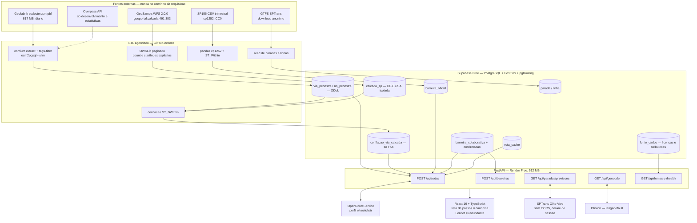
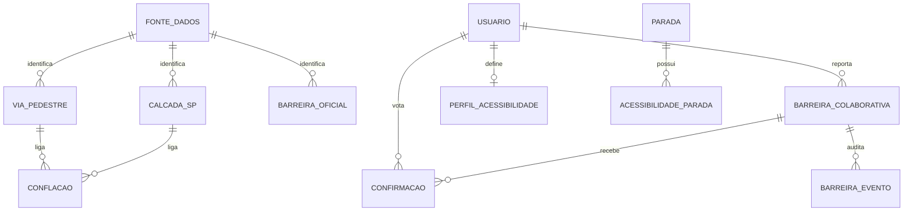

# Rota Falada SP — Documento de Design

**Disciplina:** Engenharia de Software II · FATEC · 4º semestre · 08/09/2026
**Produto:** Guia de Rotas de Transporte com Alertas de Barreiras Físicas
**Status:** rascunho aguardando aprovação do dono do projeto (ver seção 14)
**Base:** pesquisa verificada em `docs/pesquisa/` (relatório consolidado em `2026-09-08-relatorio-apis.md`; painel de 3 arquiteturas e julgamento em `2026-09-08-painel-de-designs.md`)

---

## 1. Visão e tese arquitetural

**Num aplicativo de acessibilidade, a rota é um texto; o mapa é uma ilustração opcional desse texto.**

Quase toda arquitetura convencional para este problema parte do mapa e depois tenta "torná-lo acessível" — e falha, porque um `<canvas>` WebGL ou uma malha de tiles é, por construção, invisível para leitor de tela. Partindo das jornadas reais dos usuários, a inversão é imediata: o artefato consumido é uma **lista ordenada de passos**, cada um com distância, direção, condição de acessibilidade, **fonte e data**. O mapa Leaflet fica ao lado, ligado por `aria-describedby`; se ele não carregar, o aplicativo continua inteiro.

Essa inversão **decide o backend**. Se o produto é texto, `/api/rotas` não pode devolver apenas uma geometria GeoJSON e deixar o React "montar a narrativa": ele precisa devolver passos já enriquecidos com a largura da calçada (GeoSampa), a declividade por segmento (`extra_info=steepness` do ORS), o estado da guia (OSM `kerb`) e as barreiras colaborativas próximas com data e confirmações. Isso é transformação geoespacial pesada com contrato tipado — exatamente o que Python faz melhor que Java ou C#.

Três decisões estruturais decorrem disso:

1. **Nada externo no caminho da requisição, exceto o motor de rotas.** GeoSampa, Geofabrik, SP156 e GTFS entram por ETL agendado. A Overpass é ferramenta de desenvolvimento, jamais backend em produção.
2. **Proveniência e licença são colunas de primeira classe.** Cada trecho de rota declara de onde veio e de quando é.
3. **O sistema nunca promete acessibilidade — declara evidência.** Com 1,88% das travessias de São Paulo informando guia rebaixada (medição própria de 08/09/2026), qualquer promessa de garantia seria irresponsável com o público-alvo.

E ainda assim o mapa **não estreia vazio**: a camada `geoportal:calcada` do GeoSampa entrega 491.383 polígonos com largura e declividade medidas pela Prefeitura, resolvendo o problema clássico do mapa colaborativo sem conteúdo no dia 1.

---

## 2. Jornadas → obrigações de projeto (rastreabilidade)

| Persona | O que faz | O que o frontend precisa | O que isso **obriga** no backend |
|---|---|---|---|
| **Marcos**, 34, cadeira de rodas manual | Rota de casa até a estação; quer saber se tem degrau e se o ônibus é acessível | Lista de passos com largura/declividade/guia por trecho; "o próximo ônibus é acessível" | `/api/rotas` devolve passos **enriquecidos**; proxy SPTrans com sessão e cache; barreiras viram `avoid_polygons` |
| **Dona Ivete**, 68, baixa visão + NVDA | Ouve a rota, navega só por teclado, digita com zoom de 400% | Zero dependência do canvas; busca de endereço que não dispare a cada tecla | Autocomplete **local** no PostGIS (não Nominatim); contrato tipado para o texto nunca vir vazio |
| **Sr. Antônio**, 79, andador | Trechos curtos e sem inclinação; reporta calçada quebrada na hora | Botões grandes, reporte em 3 toques, funciona sem sinal | `POST /api/barreiras` idempotente, fila offline, moderação e expiração; perfil com `velocidade_caminhada` |

Essa tabela é o artefato que amarra requisito → decisão de projeto → justificativa, e deve abrir a monografia.

---

## 3. Arquitetura



### Fluxo "usuário pede rota → resposta"

```mermaid
sequenceDiagram
  autonumber
  actor U as Usuario com leitor de tela
  participant FE as React
  participant API as FastAPI
  participant PG as PostGIS
  participant ORS as OpenRouteService

  U->>FE: informa destino e aciona Calcular rota
  FE->>FE: debounce 800 ms; foco no h1; aria-live polite
  FE->>API: POST /api/rotas
  API->>PG: consulta rota_cache por hash
  alt cache quente
    PG-->>API: rota armazenada
  else cache frio
    API->>ORS: 1a passada — avoid_features steps,<br/>profile_params incline 6, kerb 0.06, largura 0.9,<br/>elevation true, extra_info steepness
    ORS-->>API: GeoJSON 3D + steepness por segmento
    API->>PG: ST_DWithin corredor de 50 m sobre barreiras
    PG-->>API: barreiras com severidade e proveniencia
    alt existe barreira intransponivel validada
      API->>API: buffer 8 m em EPSG:31983 e reprojeta
      API->>ORS: 2a passada com avoid_polygons, max 15
      ORS-->>API: rota desviada
    end
    alt sem rota ou HTTP 403/429
      API->>API: relaxamento 3 → 6 → 10 → any
      API->>PG: fallback pgr_dijkstra com custo_acessivel
    end
    API->>PG: enriquece passos via conflacao_via_calcada
    API->>PG: grava rota_cache TTL 6 h
  end
  API-->>FE: passos, avisos, nivel_exigencia_atendido, fontes
  FE-->>U: anuncia "Rota encontrada. 1,4 km, 22 minutos, 2 avisos."
```

**Orçamento de latência (p95, sem cache):** geocode 300 ms + ORS 600 ms + PostGIS 80 ms + ORS 700 ms + enriquecimento 60 ms ≈ **1,8 s**. Com cache quente, < 150 ms.

---

## 4. Backend escolhido: **Python + FastAPI**

### Comparativo honesto

| Critério | **Python (FastAPI)** | **Java (Spring Boot)** | **C# (.NET Minimal API)** |
|---|---|---|---|
| ETL geoespacial (70% do esforço) | pyrosm, GeoPandas/pyogrio, Shapely, pyproj, OWSLib — ferramenta pronta em cada etapa | GeoTools: maduro, porém várias vezes mais verboso | Sem equivalente a GeoPandas nem cliente WFS de 1ª classe |
| Conflação exploratória | Jupyter + matplotlib: ciclo de segundos | ciclo de recompilação | ciclo de recompilação |
| Memória no Render Free (512 MB) | 80–150 MB, sobe em segundos | **250–400 MB + 10–30 s de startup** → exige `-Xmx256m` ou GraalVM | 80–130 MB, comparável |
| Cliente SPTrans (será escrito à mão nos 3) | `httpx.Client` gerencia o cookie sozinho: ~80 linhas | `CookieManager` explícito | `HttpClientHandler` + `CookieContainer` |
| Geometria fora do banco | Shapely (ótimo) | JTS (ótimo) | **NetTopologySuite + Npgsql: o melhor dos três** |
| Cliente oficial do ORS | `openrouteservice-py` **parado em 2021** → usar `httpx`/`routingpy` | ORS é Java, mas não há cliente | inexistente |
| Motor de rotas embarcável | — | **GraphHopper como biblioteca** (mas `wheelchair` removido na 9.0) | Itinero/OsmSharp: comunidade pequena |
| Referência acadêmica em português | livro do IPEA sobre acessibilidade urbana, com código e dados de SP | — | — |

### Justificativa

A decisão **não é** "Python é mais fácil" — e o relatório deve dizer isso explicitamente. Quatro razões técnicas independentes:

1. **O perfil de trabalho é ETL, não HTTP.** O pipeline obrigatório (recortar PBF → filtrar tags → carregar em PostGIS → paginar o WFS → ler CSV cp1252 → conflar com o grafo) tem ferramenta madura em Python para cada etapa.
2. **A parte mais difícil é experimentação.** Calibrar o buffer da conflação exige testar, plotar, comparar e repetir dezenas de vezes.
3. **O limite de 512 MB de RAM decide o empate.** Spring Boot em JVM soma 10–30 s de startup ao cold start de ~1 min do Render Free.
4. **Nada aqui exige performance de JVM ou CLR.** Interseção espacial, buffer e caminho mínimo rodam **dentro do PostGIS**, em C. Escolher Java "por performance" otimizaria a camada errada.

**Ressalva:** se o escopo fosse construir o próprio motor de rotas, Java seria a escolha certa — mas o veículo `wheelchair` do GraphHopper foi removido na versão 9.0 (23/04/2024) e reescrevê-lo é um TCC inteiro. **C# não é inferior como linguagem** (o Npgsql tem o melhor suporte a tipos espaciais fora do banco entre os três); o problema é o ecossistema de dados OSM.

**Bibliotecas-chave:** `fastapi`, `uvicorn`, `pydantic>=2`, `sqlalchemy>=2 + geoalchemy2`, `psycopg[binary]`, `httpx`, `shapely>=2`, `pyproj`, `geopandas + pyogrio` (só no ETL), `pyrosm`, `osmnx>=2.1`, `OWSLib`, `pandas`, `pytest + respx + testcontainers`.

---

## 5. Modelo de dados

**Regra que governa o esquema:** toda linha espacial carrega `fonte_id` (FK), `data_referencia` (a data do dado, não a da carga) e `geom` em SRID 4326. Cálculos métricos reprojetam para **EPSG:31983** (SIRGAS 2000 / UTM 23S) — buffer em graus não é metro.



**Tabelas essenciais:**

- **`fonte_dados`** — catálogo de proveniência: `chave`, `licenca`, `url`, `atribuicao` (texto literal renderizado na UI), `data_extracao`. Alimenta o rodapé automaticamente: cumprir licença vira consequência do esquema, não disciplina humana.
- **`via_pedestre`** (ODbL) — grafo com `source`/`target` (nomes do pgRouting), `esquema_calcada` (`geometria_propria` | `atributo_via` | `via_generica`, porque **SP tem os dois convivendo**), `is_degrau`, `kerb`, **`kerb_transponivel boolean NULLABLE`** e `custo_acessivel`.
- **`calcada_sp`** (CC-BY-SA, **fisicamente isolada**) — com colunas **geradas** `largura_medida` e `declividade_medida` (`GENERATED ALWAYS AS (largura_min_m > 0) STORED`), tornando impossível esquecer que zero é ausência, não medição.
- **`conflacao_via_calcada`** — `(via_id, calcada_id, distancia_m, confianca, metodo)`. **Apenas chaves e distância**: nenhuma geometria, nenhum atributo copiado. É a peça que resolve CC-BY-SA × ODbL por modelagem.
- **`barreira_colaborativa`** + **`confirmacao`** (com `UNIQUE(barreira_id, usuario_id)` — antivandalismo no nível do banco) + **`barreira_evento`** (auditoria imutável).
- **`rota_cache`** — chave `sha256(orig~5casas, dest~5casas, perfil, hash_barreiras)`, com coluna `regiao` para invalidação **espacial** quando uma barreira nova é validada.
- **`logradouro`** — índice GIN `pg_trgm` para autocomplete local.

**Dois cuidados não óbvios.** `kerb='yes'` grava `NULL` em `kerb_transponivel` (significa "existe guia de altura indeterminada"; mapeá-lo como acessível manda um cadeirante para uma guia de 15 cm). E o `stop_id` do GTFS e o `codigoParada` do Olho Vivo são **espaços de identificadores diferentes** — a junção é espacial + nome, e é trabalho real de sprint.

**Dimensionamento.** Os 500 MB do Supabase Free não comportam a cidade inteira. Área piloto de 3–5 distritos (sugestão: Lapa + Vila Mariana, onde o mapeamento sistemático de 2021 deixou a melhor cobertura, **mais um distrito periférico para expor honestamente o viés**): ~40 mil calçadas, ~25 mil arestas, ~120 MB.

---

## 6. Estratégia de roteamento

**Motor:** OpenRouteService, perfil `wheelchair`, API pública, chave **apenas no servidor**.

**Duas passadas:** (1) rota-base com `profile_params.restrictions` ancoradas na NBR 9050; (2) consulta das barreiras que interceptam um corredor de 50 m; (3) as **intransponíveis e validadas** viram polígonos (buffer de 8 m em EPSG:31983, reprojetado), **teto de 15 por requisição**, ordenados por severidade; (4) segunda chamada com `avoid_polygons`. Sempre **POST**, nunca GET.

**Severidade graduada sobre um motor binário** — esta é a lógica de negócio própria, o que diferencia o trabalho de um wrapper de API:

| Severidade | Exemplo | Requisito | Efeito |
|---|---|---|---|
| Intransponível | escada, ausência de rampa, elevador quebrado | 2 confirmações | vira `avoid_polygons` |
| Dificulta | largura 0,80–1,20 m, declividade 6–8,33% | 1 confirmação | **não bloqueia**; ordena as alternativas e vira aviso |
| Informativo | POI `wheelchair=no`, piso irregular | — | exibido, peso zero |
| Não medido | GeoSampa com largura 0 | — | **nunca** exibido como acessível |

**Fallback progressivo** (`incline` 3 → 6 → 10 → `any`) com a resposta **declarando o nível atendido**: *"Não encontramos rota com inclinação até 3%. Esta rota tem trechos de até 6%."* Evita a tela vazia diante da banca e é, por si só, uma funcionalidade de acessibilidade honesta.

**Cotas:** leia `x-ratelimit-remaining` e `x-ratelimit-reset` a cada resposta e exponha em `/health` — **não codifique o número**. Defesas em camadas: debounce de 800 ms, cache no PostGIS, uma chave por integrante, fixtures gravadas e **pgRouting local** como fallback determinístico, com `custo_acessivel` materializado por job e recorte por bbox na própria query.

**Transporte público:** sem roteamento multimodal (o GTFS não tem `pathways.txt` nem os campos de acessibilidade). Entra como enriquecimento: `Previsao/Parada` com cache de 25 s, mostrando linha, horário e o booleano `a` do veículo.

---

## 7. Acessibilidade do frontend

**Meta: WCAG 2.2 nível AA**, com eMAG 3.1 e ABNT NBR 17225:2025 como referências nacionais e o art. 63 da LBI como base legal.

- **Lista de passos como componente canônico** (`<ol>` semântico), sempre visível; mapa como `role="img"` com `aria-label` remetendo à lista.
- **Leaflet + react-leaflet v5** — única biblioteca com marcadores em **DOM real**, focáveis por teclado, e guia oficial de acessibilidade. Atenção: **v5 exige React 19** como peer dependency.
- **Uma única região viva** `role="status" aria-live="polite" aria-atomic="true"`, anunciando **só mudança de passo**, com throttle de 3–5 s. Nunca `assertive`, nunca a cada tick do GPS.
- **Alvos de 44×44 px** (supera o mínimo AA de 24×24 px do 2.5.8).
- **Nunca arrastar como via única** (2.5.7): clique/Enter, "minha localização" e busca de endereço.
- **Foco:** mover para o `<h1>` ao trocar de rota, atualizar `document.title`, skip link. Nenhum elemento fixo pode cobrir o item focado (2.4.11).
- **Reflow a 320 px CSS e zoom 400%** (1.4.10/1.4.4) — o layout de mapa com painel sobreposto é o que mais quebra aqui.
- **Contraste sobre o mapa:** casing branco de 8 px sob traço escuro de 4 px na linha da rota; contorno escuro nos pinos; camada de dessaturação sobre o tile. Nenhum dado existe só no mapa.
- **`<html lang="pt-BR">`** — pré-requisito para leitor de tela e `SpeechSynthesis` escolherem voz pt-BR.
- **Voz como progressive enhancement:** `SpeechSynthesis` é local; `SpeechRecognition` **não é Baseline**, não existe no Firefox e envia áudio a servidor remoto no Chrome — exige detecção de recurso, **consentimento explícito (LGPD)** e tratamento visível dos erros. Categoria por **lista fechada**, não texto livre. **Foto sempre opcional** (exigi-la excluiria o usuário cego do papel de colaborador).
- **VLibras** (gov.br, duas linhas de script) como ganho barato de conformidade.
- **`prefers-reduced-motion`:** trocar `map.flyTo()` por `map.setView()` — o Leaflet não respeita a media query sozinho.

**Critérios de aceite mensuráveis:** zero violações críticas/sérias no axe; 100% dos fluxos completáveis só com teclado; todo alvo ≥ 44 px; sem scroll horizontal a 320 px; primeiro anúncio de passo < 2 s; e **pelo menos um teste com usuário real** registrado — automação cobre ~57% dos problemas.

---

## 8. MVP

1. Busca de origem/destino com autocomplete **local** (Photon como fallback, `lang=default`)
2. Rota pedonal acessível em duas passadas, com fallback progressivo declarado
3. **Lista textual de passos** com distância, direção, condição, fonte e data
4. Mapa Leaflet redundante, com marcadores focáveis e `alt` descritivo
5. **Seed oficial** do GeoSampa + SP156, distinguindo "estreita" de "não medida"
6. Cadastro colaborativo em 3 toques, foto opcional com descrição alternativa
7. Moderação: 2 confirmações para validar, contestação, "resolvido", expiração
8. Painel "próximo ônibus acessível" via `Previsao/Parada`
9. Leitura da rota em voz alta (`SpeechSynthesis`)
10. Páginas `/acessibilidade` (art. 63 §1º) e `/fontes` (licenças e datas)
11. `/health` com saldo de cota do ORS e data do último ETL
12. Modo `USE_FIXTURES` para a demonstração sobreviver à queda de qualquer serviço

**Fora do MVP, com justificativa registrada:** ARTESP, Wheelmap, MDT LiDAR, IA generativa no caminho crítico, roteamento multimodal.

**Futuras:** pgRouting como motor primário; custom model de cadeirante no GraphHopper; MDT LiDAR para declividade centimétrica; devolução das barreiras ao OSM (com a discussão dos Contributor Terms); isócronas; PWA offline via Protomaps/PMTiles; pedidos via LAI sobre elevadores; comparação com o AccessMap.

---

## 9. Estrutura de pastas (resumo)

```
rota-falada-sp/
├── README.md                 # inclui a seção "armadilhas conhecidas"
├── DATA-LICENSES.md          # ODbL x CC-BY-SA x CC0, decisão de tabelas separadas
├── docker-compose.yml        # pgrouting/pgrouting local
├── backend/app/
│   ├── routers/              # rotas, barreiras, geocode, transporte, fontes, health
│   ├── services/
│   │   ├── ors_client.py     # 2 passadas, fallback, lê x-ratelimit-*
│   │   ├── sptrans_client.py # Content-Length 0, reauth no 401
│   │   └── barreira_geom.py  # buffer em EPSG:31983
│   ├── models/  schemas/     # px/py vira {lat,lng} AQUI, uma única vez
│   └── fixtures/             # snapshots reais → modo demo
├── etl/                      # 01_osm  02_geosampa  03_sp156  04_gtfs  05_conflacao
│   └── notebooks/            # medições do relatório e calibração do buffer
├── frontend/src/
│   ├── features/rota/        # ListaPassos.tsx (canônica) · MapaRota.tsx (redundante)
│   └── a11y/                 # SkipLink, useFocoNaNavegacao, useVoz
├── tests/                    # dados · contrato · roteamento · a11y · e2e
├── docs/adr/                 # 001-backend-python … 005-area-piloto-e-vies
└── .github/workflows/        # ci.yml · keep-alive.yml · backup.yml
```

**Setup essencial:**

```bash
docker run -d -e POSTGRES_PASSWORD=dev -p 5432:5432 pgrouting/pgrouting:latest
psql ... -c "CREATE EXTENSION postgis; CREATE EXTENSION pgrouting; CREATE EXTENSION pg_trgm;"
osmium extract -b -46.66,-23.57,-46.62,-23.53 sudeste-latest.osm.pbf -o piloto.osm.pbf
osm2pgsql -d acessibilidade --create --slim -G --hstore piloto.osm.pbf
npx openapi-typescript http://localhost:8000/openapi.json -o src/api/types.gen.ts
```

---

## 10. Testes e qualidade — cinco camadas

1. **Qualidade de dados (falha o build).** `test_calcada_sem_zeros_mascarados`, `test_proveniencia_completa`, `test_licencas_nao_se_misturam`, `test_kerb_yes_nunca_vira_acessivel`, `test_wfs_nao_truncou`, `test_coordenadas_dentro_do_municipio`. É a camada que pega o defeito real deste projeto.
2. **Contrato com serviços externos.** Contra fixtures em cada PR; contra a API real em job **noturno** que não bloqueia o merge — o precedente é a ARTESP, que excluiu Metrô e CPTM de um dia para o outro.
3. **Casos de roteamento de referência.** 10–15 pares origem/destino verificados no Street View, incluindo a regressão *"POI `wheelchair=no` NÃO bloqueia a calçada em frente"*.
4. **Acessibilidade automatizada.** `eslint-plugin-jsx-a11y` → `jest-axe` → `@axe-core/playwright` → Lighthouse CI (≥ 95).
5. **Manual reproduzível.** Matriz de **combinações**: NVDA+Firefox, NVDA+Chrome, TalkBack+Chrome, VoiceOver+Safari, só-teclado, zoom 400%.

Mais `gitleaks` no pre-commit e Secret Scanning no repositório: chave vazada em repositório público de faculdade é o vazamento mais comum que existe.

---

## 11. Riscos e mitigações (principais)

| Risco | Mitigação |
|---|---|
| **Cobertura insuficiente** (1,88% das travessias com guia) | Rotas rotuladas como sugestão; proveniência e data por trecho; seed do GeoSampa; a limitação vira fundamentação |
| **Demo quebrar na banca** (cold start de 1 min, cota 403, SPTrans sem SLA) | `USE_FIXTURES`; cache no banco; cron `17 9 * * *` (crons na hora cheia atrasam; e o GitHub desabilita agendamentos em repo público após 60 dias sem atividade); aquecer antes |
| **Truncamento silencioso do WFS** | `count`/`startIndex` explícitos + teste que falha o build |
| **Conflito CC-BY-SA × ODbL** | Tabelas separadas + junção só com FKs; jamais subir GeoSampa ao OSM |
| **Zeros do GeoSampa como medição** | Colunas geradas `largura_medida`/`declividade_medida` |
| **Vandalismo na base colaborativa** | 2 confirmações, voto único por usuário, expiração, auditoria |
| **LGPD** | Sem histórico de trajetos; consentimento granular para localização e microfone; SP156 agregado por face de quadra |
| **500 MB do Supabase** | Área piloto decidida na semana 1; monitorar `pg_database_size()` |
| **Viés geográfico da demo** | Incluir um distrito periférico e **declarar o viés** no relatório |
| **Chave no bundle do React** | Nenhuma chave no frontend; tudo via backend |

---

## 12. Cronograma — 16 semanas

**Semana 0 (3 horas, antes de qualquer código):** medir a fração de veículos com `a=true` em `/Posicao`; confirmar com os próprios olhos a ausência dos campos de acessibilidade no GTFS; fixar as contagens da Overpass; medir os zeros do GeoSampa. Qualquer uma dessas descobertas na semana 12 reprovaria o projeto.

| Sem. | Foco | Entregável |
|---|---|---|
| 1–2 | Contas, área piloto, CI com lint + axe, **deploy de ponta a ponta** | App vazio publicado e funcionando |
| 3–4 | ETL do OSM e do GeoSampa/SP156 | Banco com barreiras oficiais; testes de dados verdes |
| 5–6 | **Conflação** (a parte mais difícil) | Taxa de arestas com atributo métrico medida |
| 7–8 | Roteamento: 1ª e 2ª passadas, cache, fallback | Rota desviando de barreira real |
| 9–10 | **Frontend acessível — lista primeiro** (sem mapa na tela); mapa só na 10 | Fluxo navegável por teclado e NVDA |
| 11–12 | Cadastro colaborativo e moderação | Usuário cadastra e a rota muda |
| 13–14 | SPTrans, voz, fila offline (IndexedDB, **não** Background Sync) | Reporte offline que sobe sozinho |
| 15 | Endurecimento: teste com usuário real, fixtures, keep-alive | Relatório de acessibilidade com métricas |
| 16 | Monografia, ADRs, `limites-e-contingencias.md`, **ensaio duplo** | Demo ensaiada com serviços desligados **e** com serviços reais |

**Gates go/no-go:** fim da S1 (escopo/área piloto), fim da S6 (se a conflação ficar abaixo de ~30%, assume-se a camada colaborativa como fonte principal e os polígonos do GeoSampa passam a ser tratados como barreiras, não como atributos conflados), fim da S10 (congela features novas até zerar violações críticas de acessibilidade).

**Ordem de corte, escrita antes de precisar dela:** (1) SPTrans → (2) SP156 → (3) fallback Photon → (4) reconhecimento de voz. **Nunca corte a camada colaborativa nem a acessibilidade.**

---

## 13. Armadilhas conhecidas (seção obrigatória do README)

1. Overpass: `{{bbox}}` é template do overpass-turbo; no `/api/interpreter` dá `parse error`.
2. GeoSampa WFS: `CountDefault=30000` trunca **em silêncio** com HTTP 200.
3. GeoSampa BBOX: funciona em EPSG:4326 **na ordem longitude,latitude**.
4. SP156: `encoding='cp1252'` (não latin-1) e `sep=';'`; normalize hífen × travessão.
5. CKAN municipal: o WAF bloqueia o User-Agent do `curl` (use `-A 'Mozilla/5.0'`).
6. SPTrans: `POST /Login/Autenticar` **sem `Content-Length: 0`** → HTTP 411.
7. SPTrans: `px` = longitude, `py` = latitude.
8. SPTrans: campo `a` é bool em `/Posicao` e int em `/Empresa`.
9. SPTrans: cada linha tem **dois** `cl`, um por sentido; `ta` é UTC e `hr`/`t` são hora local.
10. Photon: rejeita `lang=pt`; use `lang=default`.
11. OSMnx ≥ 2.0: `graph_from_bbox(bbox=(oeste, sul, leste, norte))` numa tupla única.
12. GeoSampa: largura e declividade **nunca são NULL** — ausência é `0`.
13. Overpass: kumi.systems e private.coffee compartilham backend; para números do relatório, use só `overpass-api.de`.
14. ORS: sempre POST; chaves novas são JWT desde 2025 (tutoriais antigos quebram).
15. pgRouting: `pgr_createTopology` foi removida na 4.0; use `pgr_extractVertices`.
16. react-leaflet v5 exige React 19; trate `Map container is already initialized` no StrictMode.
17. **Nunca** use o Postgres gratuito do Render: expira em 30 dias, sem backups.

---

## 14. Decisões do dono do projeto (registradas em 10/09/2026)

| # | Decisão | Resposta | Efeito no projeto |
|---|---|---|---|
| 1 | Área piloto | **Vila Mariana + Lapa**, com o entorno da **FATEC Ipiranga** (Alto do Ipiranga / Rua Vergueiro) como terceiro recorte | Três distritos, dentro do dimensionamento de 500 MB. Cobertura medida em 10/09/2026 na tabela abaixo. O Ipiranga tem cobertura OSM menor e cumpre o papel de "distrito que expõe o viés"; sua vantagem é a verificação em campo pela equipe |
| 2 | Equipe | **5 pessoas**, todas com Python e React | Cronograma de 16 semanas com duas trilhas paralelas mantido sem corte |
| 3 | Usuário real para teste | Talvez, mais para frente | Fica como item da semana 15; planejar contato com SMPED, associações ou núcleo de acessibilidade da FATEC a partir da semana 10 |
| 4 | Dispositivos | Há iPhone, não há Mac | Matriz de teste manual: NVDA+Firefox, NVDA+Chrome, TalkBack+Chrome, **VoiceOver+Safari iOS**, só-teclado, zoom 400%. VoiceOver no macOS declarado como limitação |
| 5 | Licença dos dados colaborativos | Em aberto | Padrão adotado até decisão contrária: **ODbL**, a mesma do OSM, o que mantém aberta a devolução futura das barreiras ao OpenStreetMap. Registrar em `DATA-LICENSES.md` |
| 6 | Conta SPTrans | **Conta criada em 10/09/2026** (usuário caiorosadev) | Falta registrar o aplicativo em "Meus Aplicativos" para obter a chave. GTFS já baixável pelo mesmo perfil |
| 7 | Token Direto dos Trens | O dono do projeto vai solicitar | Status de Metrô/CPTM tratado como bônus, não requisito |
| 8 | IA generativa | **Eliminada do sistema. Regra dura: a aplicação é 100% determinística.** IA só como ferramenta de desenvolvimento | Remove qualquer chamada a LLM do backend e do frontend, remove a categoria de risco de cota de IA, simplifica a LGPD (nenhum dado de usuário sai para provedor de IA). Deve constar como requisito não funcional numerado |
| 9 | LGPD | **Sem histórico de trajetos por usuário** | Não existe tabela de rotas por usuário; `rota_cache` é anônimo, chaveado por hash de origem/destino/perfil. Sem "rotas favoritas" no MVP |
| 10 | Formato de entrega da disciplina | Vai perguntar ao professor | Reservar tempo nas semanas 15 e 16 para artefatos formais (casos de uso, diagrama de classes, requisitos numerados) se exigidos |
| 11 | Repositório | **Público**, no GitHub | GitHub Actions ilimitado. Obriga gitleaks no pre-commit e Secret Scanning desde o primeiro commit. Dados colaborativos serão públicos |
| 12 | Correção da proposta original | **Sim, o grupo pode reescrever** | A proposta passa a posicionar a SPTrans como enriquecimento ("o próximo ônibus neste ponto é acessível"), não como núcleo do roteamento. Reescrever antes da entrega final |

### Cobertura OSM dos três recortes (medição própria, overpass-api.de, 10/09/2026)

| Recorte (bbox aproximado) | Travessias | com `kerb=*` | Escadas | `wheelchair=*` | Vias de pedestre | Calçadas como geometria |
|---|---|---|---|---|---|---|
| Vila Mariana (-23.610,-46.660,-23.570,-46.615) | 2.808 | 101 (3,6%) | 70 | 1.079 | 3.351 | 781 |
| Lapa (-23.545,-46.720,-23.510,-46.680) | 1.643 | 10 (0,6%) | 77 | 706 | 1.228 | 128 |
| Ipiranga / FATEC (-23.605,-46.625,-23.575,-46.590) | 1.157 | 12 (1,0%) | 21 | 174 | 736 | 105 |

Leitura: Vila Mariana é o recorte mais rico e deve ser o primeiro a entrar no ETL. Lapa e Ipiranga têm cobertura semelhante entre si e ambos dependem mais do GeoSampa e da camada colaborativa. O Ipiranga entra por ser verificável a pé pela equipe, e sua cobertura baixa deve ser declarada no relatório como parte da fundamentação.

## 15. Pendências externas e como destravar

**Conta de desenvolvedor SPTrans (decisão 6).**
1. Criar conta em `https://www.sptrans.com.br/desenvolvedores/cadastro-desenvolvedores/`.
2. Aguardar o e-mail de validação do cadastro (validação humana, pode levar dias).
3. Entrar em "Meus Aplicativos" e registrar um aplicativo; cada aplicativo recebe uma chave de acesso.
4. Repetir para cada integrante que for desenvolver o cliente SPTrans, para não compartilhar a mesma chave.
5. A chave vai em variável de ambiente no backend, nunca no repositório nem no React.

**Token do Direto dos Trens (decisão 7).** Pedir por e-mail para **api@diretodostrens.com.br** (contato oficial da especificação OpenAPI, confirmado em 10/09/2026), informando propósito acadêmico, nome da instituição e disciplina. Contato e termos estão na especificação OpenAPI em `https://static.diretodostrens.com.br/swagger/api.json`. Uso acadêmico é explicitamente encorajado; uso comercial exige autorização.

**Correção da proposta original (decisão 12).** A proposta entregue ao professor diz que a SPTrans "fornece dados sobre ônibus acessíveis em circulação em tempo real". Isso é verdade, mas o campo descreve o veículo, não a parada, a calçada nem o trajeto, e o GTFS não tem campos de acessibilidade. Se o texto oficial do projeto prometer roteamento por transporte público acessível, a banca cobrará algo que a fonte de dados não sustenta. A pergunta é: o grupo pode ajustar o texto da proposta para posicionar a SPTrans como enriquecimento ("o próximo ônibus neste ponto é acessível") e não como núcleo?
